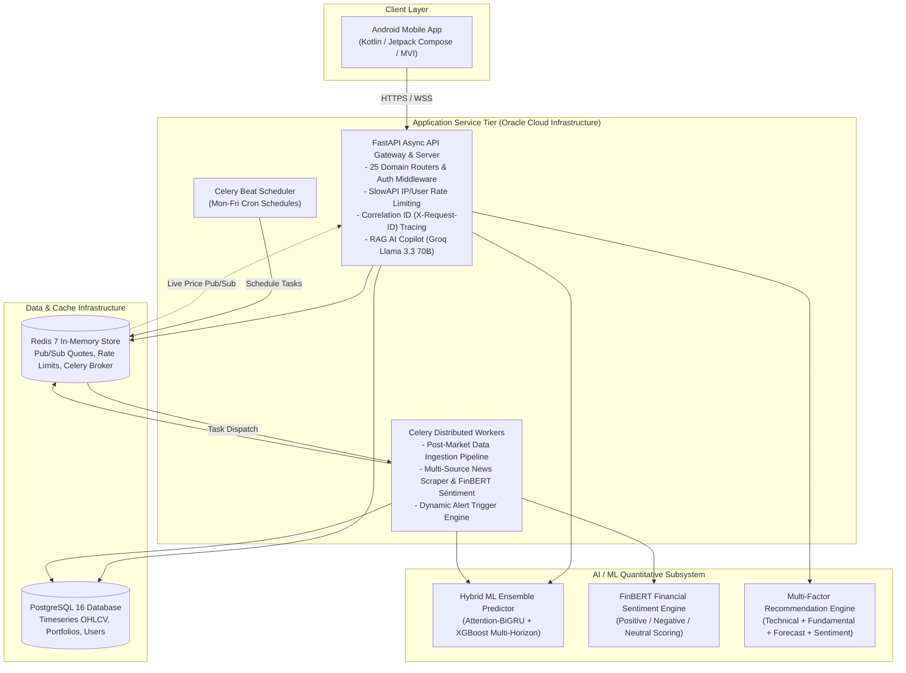

# Basarat — AI-Powered Investment Intelligence Platform

[](https://www.python.org/)
[](https://fastapi.tiangolo.com)
[](https://www.postgresql.org/)
[](https://redis.io/)
[](https://docs.celeryq.dev/)
[](docs/09-ai-ml/README.md)
[-brightgreen.svg)](docs/06-testing/testing-strategy.md)
[]()

> **Basarat** is an enterprise-grade AI-powered financial intelligence and quantitative recommendation platform purpose-built for the **Pakistan Stock Exchange (PSX)**. It unifies real-time PSX data feeds, hybrid machine learning price directional forecasting, FinBERT financial sentiment analysis, mathematical portfolio risk analytics (VaR/CVaR/Monte Carlo), Shariah compliance screening (KMI-30 rules), and a contextual RAG AI Investment Copilot into a high-performance backend API.

---

## 🌐 Live Deployment & Interactive Web Endpoints

| Resource | URL Link | Description |
|---|---|---|
| **Live Production API Gateway** | [https://api.basarat.live](https://api.basarat.live) | Root service gateway with health and readiness status |
| **Interactive Swagger API Docs** | [https://api.basarat.live/docs](https://api.basarat.live/docs) | Interactive OpenAPI 3.1 schema for testing all 25 domain routers |
| **Interactive Architecture Diagram**| [https://api.basarat.live/architecture](https://api.basarat.live/architecture) | Live web-based dynamic architecture visualization |
| **Alternative ReDoc Docs** | [https://api.basarat.live/redoc](https://api.basarat.live/redoc) | Clean formatted REST endpoint specifications |

---

## 1. System Architecture



> 🔍 **Interactive Architecture Visualizer**: Explore the dynamic, live-rendered architecture topology directly in your browser at **[https://api.basarat.live/architecture](https://api.basarat.live/architecture)**.

---

## 2. Core Platform Capabilities

| Capability | Technical Implementation |
|---|---|
| **PSX Real-Time Tracking & Screener** | Real-time and end-of-day market data ingestion across 100+ PSX equities and major sector indices with Redis pub/sub streaming. |
| **Hybrid Directional Forecasting** | Multi-horizon directional forecasting (5-Day, 10-Day, 20-Day) combining **Temporal Attention-BiGRU** and **XGBoost Classifier v3** with dynamic volatility-weighted blending. |
| **Quantitative Recommendations** | 4-pillar deterministic multi-factor recommendation engine combining Technicals (35%), ML Forecasts (25%), Financial Sentiment (20%), and Valuation Fundamentals (20%) with strict stop-loss and target bounds. |
| **FinBERT Market Sentiment** | Dedicated NLP pipeline ingesting Pakistani financial news (Dawn, Business Recorder, Profit) scored via Hugging Face **FinBERT**. |
| **Portfolio Risk Engine** | Parametric, Historical, and Monte Carlo Value-at-Risk (**VaR**), Conditional VaR (**CVaR**), Sharpe/Sortino ratios, and macroeconomic stress testing. |
| **Shariah Compliance Screening** | Automated financial ratio filtering based on SECP and KMI-30 Shariah governance standards (debt-to-assets, illiquid assets, non-compliant income purification). |
| **RAG AI Investment Copilot** | Contextually grounded financial assistant powered by **Groq Llama 3.3 70B**, vector-augmented with live user portfolio metrics and market quotes. |

---

## 3. AI / ML Predictive Engine Performance

Our production models are trained on **151,484 daily PSX rows (2020-03-12 to 2026-10-02)** across 100 liquid symbols using strict temporal walk-forward splits to eliminate lookahead bias:

| Horizon | Primary Production Model | Out-of-Sample Accuracy | Actionable Win Rate (Confidence &ge; 0.55) | Actionable Win Rate (Confidence &ge; 0.60) | Spearman Rank IC |
|---|---|:---:|:---:|:---:|:---:|
| **5-Day (1-Week)** | **Hybrid Attention-BiGRU + XGBoost** | **55.30%** | **59.70%** | **65.38%** | **+0.093 (p &lt; 0.001)** |
| **10-Day (2-Week)** | **XGBoost 10D Classifier** | **54.85%** | **58.20%** | **64.71%** | **+0.088 (p &lt; 0.001)** |
| **20-Day (1-Month)** | **XGBoost 20D Classifier** | **54.33%** | **57.56%** | **65.22%** | **+0.080 (p &lt; 0.001)** |

> Complete training methodologies, feature engineering definitions (29+ alpha signals), ablation studies, and viva defense guides are documented in **[docs/09-ai-ml/](docs/09-ai-ml/README.md)**.

---

## 4. Documentation Suite

The project includes an exhaustive technical documentation suite located in the **[docs/](docs/README.md)** directory:

| Module | Title | Key Documents |
|---|---|---|
| **01-Project** | **[Project & SDLC](docs/01-project/)** | **[SDLC Methodology](docs/01-project/software-development-life-cycle.md)**, [Project Overview](docs/01-project/project-overview.md), [SRS Requirements](docs/01-project/functional-requirements.md), [NFRs](docs/01-project/non-functional-requirements.md) |
| **02-Architecture** | **[Architecture & SDD](docs/02-architecture/)** | **[Software Design Document (SDD)](docs/02-architecture/software-design-document.md)**, [HLD System Arch](docs/02-architecture/system-architecture.md), [LLD API Arch](docs/02-architecture/api-architecture.md), [Database ERD](docs/02-architecture/database-design.md), [ADR Decisions](docs/02-architecture/decisions/) |
| **03-API** | **[API Specifications](docs/03-api/)** | [Endpoint Catalog](docs/03-api/api-overview.md), [Authentication](docs/03-api/authentication.md), [Error Contracts](docs/03-api/error-handling.md), [Mobile API Contract](docs/03-api/recommendation-api-mobile-contract.md) |
| **04-Development** | **[Development Guides](docs/04-development/)** | [Project Structure](docs/04-development/project-structure.md), [Local Setup](docs/04-development/development-setup.md), [Environment Config](docs/04-development/environment-variables.md), [Coding Standards](docs/04-development/coding-standards.md) |
| **05-Security** | **[Security & Governance](docs/05-security/)** | [Security Architecture](docs/05-security/security.md), [RBAC Authorization](docs/05-security/authorization.md), [Data Protection](docs/05-security/data-protection.md) |
| **06-Testing** | **[Quality Assurance](docs/06-testing/)** | [Testing Strategy](docs/06-testing/testing-strategy.md), [Master Test Plan](docs/06-testing/test-plan.md), [Test Cases Catalog](docs/06-testing/test-cases.md) |
| **07-Deployment** | **[DevOps & Deployment](docs/07-deployment/)** | [Deployment Guide](docs/07-deployment/deployment.md), [Oracle Cloud Deployment](docs/07-deployment/oracle-deployment.md), [CI/CD Pipelines](docs/07-deployment/ci-cd.md), [Infrastructure](docs/07-deployment/infrastructure.md) |
| **08-Operations** | **[Operations & Runbooks](docs/08-operations/)** | [Monitoring & Health](docs/08-operations/monitoring.md), [Troubleshooting Guide](docs/08-operations/troubleshooting.md), [Execution Runbook](docs/08-operations/execution-runbook.md) |
| **09-AI-ML** | **[AI/ML Deep Dives](docs/09-ai-ml/)** | [AI/ML Index](docs/09-ai-ml/README.md), [Dataset Specs](docs/09-ai-ml/01-dataset.md), [Feature Engineering](docs/09-ai-ml/03-feature-engineering.md), [Evaluation Results](docs/09-ai-ml/06-model-evaluation-results.md), [Viva Defense Guide](docs/09-ai-ml/viva-preparation-guide.md) |

---

## 5. Repository Structure

```text
Basarat-fyp-official/
├── docs/                               # Master Technical Documentation Suite
│   ├── 01-project/                     # SDLC, scope, requirements (SRS/NFRs)
│   ├── 02-architecture/                # Master SDD, HLD/LLD, C4 diagrams, ERDs, ADRs
│   ├── 03-api/                         # REST & WebSocket endpoint contracts
│   ├── 04-development/                 # Setup guides, coding standards, configs
│   ├── 05-security/                    # Threat modeling, RBAC, PII protection
│   ├── 06-testing/                     # QA test plans, automated test reports
│   ├── 07-deployment/                  # Docker Compose, Oracle OCI, CI/CD
│   ├── 08-operations/                  # Runbooks, monitoring, production reviews
│   ├── 09-ai-ml/                       # Complete AI/ML lifecycle & Viva guide
│   └── README.md                       # Documentation index and reading paths
│
├── backend/                            # FastAPI Production Backend Service
│   ├── app/                            # Application Core
│   │   ├── api/v1/                     # 22 Domain Routers (auth, stocks, portfolio, etc.)
│   │   ├── core/                       # App settings, DB sessions, security, logging
│   │   ├── db/                         # Base models and database initializers
│   │   ├── middleware/                 # Rate limiting, Request-ID, error handlers
│   │   ├── ml/                         # ML feature pipelines, inference engines, trainers
│   │   │   ├── serving/                # Model loader and high-performance inference
│   │   │   ├── v3/                     # Multi-horizon feature pipelines & training
│   │   │   ├── training_xgb/           # XGBoost training workflows
│   │   │   └── v2/                     # Legacy experimental models (preserved)
│   │   ├── models/                     # SQLAlchemy async ORM entity definitions
│   │   ├── schemas/                    # Pydantic v2 data validation schemas
│   │   ├── services/                   # Business logic layer (recommendations, risk, quant)
│   │   └── tasks/                      # Celery background tasks & beat schedules
│   ├── alembic/                        # Database migration scripts
│   ├── data/                           # Canonical dataset & features parquet
│   ├── deploy/                         # Production deployment definitions & guides
│   ├── models/                         # Model Artifacts Store
│   │   ├── production/v3/              # Active production models (GRU .keras + XGB .ubj)
│   │   └── archive/                    # Archived legacy models & checkpoints
│   ├── scripts/                        # Production operations & verified utilities
│   │   └── archive/                    # Archived one-off debug/test scripts
│   ├── tests/                          # 204 Passing Automated Pytest Suite
│   │   ├── unit/                       # Unit tests for services, ML, and schemas
│   │   ├── integration/                # Database and Redis integration tests
│   │   ├── api/                        # API endpoint contract tests
│   │   ├── e2e/                        # End-to-end user workflows
│   │   └── security/                   # Auth, JWT, and rate limit tests
│   ├── docker-compose.yml              # Local development stack
│   ├── docker-compose.production.yml   # Production container orchestration
│   ├── dockerfile                      # Multi-stage optimized Docker build
│   └── requirements.txt                # Python runtime dependencies
│
└── .github/workflows/                  # Automated CI/CD Workflows
```

---

## 6. Quick Start & Local Setup

### Prerequisites
- **Python 3.11+**
- **Docker & Docker Compose**
- **PostgreSQL 16** (or run via Docker)
- **Redis 7** (or run via Docker)

### 1. Clone & Setup Environment

```bash
git clone https://github.com/iahmedd-k/Basarat-fyp-official.git
cd Basarat-fyp-official/backend

# Create virtual environment
python -m venv .venv
source .venv/bin/activate       # On Windows: .venv\Scripts\activate

# Install dependencies
pip install -r requirements.txt

# Configure environment variables
cp .env.example .env
```

### 2. Run with Docker Compose (Recommended)

To launch the full stack (FastAPI, Celery Worker, Celery Beat, PostgreSQL 16, Redis 7):

```bash
docker compose up --build
```

The API will be available at `http://localhost:8000`. Interactive Swagger documentation is accessible at `http://localhost:8000/docs`.

### Optional API Monitoring

Set strong, unique `PROMETHEUS_METRICS_USERNAME`, `PROMETHEUS_METRICS_PASSWORD`,
and `GRAFANA_ADMIN_PASSWORD` values in `backend/.env`, then run
`make monitoring-up` from the repository root. Grafana is available at
`http://localhost:3000`; see [Monitoring](docs/08-operations/monitoring.md) for
the dashboard and metrics details.

### 3. Run Manually for Local Development

```bash
# Apply database migrations
alembic upgrade head

# Seed verified demo and admin accounts (Pre-configured for evaluations)
python -m scripts.seed_demo_users

# Start FastAPI API server with live reload
uvicorn app.main:app --host 0.0.0.0 --port 8000 --reload

# Start Celery worker in a separate terminal
celery -A app.tasks.celery_app worker --loglevel=info -Q default,data_ingestion,ml_inference,news_processing,alert_notifications

# Start Celery beat scheduler in a separate terminal
celery -A app.tasks.celery_app beat --loglevel=info
```

### 4. Seeded Demo & Evaluator Accounts

For live FYP defense, jury evaluation, and mobile client demoing, the following accounts are pre-seeded with active verified status (`is_verified = true`):

| Account Type | Email Address | Username | Password | Role & Permissions | Pre-Loaded Feature Showcase |
|---|---|---|---|:---:|---|
| **Primary Demo Investor**<br/>*(Recommended for Demo)* | `demo@basarat.pk` | `demo_investor` | `TestPassword12345!` | `is_admin: false`<br/>`is_verified: true`<br/>`Tier: Pro (Active)`<br/>`Risk: Moderate` | • **Basarat Pro Access**: 50 AI Assistant queries/day, all ML forecast horizons, Shariah scanner.<br/>• **Diversified Portfolio**: 6 stocks (`SYS`, `ENGRO`, `MEBL`, `OGDC`, `HUBC`, `LUCK`) across 5 PSX sectors with buy transactions & PnL.<br/>• **Portfolio Risk Engine**: Calculated VaR (1.82%), CVaR (2.45%), Sharpe (1.64), and sector weightings.<br/>• **Full Watchlist**: 6 stocks with price target bounds and notes.<br/>• **Alerts & In-App Inbox**: Active price alert rules + 5 realistic market/dividend/AI notifications.<br/>• **AI Assistant Chat**: Multi-turn grounded conversations analyzing `SYS` 5D ML forecast and KMI-30 Shariah screening.<br/>• **Community Socials**: Authored stock/macro posts, comments, likes, and follower graph. |
| **System Administrator** | `admin@basarat.pk` | `admin_master` | `TestPassword12345!` | `is_admin: true`<br/>`is_verified: true`<br/>`Tier: Pro (Active)` | Full administrative control, model registry inspection, user moderation, and system audit access. |
| **Secondary Trader** | `trader2@basarat.pk` | `trader_two` | `TestPassword12345!` | `is_admin: false`<br/>`is_verified: true`<br/>`Tier: Pro (Active)` | Social counterpart for community interactions (comments on posts, mutual follows, and feed testing). |

> **One-Command Seeding**: Run `python -m scripts.seed_demo_users` in the backend directory to reset or seed these accounts with all demo data on any PostgreSQL or SQLite environment.

---

## 7. Testing & Quality Verification

Basarat adheres to a strict test-driven development and verification strategy. All 204 tests pass with 100% success rate:

```bash
cd backend
pytest tests/unit/ -v
```

```text
======================= 204 passed, 2 warnings in 147.89s =======================
```

To run complete verification across all test categories:
```bash
# Run all test suites
pytest

# Run security & authentication test suite
pytest tests/security/

# Run schema validation tests
pytest tests/unit/test_schemas.py
```

---

## 8. CI/CD & Deployment

- **Containerization**: Standardized multi-stage [dockerfile](backend/dockerfile) with embedded production ML model bundle (`models/production/v3/`).
- **Oracle Cloud Production Fleet**: Containerized deployment on Oracle Cloud Infrastructure (OCI) Ampere A1 ARM64 VM (`193.123.84.223`) running FastAPI, Celery Worker, Celery Beat, and Redis ([oracle-deployment.md](docs/07-deployment/oracle-deployment.md)).
- **Automated CI/CD Workflows**: GitHub Actions pipeline automating linting, test execution (204 unit tests), immutable Docker packaging on GHCR, and automated SSH cutover on pushes to `main` ([ci-cd.md](docs/07-deployment/ci-cd.md)).

---

## 9. Academic Disclaimer & Attribution

> **Final Year Project (FYP)**: This project was developed as a BS Computer Science Final Year Project. 
> 
> **Investment Disclaimer**: Basarat is an educational, analytical, and quantitative research tool. The forecasts, scores, and algorithmic recommendations generated by this platform do not constitute binding financial, legal, or investment advice. Trading in equities on the Pakistan Stock Exchange involves substantial financial risk.

---

## 10. Authors & Contributors

- **Basarat FYP Engineering Team**
- **Institution**: Department of Computer Science
- **Repository**: [iahmedd-k/Basarat-fyp-official](https://github.com/iahmedd-k/Basarat-fyp-official)
