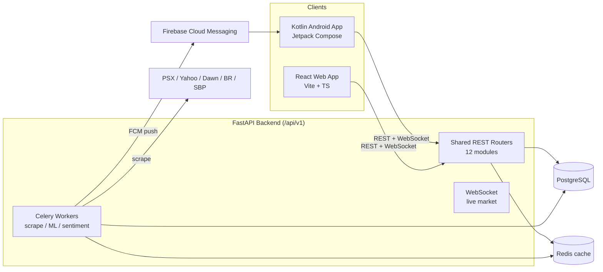
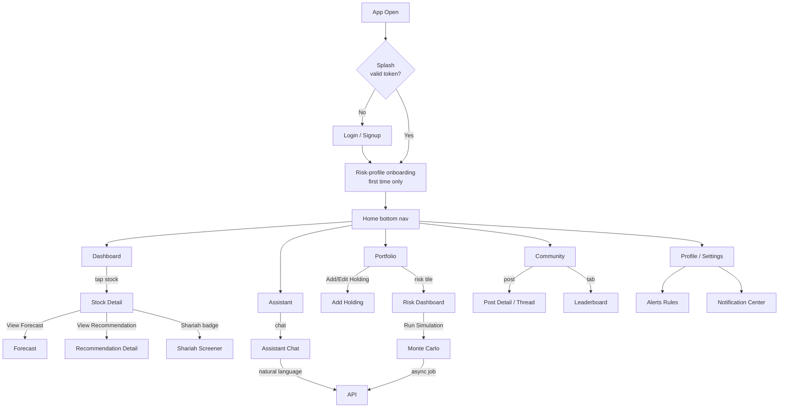

# Basarat — Project Overview
### Trade Recommendation & Assistance System for PSX (Pakistan Stock Exchange)

**Version:** 1.1 | **FYP Track:** Trade Recommendation & Assistance System | **Supervisor:** Dr. Faheem Ullah

---

## 1. Project Vision

**Basarat** (بصارت — "insight/foresight") is a full-stack trade recommendation and assistance system for the Pakistan Stock Exchange (PSX). It is not a guaranteed-return trading robot — it is a **decision-support and learning platform** that combines market data, technical analysis, GRU-based ML forecasting, risk analytics, sentiment intelligence, Shariah compliance screening, a community trading hub, and a personal AI assistant into one coherent product.

The system surfaces **live, explainable, and honest** information: every forecast shows a confidence score, every recommendation explains *why*, every risk metric identifies its method, and every news article links out to its source. AI outputs are informational, never presented as guaranteed financial advice (per the project's stated non-advisory positioning).

---

## 2. Problem Statement

Retail investors on the Pakistan Stock Exchange face significant barriers:

- **Fragmented data** — prices, news, fundamentals, and forecasts live in disconnected places.
- **Low ML accessibility** — AI-driven forecasting, risk simulation (VaR/CVaR/Monte Carlo), and sentiment analysis require domain expertise most retail investors lack.
- **Trust deficit** — forecasts are rarely shown with confidence scores or "predicted vs. actual" history, so users cannot tell how reliable signals are.
- **Compliance gap** — Shariah compliance (AAOIFI/SECP criteria) and purification calculations are complex and rarely accessible in an integrated tool.

Basarat consolidates these capabilities into **one shared backend** consumed identically by a **React web app** and a **Kotlin/Jetpack Compose Android app** (full parity), built for a 3-person FYP team delivering 12 integrated modules.

---

## 3. Key Decisions & Rationale (locked in v1.1)

| Original (proposal) | Final decision | Rationale |
|---|---|---|
| Node.js + FastAPI | **FastAPI only** | ML (TensorFlow), NLP (FinBERT), AI Assistant (LangChain) are Python-native. One backend = one auth system, one DB layer, no inter-service calls. |
| Next.js | **React + Vite** | No SSR/SEO need — it's an authenticated dashboard. Avoids a second backend hidden in the web framework. |
| (missing) | **Celery + Redis** (APScheduler fallback) | Scraping, GRU inference, sentiment scoring run on schedules independent of the request/response cycle. |
| (missing) | **Firebase Cloud Messaging (FCM)** | Push delivery for Android; web uses in-app + optional browser push later. |
| (missing) | **Docker Compose** (single VM) | FastAPI + Postgres + Redis + Celery worker; keeps ops simple for a 3-person team. |
| (missing) | **GitHub Actions** (lint + test on PR) | Minimum guardrail before supervisor demos. |

**Locked assumption:** one FastAPI backend, versioned at `/api/v1/`, consumed identically by React (web) and Kotlin (Android), with full 12-module parity on both clients.

---

## 4. Target Users & Personas

| Persona | Needs | How Basarat serves them |
|---|---|---|
| **Retail / beginner investor** | Understand basics, manage first holdings, avoid obvious risks | Risk-profile onboarding, plain-language fundamentals, Shariah screener, community feed |
| **Active/trading-oriented user** | Live market, technicals, alert rules, quick buy/sell signals | Live dashboard, candlestick charts + indicators, GRU forecasts, price/forecast/risk alerts |
| **Compliance-conscious investor** | Trade within Shariah bounds | Shariah screener (AAOIFI/SECP), purification calculator, KMI-30 list |
| **Research/learning user** | Verify model honesty | "Predicted vs. actual" history, explainable recommendations, confidence scores |

---

## 5. Scope

### In scope
- Live market dashboard (indices, sector heatmap, gainers/losers, volume spikes)
- Stock analysis (OHLCV charts, technical indicators, fundamentals, search)
- GRU-based price forecasting (1D/1W/1M horizons) with confidence + prediction history
- Personalized BUY/SELL/HOLD recommendation engine (explainable)
- Portfolio management with P&L and sector allocation
- Risk analytics (VaR/CVaR, Monte Carlo, stress tests) + sentiment (FinBERT)
- News & events intelligence (Pakistani sources, FinBERT sentiment, event calendar)
- Alerts & notifications (rule-based, FCM push, deep-linking)
- Community trading hub (posts, votes, comments, leaderboard)
- Shariah compliance screener + KMI-30 + purification calculator
- Personal AI assistant (LangChain agent grounded in live data)

### Out of scope (for this FYP)
- Production/cloud deployment, CI/CD deploy pipeline
- Self-hosting an LLM (uses a hosted API for the assistant)
- Full copyrighted news article bodies (summaries + links only, for ToS/copyright)
- Regulation as a licensed investment advisor (in-app disclaimer required)

> **Locked deployment note:** Docker here is for **local dev consistency** only — production deployment is explicitly deferred.

---

## 6. High-Level System Landscape

---

## 7. The 12 Modules

| # | Module | Track | One-line description |
|---|---|---|---|
| 1 | User Management (Auth, Profile, Risk Profile) | Full-Stack | Auth, JWT, risk-profile onboarding, notification prefs, device tokens |
| 2 | Market Dashboard | Backend | Live indices, sector heatmap, gainers/losers, volume spikes |
| 3 | Stock Analysis | Frontend/UX | Search, candlestick charts, technical indicators, fundamentals |
| 4 | ML Forecasting (GRU) | Full-Stack | Bullish/bearish/sideways + confidence per horizon |
| 5 | Recommendation Engine | Full-Stack | Explainable BUY/SELL/HOLD signals with target/stop-loss |
| 6 | Portfolio Management | Backend | Holdings, P&L, sector allocation |
| 7 | Risk & Sentiment Analytics | Shared | VaR/CVaR, Monte Carlo, stress tests, FinBERT sentiment |
| 8 | News & Events Intelligence | Backend | PSX/SECP/SBP/BR/Dawn pipeline, content-hash dedup, symbol tagging, event classification, FinBERT sentiment, deterministic impact scoring, market-aware scheduling |
| 9 | Alerts & Notifications | Shared | Alert rules, notification center, FCM push |
| 10 | Community Trading Hub | Frontend/UX | Feed, posts, votes, comments, leaderboard |
| 11 | Shariah Compliance Screener | Backend | AAOIFI/SECP screening, purification, KMI-30 |
| 12 | Personal AI Assistant | Full-Stack | LangChain agent grounded in live module data |

---

## 8. End-to-End User Flow

---

## 9. Clients — Full Parity

Every screen decision is validated against this rule set (from Execution Document Section 4):

1. **New screen** if it's a distinct user goal reached via navigation (own route in the NavHost).
2. **Component/section within a screen** if it's a sub-view of the same goal (e.g. Chart and Fundamentals are **tabs** inside one Stock Detail screen).
3. **Bottom sheet/dialog** for short interruptive actions returning to the same context.
4. **Reusable component** the moment a pattern appears in 2+ modules. Build these shared from day one: `StockRow`, `SignalBadge`, `SentimentChip`, `LoadingState`/`ErrorState`/`EmptyState`, `PriceChart` (candlestick).

Both React and Android consume the identical shared API — no platform-specific business logic.

---

## 10. Success Criteria

- Dashboard first paint < 2s, live tick delivery < 1s end-to-end.
- Both clients render identical data for identical API responses.
- Every AI-generated number shows a confidence/methodology indicator.
- End-to-end alert flow works (rule created → condition met → push delivered → deep-link opens correct screen).
- GRU model reports an honest baseline accuracy on held-out PSX data (documented, not hidden).
- Shariah thresholds match cited AAOIFI/SECP standards (verifiable).
- In-app disclaimer that the system is not a licensed investment advisor.

---
*Derived from the Basarat Execution Document v1.1 — Tech Stack Decisions (0), System Architecture & User Flow (1), and Modules (6–12).*
