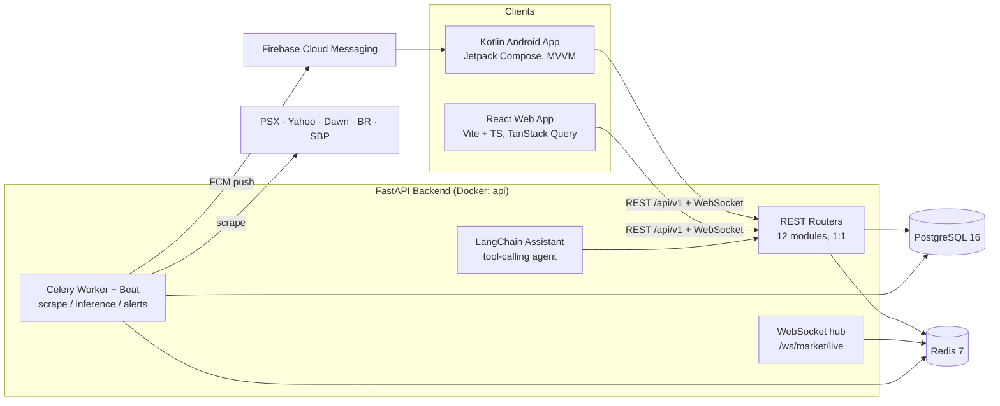
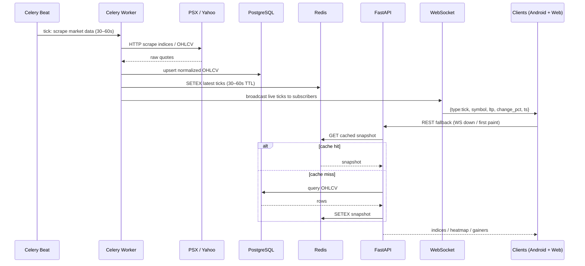
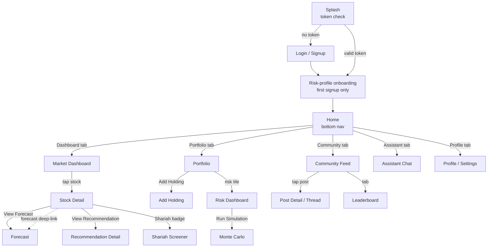

# Basarat — System Architecture
### Trade Recommendation & Assistance System for PSX

**Version:** 1.1 | **Document:** System Architecture | **Source of truth:** Basarat Execution Document — §0/§0.1/§1/§4/§5

---

## 1. Architecture Philosophy

One **shared, stateless FastAPI backend** at `/api/v1/` serves **both clients identically**. There is exactly one auth system, one database, one cache, and one ML pipeline. The React (web) and Kotlin (Android) clients have **full parity** — same routes, same payloads, same business rules. No platform-specific logic lives in the backend; no business logic is duplicated client-side.

This architecture was locked for one overriding reason: **ML (TensorFlow/GRU), NLP (FinBERT/FinSent), and the AI assistant (LangChain) are all Python-native.** One Python backend eliminates inter-service calls and keeps a 3-person FYP tractable.

---

## 2. High-Level System Diagram

---

## 3. Container Topology (Docker Compose)

All local development runs through `docker-compose.yml` — five services behind one command (`docker compose up --build`):

| Service | Build / Image | Entrypoint | Role |
|---|---|---|---|
| `api` | local `Dockerfile` (Python 3.11-slim) | `uvicorn app.main:app --host 0.0.0.0 --port 8000 --reload` | FastAPI application; live-reloads via mounted source |
| `db` | `postgres:16` | default | PostgreSQL with named volume for persistence |
| `redis` | `redis:7-alpine` | default | General cache (Section 2 standards) + Celery broker |
| `celery_worker` | same build as `api` | `celery -A app.celery_app worker` | Scraping / ML inference / sentiment / alert jobs |
| `celery_beat` | same build as `api` | `celery -A app.celery_app beat` | Schedules market refresh, forecast retrain, news scrape |

**Dev workflow highlights**
- Inside containers, services talk via **service names** (`db`, `redis`), never `localhost` — e.g. `postgresql://user:pass@db:5432/basarat`, `redis://redis:6379/0`.
- `.env` (git-ignored) holds real secrets; `.env.example` (committed) holds placeholders so the team converges on one config shape.
- Schema drift is handled by **Alembic**: `docker compose exec api alembic upgrade head`.
- The `api` service bind-mounts source and runs with `--reload` so edits reflect immediately — no rebuild per change.

**Locked note:** Docker here is for **local dev consistency only**. Production/cloud deployment is explicitly out of FYP scope (§0.1).

---

## 4. Data Flow — Market Data (the "spine")

Celery beat schedules scraping → OHLCV normalized into Postgres → Redis caches latest ticks → FastAPI serves REST snapshots + WebSocket live push → both clients render from the identical payload shape.

**Failure rule (NFR-9):** if WebSocket fails 3 consecutive times, clients fall back to REST polling; the dashboard remains functional, just not live.

---

## 5. Caching Strategy (Redis)

Redis is a **general response cache** covering every expensive-to-compute or expensive-to-scrape endpoint. Rule of thumb from §2: *if recomputing on every request means re-running indicator math, re-scraping a source, or re-invoking a model — cache it; serve from Redis until the next scheduled refresh.*

| Data | Cache key | TTL | Refreshed by |
|---|---|---|---|
| Market indices / heatmap / gainers / spikes | `market:indices` · `market:heatmap` · `market:gainers` | 30–60s | Celery job overwrites |
| Technical indicators / symbol | `indicators:{symbol}:{period}` | 5 min | Cache-miss recompute or scheduled job |
| Fundamentals / symbol | `fundamentals:{symbol}` | 24h | Quarterly source data |
| GRU forecast / symbol+horizon | `forecast:{symbol}:{horizon}` | 1h | Celery inference job writes result |
| Recommendation / symbol+risk | `recommendation:{symbol}:{risk_tolerance}` | 1h | Recomputed alongside forecast refresh |
| Sentiment / symbol | `sentiment:{symbol}` | 1h | Sentiment aggregation job |
| Shariah screening / symbol | `shariah:{symbol}` | 24h | Quarterly/manual refresh |
| VaR/CVaR/stress per portfolio | `risk:{user_id}:var` · `risk:{user_id}:stress` | 5–15 min | Invalidate on holdings change |
| Monte Carlo result | `montecarlo:{job_id}` | 1h | Written once when async job completes |
| News feed page | `news:feed:{page}:{filters_hash}` | 5–10 min | New articles invalidate pages |

**Invalidation rule (§2):**
- Derived from **user-mutable data** (portfolio holdings, alert rules) → invalidated **on write**, not just TTL.
- Derived from **market/external data** (prices, news, forecasts) → relies on **TTL + scheduled overwrite**, never invalidated by user action.

**Endpoint pattern:** thin handler → `cache.get(key)` → on hit return; on miss run real compute → write back to cache → return. Implement once, reuse across every module (note in §2).

---

## 6. User Flow / Screen Map (single shared navigation contract)

**Screen-creation rule (§4) — re-applies everywhere:**
1. **New screen** = distinct user goal reachable via navigation (own back-stack entry).
2. **Component/section** = sub-view of the same goal (e.g. "Chart" and "Fundamentals" are **tabs**, not routes).
3. **Bottom sheet / dialog** for short interruptive actions that return to the same context (filter picker, confirm-delete, quick vote).
4. **Reusable component** the moment a pattern appears 2+ times — build from day one: `StockRow`, `SignalBadge` (BUY/SELL/HOLD), `SentimentChip`, `LoadingState`/`ErrorState`/`EmptyState`, `PriceChart` (candlestick).

---

## 7. Client Architectures

### 7.1 Android (Kotlin) — MVVM + Repository, single-activity, Compose Navigation

| Layer | Technology |
|---|---|
| UI | Jetpack Compose (Material 3) |
| Navigation | Compose Navigation — one `NavHost`, routes per module |
| State | `ViewModel` + `StateFlow`, single `UiState` sealed class: `Loading / Success(data) / Error(message) / Empty` |
| Networking | Retrofit + OkHttp (auth interceptor auto-refresh), Moshi/kotlinx-serialization |
| Local data | Room (offline portfolio/watchlist/chat cache), DataStore (tokens, prefs) |
| DI | Hilt |
| Real-time | OkHttp WebSocket → `Flow<Tick>` |
| Push | FCM, token via `/devices/register` |
| Charts | Vico / MPAndroidChart (candlestick + line) |

### 7.2 React Web — feature folders, Vite, one page per module route

| Layer | Technology |
|---|---|
| Build | Vite + TypeScript |
| Routing | React Router v6 — mirrors Android routes 1:1 |
| State | TanStack Query (server/cache) + Zustand (client: auth, theme) |
| Forms | React Hook Form + Zod |
| Charts | Recharts / Lightweight-Charts (TradingView) for candlesticks |
| Real-time | native `WebSocket` in `useMarketTicker(symbols)` hook |
| Styling | Tailwind CSS |
| Auth | JWT in memory + httpOnly refresh cookie, Axios interceptor for silent refresh |

**Parity contract:** identical API responses → identical rendered data on both clients. No platform-specific business logic, ever (NFR-10).

---

## 8. Background Processing (Celery)

| Job | Schedule (Celery beat) | Writes |
|---|---|---|
| `scrape_market` | every 30–60s (market hours) | OHLCV + indices → Postgres; ticks → Redis |
| `scrape_news` | every 5–10 min | news_articles (summaries only), event calendar |
| `run_forecast_inference` | hourly | forecasts + prediction_history (predicted vs actual trust data) |
| `compute_sentiment` | hourly | sentiment_scores (FinBERT over news/community) |
| `evaluate_alert_rules` | continuous/on-event | notifications → FCM dispatch |
| `retrain_gru_model` | weekly | model version artifacts |

Monte Carlo (Module 7) is triggered as an **async job** — returns `job_id` immediately, UI polls `GET /risk/monte-carlo/{job_id}`. Heavy computation never blocks the request thread (NFR-2) nor the UI thread.

---

## 9. Non-Functional Architecture Guarantees

- **NFR-1:** dashboard first paint < 2s (cached snapshot); live tick end-to-end < 1s.
- **NFR-3:** bcrypt password hashing; 15-min access / 7-day rotating refresh; refresh-token blacklist on logout (Redis).
- **NFR-6:** backend stateless — session/queue state in Redis so it can scale horizontally later.
- **NFR-9:** scraping pipeline survives source downtime/format changes without crashing ingestion (data-quality).
- **NFR-7/8:** every AI number carries confidence/methodology; explicit non-advisory disclaimer.

---
*Derived from the Basarat Execution Document — Sections 0 (Tech Stack), 0.1 (Docker), 1 (Architecture & User Flow), 2 (Caching Strategy), 4 (Android), 5 (React).*
