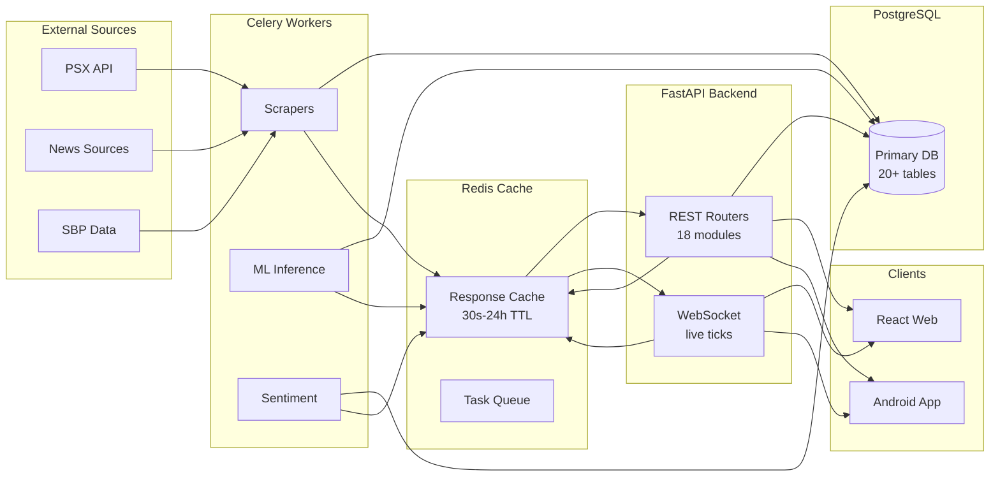

# Basarat — Database Design
### Trade Recommendation & Assistance System for PSX

**Version:** 1.1 | **Scope:** Logical + Physical schema for the single shared FastAPI backend

---

## Table of Contents

1. [Design Philosophy](#1-design-philosophy)
2. [Entity Overview](#2-entity-overview)
3. [Data Flow Architecture](#3-data-flow-architecture)
4. [Conceptual ERD](#4-conceptual-erd)
5. [Logical Schema — Groups & Tables](#5-logical-schema--groups--tables)
6. [Indexing & Performance Strategy](#6-indexing--performance-strategy)
7. [Migrations & Evolution](#7-migrations--evolution)

---

## 1. Design Philosophy

The database is the single source of truth shared by all 12 modules. Three governing rules, from the project Execution Document (Section 9):

1. **Every user-owned table carries `user_id`** — nothing user-specific is ever global.
2. **Every stock-related table references `symbol` as a foreign key back to a single `stocks` master table** — normalized from day one. This is what keeps cross-module joins (e.g. portfolio risk using live prices) clean.
3. **Live/derived data never replaces source-of-truth data** — Redis holds cacheable/live ticks (Section 3), while PostgreSQL persists durable records (prices, forecasts, holdings, posts, notifications). Celery jobs write, the API reads, Redis fronts the expensive reads.

---

## 2. Entity Overview

The schema is organized into **domain groups**. Each group maps to one or more modules.

```
┌──────────────────────────────────────────────────────────────────────────────┐
│                          USERS & AUTH (Module 1)                             │
│  users · risk_profiles · notification_preferences · devices                 │
└──────────────────────────────────────────────────────────────────────────────┘
┌──────────────────────────────────────────────────────────────────────────────┐
│                         MARKET CORE (Modules 2–4)                            │
│  stocks · price_history (OHLCV) · fundamentals · technical_indicators_cache  │
│  forecasts · prediction_history                                              │
└──────────────────────────────────────────────────────────────────────────────┘
┌──────────────────────────────────────────────────────────────────────────────┐
│                       DECISIONS & ENGAGEMENT (Modules 5–6)                   │
│  recommendations · portfolio_holdings                                        │
└──────────────────────────────────────────────────────────────────────────────┘
┌──────────────────────────────────────────────────────────────────────────────┐
│               RISK & INTELLIGENCE (Modules 7–8)                              │
│  risk_snapshots · monte_carlo_jobs · sentiment_scores · news_articles ·      │
│  calendar_events                                                             │
└──────────────────────────────────────────────────────────────────────────────┘
┌──────────────────────────────────────────────────────────────────────────────┐
│                  ALERTS & NOTIFICATIONS (Module 9)                           │
│  alert_rules · notifications                                                 │
└──────────────────────────────────────────────────────────────────────────────┘
┌──────────────────────────────────────────────────────────────────────────────┐
│          COMMUNITY & COMPLIANCE (Modules 10–11)                              │
│  community_posts · community_votes · community_comments ·                    │
│  leaderboard_snapshots · shariah_screenings · purification_records           │
└──────────────────────────────────────────────────────────────────────────────┘
┌──────────────────────────────────────────────────────────────────────────────┐
│                     PERSONAL ASSISTANT (Module 12)                           │
│  assistant_conversations · assistant_messages                                │
└──────────────────────────────────────────────────────────────────────────────┘
```

---

## 3. Data Flow Architecture



### Read/Write Patterns

| Operation | Path | Cache Behavior |
|-----------|------|---------------|
| **Market data read** | Celery writes → PG + Redis | REST reads Redis (30s TTL) |
| **Forecast read** | Celery writes → PG + Redis | REST reads Redis (1h TTL) |
| **Portfolio write** | API → PG, invalidates Redis | Cache invalidates on write |
| **Alert evaluation** | Celery reads rules + ticks | Push to FCM on match |
| **News ingestion** | Celery writes → PG + Redis | 5-10min TTL |

---

## 4. Conceptual ERD

```mermaid
erDiagram
    USERS ||--o{ RISK_PROFILES : "has a"
    USERS ||--o{ NOTIFICATION_PREFERENCES : "configures"
    USERS ||--o{ DEVICES : "owns"
    USERS ||--o{ PORTFOLIO_HOLDINGS : "holds"
    USERS ||--o{ ALERT_RULES : "creates"
    USERS ||--o{ NOTIFICATIONS : "receives"
    USERS ||--o{ COMMUNITY_POSTS : "authors"
    USERS ||--o{ ASSISTANT_CONVERSATIONS : "runs"

    STOCKS ||--o{ PRICE_HISTORY : "has OHLCV for"
    STOCKS ||--o{ FUNDAMENTALS : "described by"
    STOCKS ||--o{ FORECASTS : "predicted in"
    STOCKS ||--o{ SENTIMENT_SCORES : "scored in"
    STOCKS ||--o{ NEWS_ARTICLES : "tagged by"
    STOCKS ||--o{ SHARIAH_SCREENINGS : "screened in"
    STOCKS ||--o{ RECOMMENDATIONS : "signaled in"
    STOCKS ||--o{ COMMUNITY_POSTS : "discussed as"

    FORECASTS ||--o{ PREDICTION_HISTORY : "measured against"
    PORTFOLIO_HOLDINGS ||--o{ RISK_SNAPSHOTS : "feeds"
    MONTE_CARLO_JOBS ||--o{ RISK_SNAPSHOTS : "produces"
    NEWS_ARTICLES }o--o{ STOCKS : "related_symbols"
    MARKET_EVENTS }o--o| STOCKS : "optionally targets"
    MARKET_EVENTS }o--o| NEWS_ARTICLES : "linked article"
    PORTFOLIO_HOLDINGS }o--|| STOCKS : "references"
    ALERT_RULES }o--o| STOCKS : "optionally targets"
    COMMUNITY_POSTS ||--o{ COMMUNITY_VOTES : "receives"
    COMMUNITY_POSTS ||--o{ COMMUNITY_COMMENTS : "threaded"

    USERS {
        bigint id PK
        string email UK
        string hashed_password
        string full_name
        string phone "optional"
        enum risk_tolerance "Conservative/Moderate/Aggressive"
        json sector_preferences
        enum investment_horizon
        timestamp created_at
    }
    RISK_PROFILES {
        bigint id PK
        bigint user_id FK
        enum risk_tolerance
        json sector_preferences
        enum investment_horizon
        timestamp updated_at
    }
    STOCKS {
        varchar symbol PK
        string name
        string sector
        boolean is_kmi30
        date listed_at
    }
    PRICE_HISTORY {
        bigint id PK
        varchar symbol FK
        bigint datetime_idx
        float open
        float high
        float low
        float close
        float volume
    }
    FUNDAMENTALS {
        bigint id PK
        varchar symbol FK
        float eps
        float pe_ratio
        float roe
        float debt_to_equity
        float dividend_yield
        timestamp as_of
    }
    FORECASTS {
        bigint id PK
        varchar symbol FK
        enum horizon "1D/1W/1M"
        enum direction "bullish/bearish/sideways"
        float bullish_pct
        float bearish_pct
        float sideways_pct
        float confidence
        timestamp generated_at
    }
    PREDICTION_HISTORY {
        bigint id PK
        bigint forecast_id FK
        varchar symbol FK
        enum predicted_direction
        enum actual_direction
        boolean was_correct
        timestamp realized_at
    }
    RECOMMENDATIONS {
        bigint id PK
        bigint user_id FK
        varchar symbol FK
        enum signal "BUY/SELL/HOLD"
        float target_price
        float stop_loss
        float confidence
        json reasoning
        timestamp generated_at
    }
    PORTFOLIO_HOLDINGS {
        bigint id PK
        bigint user_id FK
        varchar symbol FK
        float quantity
        float avg_buy_price
        date purchase_date
    }
    RISK_SNAPSHOTS {
        bigint id PK
        bigint user_id FK
        float var_95
        float cvar_95
        float sharpe
        float max_drawdown
        timestamp as_of
    }
    MONTE_CARLO_JOBS {
        varchar job_id PK
        bigint user_id FK
        int num_simulations
        int horizon_days
        enum status "queued/running/done/failed"
        json result "distribution + percentiles"
        timestamp created_at
    }
    NEWS_ARTICLES {
        bigint id PK
        string title
        string source "human-readable source name"
        enum source_type "psx/secp/sbp/financial_media/general_news"
        string summary
        string url UK
        string content_hash UK "SHA-256 of normalised title+URL"
        timestamp published_at
        timestamp created_at
        timestamp updated_at
        json symbols "FK refs to stocks.symbol"
        json company_names
        string sector
        enum event_type "earnings/dividend/corporate_action/monetary_policy/regulatory_action/market_commentary/general_news/interest_rate/inflation/gdp"
        enum sentiment_label "positive/negative/neutral"
        float sentiment_score "FinBERT confidence 0.0–1.0"
        int impact_score "deterministic 0–100"
    }
    SENTIMENT_SCORES {
        bigint id PK
        varchar symbol FK
        float score
        string label
        int article_count
        timestamp window_start
    }
    MARKET_EVENTS {
        bigint id PK
        enum event_type "earnings/dividend/monetary_policy/regulatory_action/corporate_action/general_news"
        varchar symbol "nullable"
        string title
        text description
        date event_date
        time event_time "nullable"
        string source "human-readable source"
        string source_url
        enum source_type "psx/secp/sbp/financial_media/general_news"
        enum sentiment_label "positive/negative/neutral"
        float sentiment_score
        int impact_score
        bigint news_article_id FK "nullable, linked article"
        timestamp created_at
        timestamp updated_at
    }
    CALENDAR_EVENTS {
        bigint id PK
        enum event_type "earnings/dividend/sbp"
        varchar symbol "nullable"
        string title
        date event_date
        string description
    }
    ALERT_RULES {
        bigint id PK
        bigint user_id FK
        enum type "price/forecast/news/risk"
        varchar symbol "nullable"
        string condition
        float threshold_value
        json channels "push/email/in-app"
        boolean enabled
    }
    NOTIFICATIONS {
        bigint id PK
        bigint user_id FK
        string title
        string body
        enum type
        boolean read
        json deep_link
        timestamp created_at
    }
    DEVICES {
        bigint id PK
        bigint user_id FK
        string fcm_token
        enum platform "android/web"
        timestamp registered_at
    }
    COMMUNITY_POSTS {
        bigint id PK
        bigint user_id FK
        varchar symbol FK
        enum stance "bullish/bearish"
        string rationale_text
        int vote_count
        timestamp created_at
    }
    COMMUNITY_VOTES {
        bigint id PK
        bigint user_id FK
        bigint post_id FK
        enum direction "up/down"
    }
    COMMUNITY_COMMENTS {
        bigint id PK
        bigint user_id FK
        bigint post_id FK
        bigint parent_id "nullable, threaded"
        string text
        timestamp created_at
    }
    SHARIAH_SCREENINGS {
        bigint id PK
        varchar symbol FK
        boolean business_compliant
        boolean debt_ratio_pass
        boolean interest_income_pass
        boolean receivables_pass
        enum overall "Compliant/Questionable/Non-Compliant"
        float overall_score
        timestamp as_of
    }
    PURIFICATION_RECORDS {
        bigint id PK
        bigint user_id FK
        varchar symbol FK
        float holding_qty
        float holding_value
        float purification_amount
        text method_note
    }
    ASSISTANT_CONVERSATIONS {
        bigint id PK
        bigint user_id FK
        string title
        timestamp last_message_at
    }
    ASSISTANT_MESSAGES {
        bigint id PK
        bigint conversation_id FK
        enum role "user/assistant"
        string content
        json tool_calls "if any"
        timestamp created_at
    }
```



---

## 5. Logical Schema — Groups & Tables

### 4.1 Users & Authentication (Module 1)

| Table | Key columns | Notes |
|---|---|---|
| `users` | `email (unique)`, `hashed_password` (bcrypt), `full_name`, `phone?`, `created_at` | Canonical identity table |
| `risk_profiles` | `user_id`, `risk_tolerance` (Conservative/Moderate/Aggressive), `sector_preferences (array)`, `investment_horizon` | Consumed by Recommendation Engine (M5) + Risk Analytics (M7) |
| `notification_preferences` | `user_id`, `channels[]` (push/email/in-app), `categories[]` (price/forecast/news/risk) | Per-module user prefs |
| `devices` | `user_id`, `fcm_token`, `platform` | FCM token registry for push (Module 9) |

### 4.2 Market Core (Modules 2–4)

| Table | Key columns | Notes |
|---|---|---|
| `stocks` | `symbol (PK)`, `name`, `sector` | Master reference for all stock-related FKs |
| `price_history` | `symbol FK`, `datetime_idx`, `open/high/low/close`, `volume` | OHLCV, multi-range queries (1D/1W/1M/1Y) |
| `fundamentals` | `symbol FK`, `eps`, `pe_ratio`, `roe`, `debt_to_equity`, `dividend_yield`, `as_of` | Scraped financials, quarterly refresh |
| `technical_indicators_cache` | `symbol FK`, `period`, json indicator series | Redis-backed cache per Section 2 strategy |
| `forecasts` | `symbol FK`, `horizon`, `direction`, `bullish/bearish/sideways_pct`, `confidence`, `generated_at` | GRU output (Module 4) |
| `prediction_history` | `forecast_id`, `predicted_direction`, `actual_direction`, `was_correct` | Feeds the "predicted vs actual" trust screen |

### 4.3 Decisions & Engagement (Modules 5–6)

| Table | Key columns | Notes |
|---|---|---|
| `recommendations` | `user_id`, `symbol FK`, `signal` (BUY/SELL/HOLD), `target_price`, `stop_loss`, `confidence`, `reasoning` | Personalized; from signal synthesis (M5) |
| `portfolio_holdings` | `user_id`, `symbol FK`, `quantity`, `avg_buy_price`, `purchase_date` | Individual positions (M6) |

### 4.4 Risk & Intelligence (Modules 7–8)

| Table | Key columns | Notes |
|---|---|---|
| `risk_snapshots` | `user_id`, `var_95`, `cvar_95`, `sharpe`, `max_drawdown`, `as_of` | Portfolio-level risk metrics (M7) |
| `monte_carlo_jobs` | `job_id (PK)`, `user_id`, `num_simulations`, `horizon_days`, `status`, `result` | Async simulation job state (M7) |
| `sentiment_scores` | `symbol FK`, `score`, `label`, `article_count`, `window_start` | Aggregated sentiment (M7/M8) |
| `news_articles` | `title`, `source`, `source_type` (psx/secp/sbp/financial_media/general_news), `summary`, `url (unique)`, `content_hash (unique)`, `published_at`, `symbols (JSON)`, `company_names (JSON)`, `sector`, `event_type`, `sentiment_label`, `sentiment_score`, `impact_score`, `created_at`, `updated_at` | Only summaries stored, not full bodies (copyright). Content hash deduplicates across sources. |
| `market_events` | `event_type`, `symbol?`, `title`, `description`, `event_date`, `event_time?`, `source`, `source_url`, `source_type`, `sentiment_label`, `sentiment_score`, `impact_score`, `news_article_id FK?`, `created_at`, `updated_at` | Extracted from news pipeline. Linked to source article when available. |
| `calendar_events` | `event_type` (earnings/dividend/sbp), `symbol?`, `event_date`, `description` | Events calendar (M8) |

### 4.5 Alerts & Notifications (Module 9)

| Table | Key columns | Notes |
|---|---|---|
| `alert_rules` | `user_id`, `type` (price/forecast/news/risk), `symbol?`, `condition`, `threshold_value`, `channels[]`, `enabled` | Rule engine (M9) |
| `notifications` | `user_id`, `title`, `body`, `type`, `read`, `deep_link`, `created_at` | Persisted inbox + push state |

### 4.6 Community & Compliance (Modules 10–11)

| Table | Key columns | Notes |
|---|---|---|
| `community_posts` | `user_id`, `symbol FK`, `stance` (bullish/bearish), `rationale_text`, `vote_count` | Trade-idea posts (M10) |
| `community_votes` | `user_id`, `post_id`, `direction` (up/down) | One vote per user per post |
| `community_comments` | `user_id`, `post_id`, `parent_id?`, `text` | Threaded discussion |
| `leaderboard_snapshots` | `user_id`, `accuracy_pct`, `engagement`, `period` | Weekly/monthly/all-time leaderboard (M10) |
| `shariah_screenings` | `symbol FK`, per-criterion pass flags, `overall`, `overall_score` | AAOIFI/SECP screener (M11) |
| `purification_records` | `user_id`, `symbol FK`, `holding_qty`, `holding_value`, `purification_amount`, `method_note` | Purification calculator (M11) |

### 4.7 Personal Assistant (Module 12)

| Table | Key columns | Notes |
|---|---|---|
| `assistant_conversations` | `user_id`, `title`, `last_message_at` | Conversation list |
| `assistant_messages` | `conversation_id FK`, `role` (user/assistant), `content`, `tool_calls?` | Full chat history (persists across restarts) |

---

## 6. Indexing & Performance Strategy

| Table | Index | Why |
|---|---|---|
| `price_history` | `(symbol, datetime_idx)` composite | All OHLCV range queries filter by symbol then time |
| `news_articles` | `published_at` + `related_symbols` (GIN) | Feed pagination + per-symbol news |
| `portfolio_holdings` | `(user_id, symbol)` | Holdings lookup + P&L aggregation |
| `forecasts` | `(symbol, horizon)` | Fast forecast fetch |
| `notification_preferences` / `alert_rules` | `user_id` | All user-scoped reads |
| `community_posts` | `(created_at)`, `vote_count` | Feed ordering + leaderboard |

**Caching layer (Redis):** expensive computations are cached and invalidated per the Global API strategy (Section 2 of the Execution Document):
- Market indices/heatmap/gainers/losers/spikes — TTL 30–60s, overwritten by Celery scheduler
- Technical indicators per symbol — TTL 5 min
- Fundamentals — TTL 24h
- GRU forecast / recommendations / sentiment — TTL 1h (recomputed on schedule)
- Shariah screening — TTL 24h
- VaR/stress-test risk metrics — TTL 5–15 min or invalidate on holdings change
- Monte Carlo result — TTL 1h, written once when async job completes

**Cache invalidation rule:** data derived from user-mutable sources (portfolio holdings, alert rules) invalidates **on write**. Data derived from market/external sources (prices, news, forecasts, sentiment) relies on **TTL + scheduled overwrite** — never invalidated by user action.

---

## 7. Migrations & Evolution

- **Alembic** manages all schema migrations; run via `docker compose exec api alembic upgrade head`.
- Approved starting entities are locked in **Phase 0**; the ERD above is the authoritative contract going forward.
- The full ERD is treated as a **living document** — refine/extend as modules are delivered, but never break the `symbol`-FK normalization rule.

---
*Derived from the Basarat Execution Document v1.1 (Section 9 — Database Entity Overview) and Global API & Data Standards (Section 2).*
