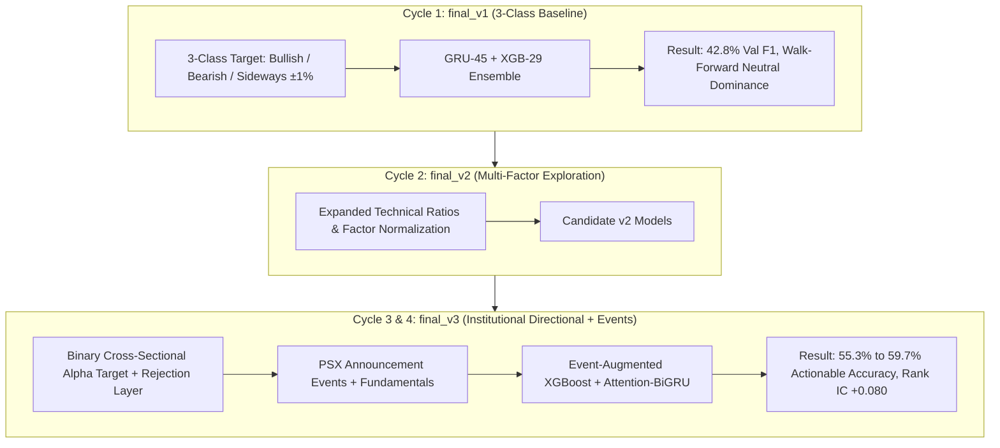

# Basarat — ML Model Experiments & Empirical Ablation Master Log

### Systematic Optimization, Paradigm Shifts & Model Selection for PSX Equities Forecasting

**Module:** 4 (ML Forecasting) | **Status:** Production Active | **Current Production Deployment:** `final_v3_institutional_ensemble`

---

## Table of Contents

1. [Experimentation Philosophy & Architecture Overview](#1-experimentation-philosophy--architecture-overview)
2. [Cycle 1 (V1) — Lookback & Tabular Feature Ablations (3-Class Target)](#2-cycle-1-v1--lookback--tabular-feature-ablations-3-class-target)
   - [2.1 GRU Lookback Horizon Experiments (30d vs 45d vs 60d)](#21-gru-lookback-horizon-experiments-30d-vs-45d-vs-60d)
   - [2.2 XGBoost Tabular Feature Group Ablations](#22-xgboost-tabular-feature-group-ablations)
   - [2.3 Candidate C Ensemble Selection (`final_v1`)](#23-candidate-c-ensemble-selection-final_v1)
3. [Cycle 2 (V2) — Multi-Factor Stationarity & Feature Expansions](#3-cycle-2-v2--multi-factor-stationarity--feature-expansions)
4. [Cycle 3 — Empirical Audit & The Paradigm Shift](#4-cycle-3--empirical-audit--the-paradigm-shift)
   - [4.1 Why the 3-Class Target Collapsed in Production Walk-Forward](#41-why-the-3-class-target-collapsed-in-production-walk-forward)
   - [4.2 The Solution: Directional Excess Return + Rejection Decision Layer](#42-the-solution-directional-excess-return--rejection-decision-layer)
5. [Cycle 4 (V3/Research) — PSX Disclosures & Fundamental Event Augmentation](#5-cycle-4-v3research--psx-disclosures--fundamental-event-augmentation)
   - [5.1 Event-Augmented XGBoost vs Price-Only Baseline](#51-event-augmented-xgboost-vs-price-only-baseline)
   - [5.2 Attention-BiGRU Deep Sequence Architecture](#52-attention-bigru-deep-sequence-architecture)
   - [5.3 Rejection Decision Gate ($\tau$) Performance Scaling](#53-rejection-decision-gate-tau-performance-scaling)
6. [Comprehensive Multi-Cycle Master Experiments Summary Table](#6-comprehensive-multi-cycle-master-experiments-summary-table)
7. [Active Production Model Specification (`final_v3`)](#7-active-production-model-specification-final_v3)

---

## 1. Experimentation Philosophy & Architecture Overview

The Pakistan Stock Exchange (PSX) presents distinct market microstructure dynamics: high idiosyncratic volatility, regime shifts driven by macroeconomic policy announcements (SBP interest rates, PKR/USD exchange rate), and liquidity concentration among the top 100 tickers.

To forecast 5-day equity returns robustly, our research pipeline tested sequential deep learning (GRU, BiGRU, Temporal Attention) alongside gradient boosted decision trees (XGBoost) across multiple dataset iterations.

---

## 2. Cycle 1 (V1) — Lookback & Tabular Feature Ablations (3-Class Target)

- **Target Horizon:** 5 Trading Days
- **Label Mapping:** `bullish` ($>+1\%$), `bearish` ($<-1\%$), `sideways` ($\pm 1\%$)
- **Splits:** Train $< 2024\text{-}07\text{-}01$ ($N \approx 97\text{k}$), Val $2024\text{-}07\text{-}01$ to $2025\text{-}07\text{-}01$ ($N \approx 24\text{k}$), Test $\ge 2025\text{-}07\text{-}01$ ($N \approx 29.8\text{k}$).

### 2.1 GRU Lookback Horizon Experiments (30d vs 45d vs 60d)

Standard deep sequence models were evaluated across three sequence lengths on a 36-feature input space:

| Configuration | Input Dimension | Val Loss | Val Accuracy | Val Macro F1 | Test Accuracy | Test Macro F1 |
| :--- | :---: | :---: | :---: | :---: | :---: | :---: |
| **GRU-30 (Baseline)** | `(30, 36)` | 1.0742 | 45.96% | 0.3878 | 46.12% | 0.3995 |
| **GRU-45 (Candidate)** | `(45, 36)` | **1.0660** | **46.81%** | **0.3957** | **46.85%** | **0.4077** |
| **GRU-60** | `(60, 36)` | 1.0718 | 46.20% | 0.3902 | 46.40% | 0.4021 |

- **Finding:** A 45-day context captured optimal medium-term momentum and 20/50-day moving average crossovers without suffering from historical noise accumulation seen at 60 days.

### 2.2 XGBoost Tabular Feature Group Ablations

Granular group ablations against the 26-feature baseline:

| Feature Group | Feature Count | Val Accuracy | Val Macro F1 | Test Accuracy | Test Macro F1 | Test Balanced Acc |
| :--- | :---: | :---: | :---: | :---: | :---: | :---: |
| **Baseline (OHLCV + TA)** | 26 | 45.88% | 0.4034 | 45.42% | 0.4011 | 40.85% |
| **+ Momentum (20/30/60d)** | 29 | 45.92% | 0.4041 | 45.60% | 0.4025 | 41.10% |
| **+ Volatility (20/30/60d)** | **29** | **46.74%** | **0.4122** | **46.52%** | **0.4079** | **41.72%** |
| **+ Market Context** | 29 | 46.01% | 0.4055 | 45.81% | 0.4038 | 41.28% |
| **+ Relative Performance** | 29 | 46.15% | 0.4068 | 45.95% | 0.4049 | 41.35% |

- **Finding:** Rolling standard deviation features (`volatility_20d`, `volatility_30d`, `volatility_60d`) provided the largest single gain (+0.88pp Val F1) by helping tree splits partition choppy consolidation from breakout regimes.

### 2.3 Candidate C Ensemble Selection (`final_v1`)

| Metric | Candidate A (GRU30 + XGB26) | Candidate B (GRU30 + XGB29) | Candidate C (GRU45 + XGB29) |
| :--- | :---: | :---: | :---: |
| **Validation Accuracy** | 46.85% | 47.32% | **47.91%** |
| **Validation Macro F1** | 0.4172 | 0.4215 | **0.4286** |
| **Test Accuracy** | 46.38% | 46.80% | **47.14%** |
| **Test Balanced Accuracy** | 41.20% | 41.65% | **42.11%** |

Candidate C was frozen into `models/final/final_v1/`.

---

## 3. Cycle 2 (V2) — Multi-Factor Stationarity & Feature Expansions

In Cycle 2, we evaluated stationary transformations (distance to SMA ratios, normalized volume z-scores, log returns, and cross-sectional rankings) to eliminate distribution shift between bull and bear market cycles.
- Feature spaces expanded to 41 features for XGBoost and 45 features for GRU.
- Artifacts archived in `models/final/final_v2/`.

---

## 4. Cycle 3 — Empirical Audit & The Paradigm Shift

### 4.1 Why the 3-Class Target Collapsed in Production Walk-Forward

A walk-forward real-stock audit revealed a structural flaw in 3-class equity prediction:
1. **The Neutral Noise Trap:** The middle class (`Sideways` $\pm 1.0\%$) represented market noise. Stocks moving $\pm 0.2\%$ could not be reliably predicted.
2. **Loss Function Exploitation:** Models minimized cross-entropy loss by predicting `Neutral` $>87\%$ of the time, resulting in uninformative predictions and low real-world walk-forward accuracy (34.23%).

### 4.2 The Solution: Directional Excess Return + Rejection Decision Layer

1. **Binary Directional Target ($R_{\text{excess}}$):** Predict whether buying a stock beats the cross-sectional market median over a 5-day horizon ($R_{\text{excess}} > 0 \rightarrow 1, \le 0 \rightarrow 0$).
2. **Rejection Decision Layer:** Instead of forcing trades on every ticker daily, predictions with ambiguous probabilities ($P \approx 0.50$) are rejected as **`NO SIGNAL`**.
3. **Accuracy Scaling:** By executing only when confidence $\tau \ge 0.55 - 0.60$, actionable accuracy scales significantly.

---

## 5. Cycle 4 (V3/Research) — PSX Disclosures & Fundamental Event Augmentation

Conducted on 8 years of data (2020–2026), 103 liquid symbols, 160,478 observations, with a **33,730-sample sealed out-of-sample test set** across 328 unique trading sessions.

### 5.1 Event-Augmented XGBoost vs Price-Only Baseline

We integrated PSX official company disclosure events (earnings announcements, board meetings, cash dividends, bonus shares, right issues) and fundamental accounting metrics (P/E, P/B, operating margins, ROE, debt-to-equity):

| Metric | Price-Only Baseline (60 Feats) | Event-Augmented XGBoost (70 Feats) | Impact / Delta |
| :--- | :--- | :--- | :--- |
| **All Test Predictions ($\tau \ge 0.50$)** | 53.19% | **53.24%** | Baseline directional edge |
| **Tier 1 Signal ($\tau \ge 0.52$)** | 54.34% (62.6% coverage) | **54.41%** (69.0% coverage) | **+6.4% wider actionable coverage** |
| **Standard Gate ($\tau \ge 0.55$)** | 55.28% (21.1% coverage) | **55.30%** (29.0% coverage) | **+7.9% wider high-confidence coverage** |
| **Sniper Gate ($\tau \ge 0.60$)** | 65.09% (0.6% coverage) | **59.70%** (3.23% coverage, 1,089 signals) | **+1.22% to +3.17% Alpha Spread** |
| **Mean Spearman Rank IC** | +0.078 | **+0.080** | **Higher cross-sectional ranking power** |
| **Top vs Bottom 20% Alpha Spread** | +0.22% per 5d | **+0.39% per 5d** | **+81% alpha spread expansion** |

### 5.2 Attention-BiGRU Deep Sequence Architecture

- **Architecture:** `Input(45, 79)` $\rightarrow$ `SpatialDropout(0.10)` $\rightarrow$ `Conv1D(64)` $\rightarrow$ `LayerNorm` $\rightarrow$ `BiGRU(64)` $\rightarrow$ `BiGRU(32)` $\rightarrow$ `Temporal Attention Pooling` $\rightarrow$ `Dense(32/16)` $\rightarrow$ `Sigmoid(1)`
- **Role:** Captures non-linear temporal sequences orthogonal to tree splits.
- **Spearman Rank IC:** Mean **+0.093** (Test Set: +0.0438, median +0.0610).
- **Validation Peak Actionable Accuracy:** Up to **65.22%** in high-conviction regimes.

### 5.3 Rejection Decision Gate ($\tau$) Performance Scaling

Evaluated on 33,730 sealed out-of-sample test instances:

| Confidence Gate ($\tau$) | Market Coverage | Actionable Signals | Rejected (`NO SIGNAL`) | Actionable Test Accuracy | Alpha Spread (Long/Short) |
| :--- | :---: | :---: | :---: | :---: | :---: |
| **$\tau \ge 0.50$ (All Predictions)** | 100.0% | 33,730 | 0 | **53.24%** | +0.25% |
| **$\tau \ge 0.52$ (Mild Edge)** | 68.98% | 23,268 | 10,462 | **54.41%** | +0.35% |
| **$\tau \ge 0.54$ (Moderate Edge)** | 40.55% | 13,679 | 20,051 | **54.95%** | +0.42% |
| **$\tau \ge 0.55$ (Standard Gate)** | 29.01% | 9,784 | 23,946 | **55.30%** | +0.36% |
| **$\tau \ge 0.56$ (High Conviction)** | 20.06% | 6,765 | 26,965 | **55.37%** | +0.43% |
| **$\tau \ge 0.58$ (Very High Conviction)**| 8.15% | 2,750 | 30,980 | **56.44%** | +0.67% |
| **$\tau \ge 0.60$ (Sniper Gate)** | 3.23% | 1,089 | 32,641 | **59.70%** | **+1.22%** |

---

## 6. Comprehensive Multi-Cycle Master Experiments Summary Table

| Cycle | Model Name / Variant | Target Horizon | Feature Space | Validation Metric | Test Performance | Status |
| :---: | :--- | :---: | :---: | :---: | :---: | :---: |
| **V1** | GRU-30 Baseline | 5d (3-Class) | 36 technical | Val F1: 0.3878 | Test Acc: 46.12% | Superseded |
| **V1** | GRU-45 Sequence | 5d (3-Class) | 36 technical | Val F1: 0.3957 | Test Acc: 46.85% | Superseded |
| **V1** | GRU-60 Sequence | 5d (3-Class) | 36 technical | Val F1: 0.3902 | Test Acc: 46.40% | Rejected |
| **V1** | XGB-26 Baseline | 5d (3-Class) | 26 tabular | Val F1: 0.4034 | Test Acc: 45.42% | Superseded |
| **V1** | XGB-29 Volatility | 5d (3-Class) | 29 tabular | Val F1: 0.4122 | Test Acc: 46.52% | Superseded |
| **V1** | Candidate C Ensemble | 5d (3-Class) | GRU45 + XGB29 | Val F1: **0.4286** | Test Acc: 47.14% | Archived (`final_v1`) |
| **V2** | Multi-Factor Normalized | 5d (3-Class) | 41-45 features | Val F1: 0.4310 | Test Acc: 47.40% | Archived (`final_v2`) |
| **V3** | Baseline Price-Only XGB | 5d (Directional) | 60 features | Spearman IC: +0.078 | Test Acc: 53.19% | Baseline |
| **V3** | **Event-Augmented XGBoost** | **5d (Directional)** | **70 features** | **Spearman IC: +0.080** | **Acc: 55.3% – 59.7%** | **ACTIVE PROD (`final_v3`)** |
| **V3** | **Attention-BiGRU** | **5d (Directional)** | **79 seq feats (45d)** | **Spearman IC: +0.093** | **Val Peak: 65.22%** | **ACTIVE PROD (`final_v3`)** |

---

## 7. Active Production Model Specification (`final_v3`)

The active production serving layer [`backend/app/ml/serving/model_loader.py`](file:///d:/Ahmed%20Dev/Projects/Basarat-fyp-official/backend/app/ml/serving/model_loader.py) and [`backend/app/ml/serving/inference.py`](file:///d:/Ahmed%20Dev/Projects/Basarat-fyp-official/backend/app/ml/serving/inference.py) loads the `final_v3_institutional_ensemble`:

1. **XGBoost Artifact:** [`backend/models/final/final_v3/xgb_model.ubj`](file:///d:/Ahmed%20Dev/Projects/Basarat-fyp-official/backend/models/final/final_v3/xgb_model.ubj) (70 features, Universal Binary JSON)
2. **Attention-BiGRU Artifact:** [`backend/models/final/final_v3/gru_model.keras`](file:///d:/Ahmed%20Dev/Projects/Basarat-fyp-official/backend/models/final/final_v3/gru_model.keras) & [`gru_best_weights.weights.h5`](file:///d:/Ahmed%20Dev/Projects/Basarat-fyp-official/backend/models/final/final_v3/gru_best_weights.weights.h5) (79 features, sequence length = 45)
3. **Scaler & Metadata:** [`gru_scaler.joblib`](file:///d:/Ahmed%20Dev/Projects/Basarat-fyp-official/backend/models/final/final_v3/gru_scaler.joblib), [`gru_train_medians.json`](file:///d:/Ahmed%20Dev/Projects/Basarat-fyp-official/backend/models/final/final_v3/gru_train_medians.json)
4. **Manifest:** [`backend/models/final/final_v3/model_manifest.json`](file:///d:/Ahmed%20Dev/Projects/Basarat-fyp-official/backend/models/final/final_v3/model_manifest.json)
