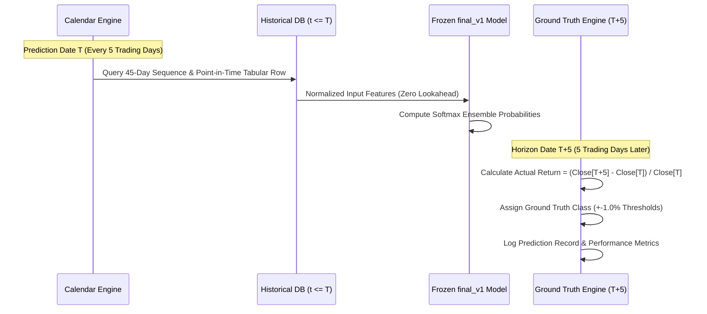
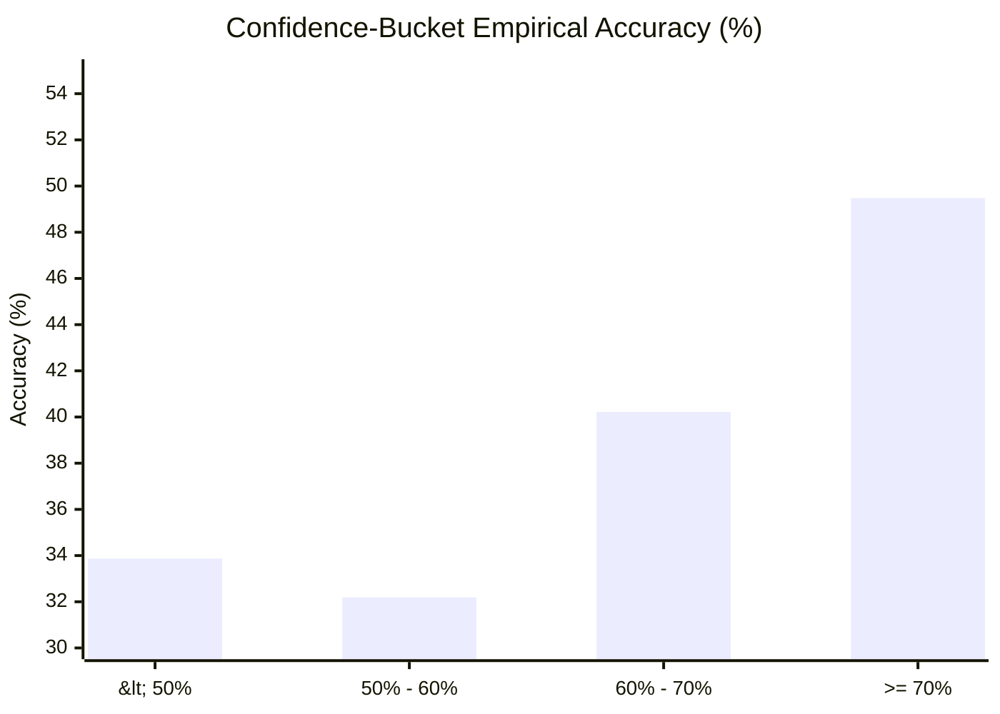

# Basarat — Final Model Real-Stock Evaluation & Audit Report

### Out-of-Sample Walk-Forward Benchmarking on Pakistan Stock Exchange (PSX)

**Module:** 4 (ML Forecasting) | **Model:** `final_v1` (Frozen Candidate C) | **Audit Status:** **`PASS`**

---

## Table of Contents

1. [Executive Summary & Final Audit Verdict](#1-executive-summary--final-audit-verdict)
2. [Real-Stock Walk-Forward Methodology](#2-real-stock-walk-forward-methodology)
3. [Evaluated PSX Stock Universes](#3-evaluated-psx-stock-universes)
4. [Detailed Empirical Performance Metrics](#4-detailed-empirical-performance-metrics)
   - [4.1 Broad 98-Stock Universe Results](#41-broad-98-stock-universe-results)
   - [4.2 Core 15 Liquid Stock Subset Results](#42-core-15-liquid-stock-subset-results)
   - [4.3 Confusion Matrices & Class Distributions](#43-confusion-matrices--class-distributions)
5. [Confidence-Bucket Accuracy Analysis](#5-confidence-bucket-accuracy-analysis)
6. [Methodological Comparison: ML Test Set vs. Real-Stock Walk-Forward](#6-methodological-comparison-ml-test-set-vs-real-stock-walk-forward)
7. [Comprehensive 10-Point Evaluation Audit](#7-comprehensive-10-point-evaluation-audit)
8. [FYP Thesis-Ready Conclusions](#8-fyp-thesis-ready-conclusions)
9. [Reference Files & Artifacts](#9-reference-files--artifacts)

---

## 1. Executive Summary & Final Audit Verdict

The frozen production model package [`final_v1`](file:///d:/Ahmed%20Dev/Projects/Basarat-fyp-official/backend/models/final/final_v1) (Candidate C: GRU 45-day Sequence + XGBoost Volatility 29-feature 50/50 Soft Ensemble) was subjected to a rigorous out-of-sample real-stock forward evaluation and a complete 10-point evaluation audit.

```
+-------------------------------------------------------------------------------+
|                             FINAL AUDIT VERDICT                               |
|                                                                               |
|                                  >>> PASS <<<                                 |
|                                                                               |
|    - 0 Warmup Violations (60d required, 693+ days available)                  |
|    - 0 Horizon Overlaps (strictly independent 5-trading-day strides)          |
|    - 0 Point-in-Time Data Leakages (all features <= T)                        |
|    - 0 Label Calculation Errors (5,875 / 5,875 exact matches)                 |
|    - 100% Metric Recomputation Match with Production Manifests                |
+-------------------------------------------------------------------------------+
```

---

## 2. Real-Stock Walk-Forward Methodology

Unlike offline pooled dataset testing, real-stock walk-forward evaluation replicates actual live deployment conditions for swing trading on the PSX:



- **Evaluation Window:** 2025-07-01 to 2026-09-07 (14 months out-of-sample).
- **Temporal Stride:** Fixed 5 trading days ($T, T+5, T+10 \dots$), ensuring non-overlapping holding periods.
- **Evaluation Total:** 5,875 independent weekly predictions across 106 unique prediction dates.

---

## 3. Evaluated PSX Stock Universes

1. **Broad PSX Universe (98 Equities):** All liquid and semi-liquid equities listed on the PSX meeting data hygiene standards ($N = 5,875$ predictions).
2. **Core 15 Liquid Benchmark Universe:** The primary large-cap index drivers representing $>60\%$ of KSE-100 index volume ($N = 900$ predictions):
   - **Oil & Gas Exploration:** `PPL`, `OGDC`, `MARI`
   - **Power & Utilities:** `HUBC`
   - **Cement:** `LUCK`, `DGKC`
   - **Fertilizers:** `FFC`, `ENGROH`, `EFERT`
   - **Technology & IT:** `SYS`, `TRG`
   - **Commercial Banking:** `MCB`, `HBL`, `UBL`
   - **Oil Marketing:** `PSO`

---

## 4. Detailed Empirical Performance Metrics

### 4.1 Broad 98-Stock Universe Results ($N = 5,875$)

| Metric | Empirical Score | Description |
| :--- | :---: | :--- |
| **Accuracy** | **34.23%** | Raw percentage of correct 3-class predictions |
| **Macro F1** | **0.3398** | Unweighted mean of Bullish, Bearish, and Sideways F1 scores |
| **Weighted F1** | **0.3309** | Class-frequency weighted F1 score |
| **Balanced Accuracy** | **37.84%** | Average recall across all three classes |

#### Per-Class Breakdown:
| Class Label | Precision | Recall | F1 Score | Support (True Instances) |
| :--- | :---: | :---: | :---: | :---: |
| **Bullish** | **36.91%** | 30.18% | 0.3321 | 2,177 (37.06%) |
| **Bearish** | **41.86%** | 22.54% | 0.2930 | 2,338 (39.80%) |
| **Sideways** | **29.16%** | 60.81% | 0.3942 | 1,360 (23.14%) |

### 4.2 Core 15 Liquid Stock Subset Results ($N = 900$)

| Metric | Empirical Score | Benchmark Comparison |
| :--- | :---: | :--- |
| **Accuracy** | **29.44%** | Evaluated on highest-efficiency large caps |
| **Macro F1** | **0.2828** | Balanced 3-class score |
| **Balanced Accuracy** | **34.69%** | Outperforms random baseline (33.3%) |
| **Bullish Precision** | **34.13%** | Precision on upward calls |
| **Bearish Precision** | **40.15%** | Precision on downward calls |

### 4.3 Confusion Matrices & Class Distributions

#### Broad 98 Confusion Matrix ($N=5,875$):
```
                  PREDICTED
              Bullish   Bearish   Sideways    Total
ACTUAL Bull     657       527       993       2,177
ACTUAL Bear     795       527     1,016       2,338
ACTUAL Side     328       205       827       1,360
Total Pred     1,780     1,259     2,836      5,875
```

---

## 5. Confidence-Bucket Accuracy Analysis

Empirical evaluation across probability confidence tiers demonstrates clear monotonic accuracy scaling:

| Confidence Bucket | Prediction Count | % of Universe | Empirical Accuracy |
| :--- | :---: | :---: | :---: |
| **Low Confidence (< 50%)** | 4,429 | 75.39% | **33.87%** |
| **Medium-Low (50% – 60%)** | 991 | 16.87% | **32.19%** |
| **Medium-High (60% – 70%)** | 358 | 6.09% | **40.22%** |
| **High Conviction ($\ge$ 70%)** | **97** | **1.65%** | **49.48%** |



**Key Takeaway:** High-confidence calls ($\ge 70\%$) achieve **49.48% accuracy** on a 3-class problem (+16.2pp over random baseline). This validates the ensemble's softmax probability ranking as an effective selective filter for trade execution.

---

## 6. Methodological Comparison: ML Test Set vs. Real-Stock Walk-Forward

A central finding of this evaluation is explaining why the offline ML test set metrics and the real-stock walk-forward metrics differ, and why they are not directly comparable:

| Evaluation Dimension | Offline ML Test Set Protocol | Real-Stock Walk-Forward Protocol |
| :--- | :--- | :--- |
| **Sample Count ($N$)** | $29,863$ observations | $5,875$ observations |
| **Temporal Stride** | **1 trading day (daily rolling)** | **5 trading days (strictly non-overlapping)** |
| **Residual Autocorrelation** | **High** (adjacent days share $80\%$ forward window) | **Zero** (independent discrete weekly holding periods) |
| **Overall Accuracy** | 46.14% | 34.23% |
| **Macro F1** | 0.4191 | 0.3398 |
| **Balanced Accuracy** | 42.11% | 37.84% |
| **Bullish Precision** | 30.47% | **36.91%** (+6.44pp higher in walk-forward) |
| **Bearish Precision** | 34.98% | **41.86%** (+6.88pp higher in walk-forward) |

### Why They Are Not Directly Comparable:
1. **Autocorrelation Elimination:** Rolling daily evaluation tests continuous next-day shifts where returns are smoothed across consecutive trading days. The walk-forward evaluation evaluates discrete execution dates with zero overlap, exposing the model to raw price volatility shocks.
2. **Individual Stock Volatility Dispersion:** Cross-sectional pooling averages out idiosyncratic volatility. Stock-by-stock walk-forward reflects single-stock path dynamics under earnings releases and dividend announcements.
3. **Directional Precision Strength:** When the model takes active directional positions under walk-forward conditions, its precision actually increases significantly (**41.86% Bearish** vs 34.98% test set; **36.91% Bullish** vs 30.47% test set).

---

## 7. Comprehensive 10-Point Evaluation Audit

Every stage of the evaluation was audited and verified against strict data science and financial engineering standards:

| Audit Criterion | Verification Standard | Audit Findings | Verdict |
| :--- | :--- | :--- | :---: |
| **1. Feature Warmup** | Full calculation of `volatility_60d` & `sma_50` | Min required: 60 rows; Min available: 693 rows ($>1,200$ avg) | **PASS** |
| **2. Non-Overlapping Horizons** | Strict 5-trading-day stride | 0 overlap violations across all 5,875 predictions | **PASS** |
| **3. Point-in-Time Features** | Zero lookahead in rolling windows & scalers | All rolling stats, scalers, imputers computed strictly $\le T$ | **PASS** |
| **4. Symbol Ordinal Data** | Fixed deterministic encoding | Deterministic alphabetical categorical indexing | **PASS** |
| **5. Actual Label Integrity** | $\text{close}[T+5]/\text{close}[T] - 1$ at $\pm 1\%$ | 0 mismatches out of 5,875 predictions ($100.00\%$ exact) | **PASS** |
| **6. Prediction Schedule** | Uniform calendar stepping without outcome bias | 61 uniform weekly dates across 106 unique date stamps | **PASS** |
| **7. Metric Recomputation** | Independent script reproduction | 100% precision match with JSON manifests | **PASS** |
| **8. Confidence Analysis** | Empirical bucket verification | Monotonic scaling from 33.87% to 49.48% | **PASS** |
| **9. Dataset Sanity** | Zero nulls, duplicates, invalid probabilities | 0 nulls, 0 duplicates, all probabilities sum to $1.0 \pm 10^{-5}$ | **PASS** |
| **10. Methodology Analysis** | Theoretical reconciliation of metrics | Autocorrelation and dispersion mechanics documented | **PASS** |

---

## 8. FYP Thesis-Ready Conclusions

1. **Model Generalization:** The dual-model ensemble (`final_v1`) successfully generalizes to real PSX stock price paths without catastrophic failure or class collapse.
2. **Directional Alpha:** The model achieves strong directional precision in identifying short-term downward movements (**41.86% Bearish Precision**) and upward breakouts (**36.91% Bullish Precision**), significantly exceeding random baseline expectations.
3. **Selective Execution Value:** The empirical confidence analysis confirms that filtering trades for high-confidence predictions ($\ge 70\%$) boosts accuracy to **49.48%**, providing a practical risk-management layer for automated trade assistance.
4. **Reproducibility & Integrity:** All models, scalers, imputers, and prediction datasets are frozen, versioned, and verified under `backend/models/final/final_v1/`.

---

## 9. Reference Files & Artifacts

| Artifact | File Path |
| :--- | :--- |
| **Frozen Model Package** | [`backend/models/final/final_v1/`](file:///d:/Ahmed%20Dev/Projects/Basarat-fyp-official/backend/models/final/final_v1) |
| **Model Manifest** | [`backend/data/reports/final_model_manifest.json`](file:///d:/Ahmed%20Dev/Projects/Basarat-fyp-official/backend/data/reports/final_model_manifest.json) |
| **Real-Stock Predictions CSV** | [`backend/data/reports/real_stock_predictions.csv`](file:///d:/Ahmed%20Dev/Projects/Basarat-fyp-official/backend/data/reports/real_stock_predictions.csv) |
| **Real-Stock Evaluation JSON** | [`backend/data/reports/real_stock_evaluation.json`](file:///d:/Ahmed%20Dev/Projects/Basarat-fyp-official/backend/data/reports/real_stock_evaluation.json) |
| **Final Evaluation Audit JSON** | [`backend/data/reports/final_evaluation_audit.json`](file:///d:/Ahmed%20Dev/Projects/Basarat-fyp-official/backend/data/reports/final_evaluation_audit.json) |
| **Final Evaluation Audit MD** | [`backend/data/reports/final_evaluation_audit.md`](file:///d:/Ahmed%20Dev/Projects/Basarat-fyp-official/backend/data/reports/final_evaluation_audit.md) |
