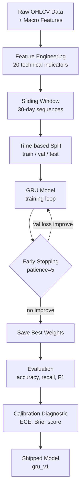
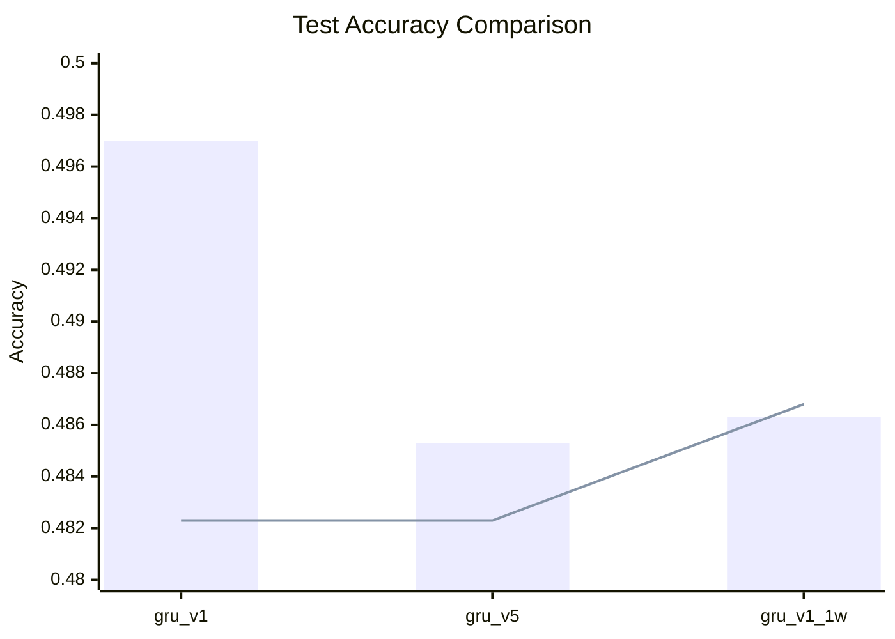
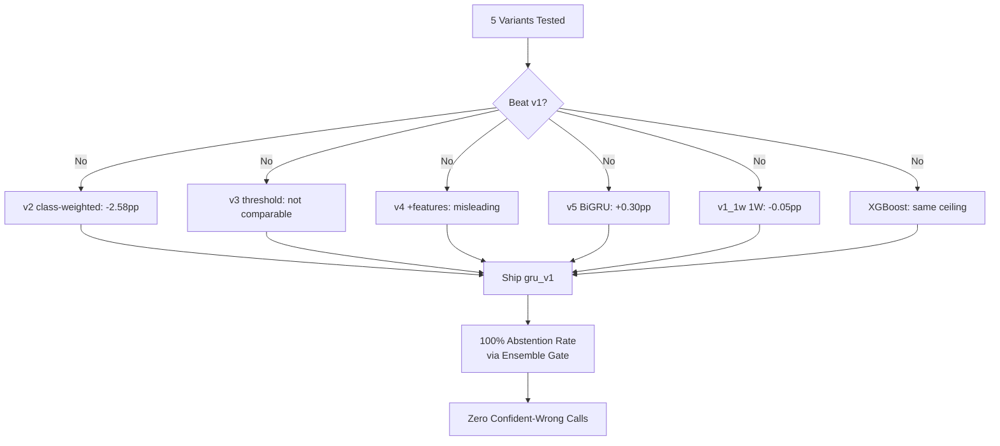

# Basarat — ML Model Training & Experiments

### Trade Recommendation & Assistance System for PSX

**Version:** 1.0 | **Module:** 4 (ML Forecasting) | **Status:** Final Decision

---

## Table of Contents

1. [Overview](#1-overview)
2. [Training Pipeline](#2-training-pipeline)
3. [GRU Experiments](#3-gru-experiments)
4. [XGBoost Parallel Track](#4-xgboost-parallel-track)
5. [Final Decision](#5-final-decision)
6. [Known Limitations](#6-known-limitations)
7. [Files Reference](#7-files-reference)

---

## 1. Overview

Basarat uses a **GRU (Gated Recurrent Unit)** neural network trained on 30-day sliding windows of daily technical indicators and macro features to predict PSX stock price direction.

**Label Definition:**
- Compute 1-day forward return: `(close[t+1] - close[t]) / close[t]`
- **bullish** if return > +1%
- **bearish** if return < -1%
- **sideways** otherwise

**Label Mapping:** `{"bullish": 0, "bearish": 1, "sideways": 2}`

**Data Split (time-based, no leakage):**

| Split | Date Range | Samples |
|-------|-----------|---------|
| Train | < 2024-07-01 | 94,422 |
| Validation | 2024-07-01 to 2025-07-01 | 24,158 |
| Test | >= 2025-07-01 | 29,373 |

**Baseline:** Always predict the majority class (bullish) = 48.23% accuracy.

---

## 2. Training Pipeline



### Feature Set (20 features)

```
atr_14, bb_lower, bb_mid, bb_upper, close, ema_12, ema_26, high, low,
macd, macd_hist, macd_signal, open, pkr_usd_rate, policy_rate, rsi_14,
sma_20, sma_50, volume, volume_zscore_20
```

---

## 3. GRU Experiments

### 3.1 gru_v1 (Shipped Model)

**Architecture:**
```
Input(30, 20)
GRU(64, return_sequences=False)
Dropout(0.2)
Dense(32, activation='relu')
Dense(3, activation='softmax')
```

**Hyperparameters:** batch_size=128, max_epochs=12, optimizer=Adam, early_stopping patience=5

**Result:** 12 epochs, best_val_accuracy = 0.4738, training duration = 286s

### 3.2 gru_v5 (Bidirectional GRU)

**Architecture:** Same as v1 but GRU layer reads sequence forward AND backward.

**Result:** 15 epochs, best_val_accuracy = 0.4662, training duration = 1051s

**Why it lost:** Flipped dominant class (predicted sideways instead of bullish), overfitted earlier, 3.7x slower training.

### 3.3 gru_v1_1w (1-Week Horizon)

**Architecture:** Identical to v1 but labels use 5-day forward return with 2.5% threshold.

**Result:** 8 epochs, best_val_accuracy = 0.4581, training duration = 529s

**Why it lost:** Severe overfitting (val accuracy collapsed from 0.4581 to 0.4067), doesn't beat baseline.

### 3.4 Test Set Comparison



| Model | Test Accuracy | Improvement | Overfitting | Training Time |
|-------|:------------:|:-----------:|:-----------:|:-------------:|
| **gru_v1** | **0.4970** | **+1.46%** | Mild | **286s** |
| gru_v5 | 0.4853 | +0.30% | Moderate | 1051s |
| gru_v1_1w | 0.4863 | -0.05% | Severe | 529s |

---

## 4. XGBoost Parallel Track

### Why XGBoost?

XGBoost was added to answer: **is the ~50% ceiling a model limitation or a data limitation?** If a tree-based model with engineered tabular features could significantly beat the GRU, it would suggest the sequence architecture was the bottleneck.

### Key Differences

| Aspect | GRU v1 | XGBoost |
|--------|--------|---------|
| Input format | 30-day sequences (3D) | Flat tabular rows (2D) |
| Features | 20 raw features per timestep | 39 features (20 GRU + 14 engineered + symbol_id) |
| Feature scaling | StandardScaler | None (tree-invariant) |

### Results

```
metric                     | gru_v1   | xgb_unweighted | xgb_weighted
---------------------------|----------|----------------|-------------
test accuracy              | 0.4970   | 0.5035         | 0.4554
improvement over baseline  | 0.0146   | 0.0218         | -0.0263
bearish recall             | 0.1273   | 0.1747         | 0.3148
```

Both models collapse to majority class — GRU predicts bullish for 88.8% of cases, XGBoost predicts sideways for 85.7%. The ~50% ceiling is a **data limitation**, not a model limitation.

### Momentum Stress Test (7 symbols)

| Symbol | Known Trend | GRU v1 | XGB Weighted |
|--------|------------|--------|--------------|
| AICL | uptrend | correct | correct |
| IBFL | downtrend | wrong | correct |
| CHCC | downtrend | wrong | wrong |
| UBL | downtrend | wrong | wrong |
| PABC | downtrend | wrong | wrong |
| **Score** | | **2/7 (29%)** | **2/7 (29%)** |

---

## 5. Final Decision



**Ship GRU v1 as the final model.** Five structurally different attempts — class weighting, threshold, features, architecture, horizon — none beat the original. This is a converging, consistent signal that this is the model family's genuine ceiling for this feature set.

### Why v1 Wins

1. **Highest test accuracy:** 49.70% vs 48.53% (v5) vs 48.63% (v1_1w)
2. **Best improvement over baseline:** +1.46% vs +0.30% (v5) vs -0.05% (v1_1w)
3. **Best training stability:** Converged cleanly in 12 epochs without severe overfitting
4. **Reasonable calibration:** ECE = 2.03%, Brier = 0.6095
5. **Strongest bullish recall:** 89.8%

---

## 6. Known Limitations

1. **Low overall accuracy:** 49.7% is only marginally better than random (33.3% for 3-class). Stock prediction is inherently noisy.
2. **Class imbalance:** Bullish (48.2%) dominates, so the model learns to predict bullish most of the time.
3. **Poor minority class recall:** Bearish and sideways recall are ~12% each.
4. **Calibration gap at high confidence:** At 80-90% confidence, actual accuracy is 91.3% (gap of 8.4pp).
5. **Data limitation:** Cross-family convergence (GRU + XGBoost) on the same ceiling confirms the predictive limitation is in feature information content, not model architecture.

---

## 7. Files Reference

| File | Description |
|------|-------------|
| `app/ml/training/model.py` | GRU model definition |
| `app/ml/training/train.py` | Training loop |
| `app/ml/training/run_training.py` | Training entry point |
| `app/ml/training/evaluate.py` | Evaluation metrics |
| `app/ml/training/data_split.py` | Time-based splitting |
| `app/ml/training/scaling.py` | StandardScaler wrapper |
| `app/ml/training_xgb/` | XGBoost training scripts |
| `app/ml/serving/inference.py` | Production inference |
| `app/ml/serving/model_loader.py` | Model loading at startup |
| `app/ml/serving/schemas.py` | Pydantic response models |
| `app/ml/serving/prediction_logger.py` | DB logging for predictions |
| `app/tasks/run_forecast_inference.py` | Celery daily batch task |
| `models/gru_v1/` | Shipped model weights + metadata |
| `data/reports/evaluation.json` | v1 test evaluation |
| `data/reports/calibration_diagnostic.json` | Calibration analysis |
| `data/features/label_mapping.json` | Label encoding |

---

*Document generated: 2026-09-16 | Model version: gru_v1 (shipped) | TensorFlow: 2.16.1*
