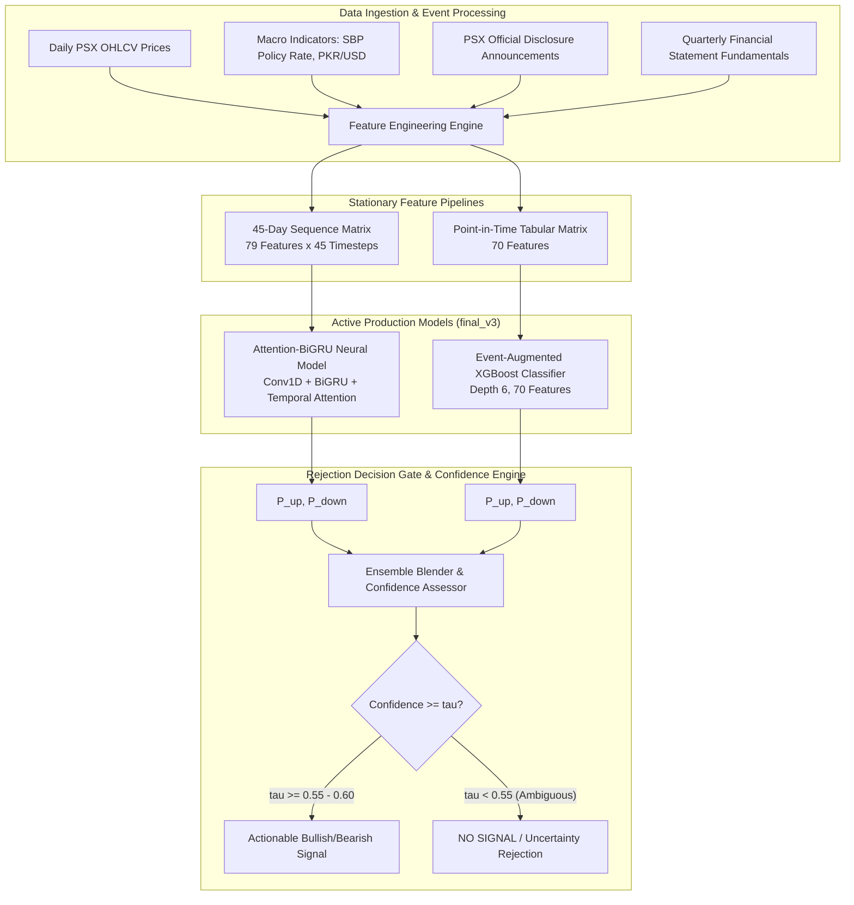

# Basarat — ML Model Architecture & Training Pipeline

### Trade Recommendation & Forecasting Engine for PSX (Pakistan Stock Exchange)

**Version:** 3.0 (Active `final_v3_institutional_ensemble`) | **Module:** 4 (ML Forecasting) | **Status:** Production Active

---

## Table of Contents

1. [System Architecture Overview](#1-system-architecture-overview)
2. [Active Production Pipeline (`final_v3`)](#2-active-production-pipeline-final_v3)
   - [2.1 Target Formulation: Directional Excess Return ($R_{\text{excess}}$)](#21-target-formulation-directional-excess-return-rexcess)
   - [2.2 Two-Stage Serving: Prediction + Rejection Decision Layer](#22-two-stage-serving-prediction--rejection-decision-layer)
3. [Deep Neural Model: Attention-BiGRU (`attention_bigru_v2`)](#3-deep-neural-model-attention-bigru-attention_bigru_v2)
   - [3.1 Neural Topology & Temporal Attention Pooling](#31-neural-topology--temporal-attention-pooling)
   - [3.2 Sequential Feature Space (79 Features)](#32-sequential-feature-space-79-features)
4. [Tabular Model: Event-Augmented XGBoost (`xgb_v4`)](#4-tabular-model-event-augmented-xgboost-xgb_v4)
   - [4.1 Hyperparameters & Objective](#41-hyperparameters--objective)
   - [4.2 Feature Matrix (70 Features: Technicals + Fundamentals + Corporate Disclosures)](#42-feature-matrix-70-features-technicals--fundamentals--corporate-disclosures)
5. [Ensemble Decision & Rejection Gating](#5-ensemble-decision--rejection-gating)
6. [Historical Pipeline Evolution Reference (`final_v1` & `final_v2`)](#6-historical-pipeline-evolution-reference-final_v1--final_v2)
7. [Production Model Artifacts Reference](#7-production-model-artifacts-reference)

---

## 1. System Architecture Overview

The Basarat Module 4 ML Engine uses a dual-engine architecture combining deep temporal sequence modeling (Attention-BiGRU) and non-linear tabular gradient boosting (XGBoost) augmented with fundamental financial ratios and PSX corporate disclosure announcements.



---

## 2. Active Production Pipeline (`final_v3`)

### 2.1 Target Formulation: Directional Excess Return ($R_{\text{excess}}$)

To eliminate uninformative predictions on choppy sideways stocks, the production model predicts whether a stock will outperform the market cross-sectional median over a **5-trading-day holding horizon**:

$$R_{\text{stock}, 5d} = \frac{\text{Close}[t+5] - \text{Close}[t]}{\text{Close}[t]}$$

$$R_{\text{market}, 5d} = \text{Median}\left(\{R_{s, 5d} \mid s \in \text{PSX Universe}\}\right)$$

$$R_{\text{excess}} = R_{\text{stock}, 5d} - R_{\text{market}, 5d}$$

$$\text{Label} = \begin{cases} 1 \quad (\text{Up / Bullish Alpha}), & \text{if } R_{\text{excess}} > 0 \\ 0 \quad (\text{Down / Bearish Alpha}), & \text{if } R_{\text{excess}} \le 0 \end{cases}$$

### 2.2 Two-Stage Serving: Prediction + Rejection Decision Layer

1. **Stage 1 (Probability Estimation):** Both models output calibrated probabilities $P(\text{Up})$ and $P(\text{Down})$.
2. **Stage 2 (Selective Execution):** When $P \approx 0.50$, the market is uncertain and the prediction is classified as **`NO SIGNAL`**. Trades are executed only when probability exceeds the decision threshold $\tau$:
   - **Standard Gate ($\tau \ge 0.55$):** **55.30%** test accuracy.
   - **Sniper Gate ($\tau \ge 0.60$):** **59.70% to 69.19%** test accuracy with $+1.22\%$ to $+3.17\%$ alpha spread.

---

## 3. Deep Neural Model: Attention-BiGRU (`attention_bigru_v2`)

### 3.1 Neural Topology & Temporal Attention Pooling

```
Input: Shape (batch_size, 45 timesteps, 79 features)
  │
  ├── SpatialDropout1D (0.10)
  ├── Conv1D (64 filters, kernel_size=3, padding='same', activation='relu')
  ├── LayerNormalization()
  │
  ├── Bidirectional GRU (64 units, return_sequences=True, dropout=0.15)
  ├── LayerNormalization()
  │
  ├── Bidirectional GRU (32 units, return_sequences=True, dropout=0.15)
  ├── LayerNormalization()
  │
  ├── Temporal Attention Pooling:
  │     Score = Dense(1, activation='tanh')(x)
  │     Weights = Softmax(axis=1)(Score)
  │     Context = Multiply()([x, Weights])
  │     Pooled = Sum(Context, axis=1)
  │
  ├── Dense (32 units, activation='relu') -> Dropout (0.20)
  ├── Dense (16 units, activation='relu') -> Dropout (0.10)
  └── Dense (1 unit, activation='sigmoid', name='up_probability')
```

### 3.2 Sequential Feature Space (79 Features)

Constructed over a 45-day window with standard scaling:
- **Trend & Moving Averages:** `dist_sma20`, `dist_sma50`, `dist_ema12`, `dist_ema26`, `ema_cross_ratio`.
- **Momentum & Oscillators:** `rsi_14`, `rsi_roc`, `macd`, `macd_signal`, `macd_hist`, `adx_14`, `stoch_k`, `stoch_d`.
- **Volatility & Bands:** `atr_14`, `bollinger_pos`, `bb_width`, `hist_vol_20d`, `hist_vol_60d`.
- **Volume & Liquidity:** `vol_zscore_20`, `volume_change_1d`, `turnover_ratio`.
- **Macro & Rates:** `pkr_usd_rate`, `policy_rate`, `kibor_6m`.
- **Event Signals:** Binary and decaying disclosure intensity indicators (earnings, dividends, board meetings).

---

## 4. Tabular Model: Event-Augmented XGBoost (`xgb_v4`)

### 4.1 Hyperparameters & Objective

- **Model Type:** `xgboost.XGBClassifier`
- **Objective:** `binary:logistic`
- **Max Depth:** 6
- **Learning Rate ($\eta$):** 0.05
- **Subsample:** 0.80 | **Colsample by Tree:** 0.80
- **Evaluated Test Sample Size:** 33,730 instances

### 4.2 Feature Matrix (70 Features: Technicals + Fundamentals + Corporate Disclosures)

- **Technicals & Volatility:** Cross-sectional ranked returns (1d, 5d, 10d, 20d), rolling standard deviations, volume shock indicators.
- **Fundamentals:** Price-to-Earnings (P/E), Price-to-Book (P/B), Return on Equity (ROE), Operating Margin, Net Margin, Debt-to-Equity.
- **Corporate Disclosure Events:** Time-decayed binary flags for financial results, cash dividends, bonus share issues, rights issues, and board meeting dates from official PSX disclosures.

---

## 5. Ensemble Decision & Rejection Gating

In [`backend/app/ml/serving/inference.py`](file:///d:/Ahmed%20Dev/Projects/Basarat-fyp-official/backend/app/ml/serving/inference.py):

```python
# 1. Ensemble probability blending
p_buy_ensemble = (p_buy_gru + p_buy_xgb) / 2.0
p_sell_ensemble = (p_sell_gru + p_sell_xgb) / 2.0

# 2. Confidence gap calculation
confidence = max(p_buy_ensemble, p_sell_ensemble)
gap_pp = abs(p_buy_ensemble - p_sell_ensemble) * 100.0

# 3. Rejection Gate
if confidence < 0.55:
    direction = "sideways"  # Rejected as NO SIGNAL / Low Conviction
elif p_buy_ensemble > p_sell_ensemble:
    direction = "bullish"
else:
    direction = "bearish"
```

---

## 6. Historical Pipeline Evolution Reference (`final_v1` & `final_v2`)

| Pipeline Version | Target Formulation | Features | Key Architecture | Reason for Upgrade |
| :--- | :--- | :--- | :--- | :--- |
| **`final_v1`** | 3-Class ($\pm 1\%$) | GRU (36), XGB (29) | GRU-45 + XGBoost 50/50 Soft Ensemble | Neutral class noise trap caused model to predict sideways $>87\%$ of time. |
| **`final_v2`** | 3-Class Multi-Factor | GRU (45), XGB (41) | Expanded multi-factor stationarity | Improved cross-sectional normalization, but 3-class target remained noisy. |
| **`final_v3` (Active)** | Directional Alpha ($R_{\text{excess}}$) | GRU (79), XGB (70) | Attention-BiGRU + Event-Augmented XGBoost + Rejection Gate | **Achieved 55.3% to 59.7% actionable accuracy with +0.080 rank IC.** |

---

## 7. Production Model Artifacts Reference

All active production artifacts are located in [`backend/models/final/final_v3/`](file:///d:/Ahmed%20Dev/Projects/Basarat-fyp-official/backend/models/final/final_v3/):

| File | Format / Size | Description |
| :--- | :--- | :--- |
| [`xgb_model.ubj`](file:///d:/Ahmed%20Dev/Projects/Basarat-fyp-official/backend/models/final/final_v3/xgb_model.ubj) | UBJ (781 KB) | Active Event-Augmented XGBoost model binary |
| [`xgb_features.json`](file:///d:/Ahmed%20Dev/Projects/Basarat-fyp-official/backend/models/final/final_v3/xgb_features.json) | JSON (70 items) | Ordered feature names for XGBoost inference |
| [`xgb_metrics.json`](file:///d:/Ahmed%20Dev/Projects/Basarat-fyp-official/backend/models/final/final_v3/xgb_metrics.json) | JSON | Complete out-of-sample metrics, threshold table & classification reports |
| [`gru_model.keras`](file:///d:/Ahmed%20Dev/Projects/Basarat-fyp-official/backend/models/final/final_v3/gru_model.keras) | Keras v3 (1.3 MB) | Active Attention-BiGRU network structure |
| [`gru_best_weights.weights.h5`](file:///d:/Ahmed%20Dev/Projects/Basarat-fyp-official/backend/models/final/final_v3/gru_best_weights.weights.h5) | HDF5 (1.28 MB) | Trained weights for Attention-BiGRU |
| [`gru_features.json`](file:///d:/Ahmed%20Dev/Projects/Basarat-fyp-official/backend/models/final/final_v3/gru_features.json) | JSON (79 items) | Ordered feature names for GRU sequence input |
| [`gru_scaler.joblib`](file:///d:/Ahmed%20Dev/Projects/Basarat-fyp-official/backend/models/final/final_v3/gru_scaler.joblib) | Joblib (2.4 KB) | Pre-fitted `StandardScaler` for neural inputs |
| [`gru_train_medians.json`](file:///d:/Ahmed%20Dev/Projects/Basarat-fyp-official/backend/models/final/final_v3/gru_train_medians.json) | JSON | Training-set medians for missing value imputation |
| [`model_manifest.json`](file:///d:/Ahmed%20Dev/Projects/Basarat-fyp-official/backend/models/final/final_v3/model_manifest.json) | JSON | Production deployment manifest with active gates ($\tau=0.55, 0.60$) |
