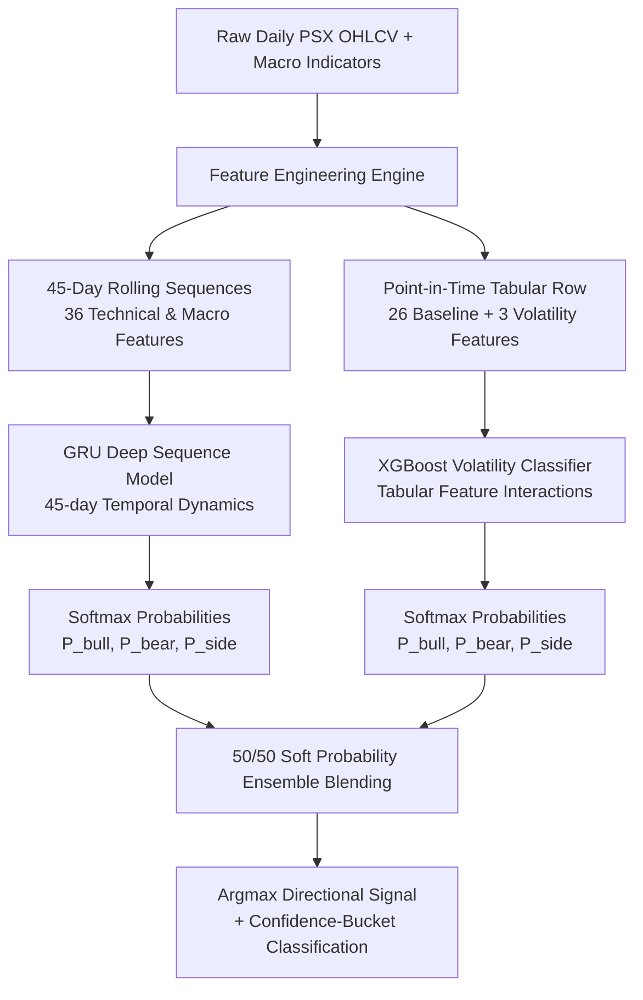
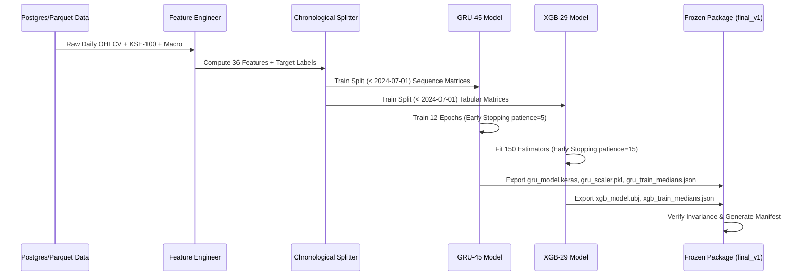

# Basarat — ML Model Architecture & Training Pipeline

### Trade Recommendation & Assistance System for PSX (Pakistan Stock Exchange)

**Version:** 2.0 (Frozen `final_v1`) | **Module:** 4 (ML Forecasting) | **Status:** Production Candidate Frozen

---

## Table of Contents

1. [System Overview](#1-system-overview)
2. [Target & Label Definition](#2-target--label-definition)
3. [Chronological Data Splits](#3-chronological-data-splits)
4. [Frozen Model Architecture (`final_v1`)](#4-frozen-model-architecture-final_v1)
   - [4.1 GRU Sequence Model (45-Day Lookback)](#41-gru-sequence-model-45-day-lookback)
   - [4.2 XGBoost Tabular Model (29 Volatility Features)](#42-xgboost-tabular-model-29-volatility-features)
   - [4.3 Soft Probability Ensemble (50/50 Blending)](#43-soft-probability-ensemble-5050-blending)
5. [Feature Engineering & Preprocessing](#5-feature-engineering--preprocessing)
   - [5.1 GRU 36-Feature Set](#51-gru-36-feature-set)
   - [5.2 XGBoost 29-Feature Set](#52-xgboost-29-feature-set)
   - [5.3 Leakage Prevention & Scaling Protocol](#53-leakage-prevention--scaling-protocol)
6. [Training Pipeline & Hyperparameters](#6-training-pipeline--hyperparameters)
7. [Production Model Artifacts Reference](#7-production-model-artifacts-reference)

---

## 1. System Overview

Basarat Module 4 implements a **dual-architecture hybrid ensemble** combining deep sequential modeling with gradient-boosted decision trees to forecast 5-trading-day direction for equities listed on the Pakistan Stock Exchange (PSX).



---

## 2. Target & Label Definition

The model is optimized for a **5-trading-day forward holding horizon** (1 trading week), aligning directly with practical swing trading execution and eliminating single-day market microstructure noise.

- **Forward Return Calculation:**
  $$\text{return}_{5d} = \frac{\text{close}[t+5] - \text{close}[t]}{\text{close}[t]}$$
- **Classification Thresholds ($\pm 1.0\%$):**
  - **Bullish (`0`):** $\text{return}_{5d} > +1.0\%$
  - **Bearish (`1`):** $\text{return}_{5d} < -1.0\%$
  - **Sideways (`2`):** $-1.0\% \le \text{return}_{5d} \le +1.0\%$

*Note: Class mapping index strictly follows `{"bullish": 0, "bearish": 1, "sideways": 2}` across all training scripts, scalers, models, and inference runtimes.*

---

## 3. Chronological Data Splits

To prevent lookahead bias and temporal leakage, all datasets are split strictly chronologically:

| Split | Date Range | Sample Count | Primary Purpose |
| :--- | :--- | :---: | :--- |
| **Train** | $< \text{2024-07-01}$ | 94,000+ | Model weight optimization & scaler fitting |
| **Validation** | $\text{2024-07-01}$ to $\text{2025-07-01}$ | 24,000+ | Hyperparameter tuning, early stopping & model selection |
| **Test (ML Test Set)** | $\ge \text{2025-07-01}$ | 29,863 | Unseen out-of-sample offline benchmarking |
| **Real-Stock Walk-Forward** | $\text{2025-07-01}$ to $\text{2026-09-07}$ | 5,875 | Non-overlapping discrete weekly execution evaluation |

---

## 4. Frozen Model Architecture (`final_v1`)

The production model package is frozen under `backend/models/final/final_v1/` and consists of two complementary models:

### 4.1 GRU Sequence Model (45-Day Lookback)
- **Role:** Captures medium-term temporal autocorrelation, moving average crossovers, and momentum trajectory over a 9-week trading window.
- **Input Shape:** `(batch_size, 45, 36)`
- **Architecture:**
  ```
  Input(shape=(45, 36))
  GRU(units=64, return_sequences=False)
  Dropout(rate=0.20)
  Dense(units=32, activation='relu')
  Dense(units=3, activation='softmax')
  ```
- **Loss Function:** `sparse_categorical_crossentropy`
- **Class Balancing:** Sample weighting via inverse class frequencies during training.

### 4.2 XGBoost Tabular Model (29 Volatility Features)
- **Role:** Evaluates instantaneous technical conditions, volatility regimes across 20d/30d/60d horizons, and non-linear feature interactions without sequential overhead.
- **Input Shape:** `(batch_size, 29)`
- **Core Hyperparameters:**
  - `max_depth`: 4
  - `learning_rate` ($\eta$): 0.05
  - `n_estimators`: 150
  - `subsample`: 0.80
  - `colsample_bytree`: 0.80
  - `objective`: `multi:softprob` (num_class=3)
  - `eval_metric`: `mlogloss`
- **Class Balancing:** Balanced sample weights computed on training set.

### 4.3 Soft Probability Ensemble (50/50 Blending)
- **Probability Fusion:**
  $$P(\text{class}_k) = 0.50 \times P_{\text{GRU}}(\text{class}_k) + 0.50 \times P_{\text{XGB}}(\text{class}_k)$$
- **Predicted Class:**
  $$\hat{y} = \arg\max_{k \in \{0, 1, 2\}} P(\text{class}_k)$$

---

## 5. Feature Engineering & Preprocessing

### 5.1 GRU 36-Feature Set
The 45-day sequential matrix uses 36 normalized features per timestep:

```
1.  open                  13. macd_hist             25. return_5d
2.  high                  14. atr_14                26. return_10d
3.  low                   15. bb_upper              27. return_20d
4.  close                 16. bb_mid                28. volume_change_5d
5.  volume                17. bb_lower              29. volume_change_10d
6.  volume_zscore_20      18. pkr_usd_rate          30. volume_change_20d
7.  sma_20                19. policy_rate           31. index_return_5d
8.  sma_50                20. log_return            32. index_return_10d
9.  ema_12                21. return_1d             33. index_return_20d
10. ema_26                22. return_2d             34. relative_to_index_5d
11. rsi_14                23. return_3d             35. relative_to_index_10d
12. macd                  24. return_4d             36. relative_to_index_20d
```

### 5.2 XGBoost 29-Feature Set
The tabular model uses 26 baseline technical indicators plus 3 explicit multi-horizon volatility features:

```
[Baseline 26 Features]
1.  open                  10. ema_26                19. policy_rate
2.  high                  11. rsi_14                20. log_return
3.  low                   12. macd                  21. return_1d
4.  close                 13. macd_hist             22. return_5d
5.  volume                14. atr_14                23. return_10d
6.  volume_zscore_20      15. bb_upper              24. return_20d
7.  sma_20                16. bb_mid                25. volume_change_5d
8.  sma_50                17. bb_lower              26. symbol_id (categorical)
9.  ema_12                18. pkr_usd_rate

[Volatility Feature Extension (+3 Features)]
27. volatility_20d (20-day rolling std of daily log returns)
28. volatility_30d (30-day rolling std of daily log returns)
29. volatility_60d (60-day rolling std of daily log returns)
```

### 5.3 Leakage Prevention & Scaling Protocol
- **Imputation:** Training median values (`gru_train_medians.json`, `xgb_train_medians.json`) computed strictly on training rows ($t < 2024\text{-}07\text{-}01$) are used to impute missing values.
- **Normalization:** A single `StandardScaler` (`gru_scaler.pkl`) is fitted strictly on training data and used to transform sequences. XGBoost utilizes invariant quantile splits with tree-based missing value handling.
- **Point-in-Time Assurance:** All rolling volatilities, technical indicators, and moving averages use data strictly $\le T$.

---

## 6. Training Pipeline & Hyperparameters



---

## 7. Production Model Artifacts Reference

All components of the frozen model package are maintained under `backend/models/final/final_v1/`:

| Artifact File | Size / Format | Description |
| :--- | :--- | :--- |
| `gru_model.keras` | Keras v3 Native Format | Trained GRU-45 neural network weights and topology |
| `gru_scaler.pkl` | Joblib / Pickle | `StandardScaler` fitted on training split for 36 features |
| `gru_train_medians.json` | JSON Object | Feature medians for GRU missing-value imputation |
| `gru_features.json` | JSON Array (36 items) | Canonical ordered feature names for GRU sequence input |
| `xgb_model.ubj` | Universal Binary JSON | Trained XGBoost 29-feature gradient boosted tree ensemble |
| `xgb_train_medians.json` | JSON Object | Feature medians for XGB missing-value imputation |
| `xgb_features.json` | JSON Array (29 items) | Canonical ordered feature names for XGB tabular input |
| `config.json` | JSON Object | Package metadata, class mappings, horizon (5D), thresholds ($\pm 1\%$) |
