# Project Overview — Basarat (بصيرة)

## Executive Summary

**Basarat** (meaning *insight* or *vision* in Arabic/Urdu) is an enterprise-grade AI-powered financial intelligence and portfolio analytics platform built specifically for the **Pakistan Stock Exchange (PSX)**. Developed as a flagship Final Year Project (FYP) and production-grade financial platform, Basarat addresses the acute information asymmetry, limited analytical tooling, and high barriers to entry faced by retail and institutional investors in Pakistan's equity market.

The platform bridges complex machine learning forecasting, real-time market data pipelines, Shariah compliance screening, portfolio risk analytics (Value-at-Risk, Monte Carlo simulation), financial natural language processing (FinBERT sentiment analysis), and a context-aware LLM investment assistant into a cohesive, high-performance web and mobile ecosystem.

---

## System Mission & Problem Statement

### The Problem in the Pakistan Stock Exchange (PSX)
1. **Data Fragmentation & Inaccessibility:** Real-time PSX data, corporate disclosures, financial reports, and regulatory filings are scattered across disparate government, exchange, and brokerage portals without standardized APIs.
2. **Lack of Advanced Analytics for Retail Investors:** Advanced risk metrics (Value-at-Risk, Conditional VaR, Monte Carlo stress testing) and multi-factor valuation models have historically been accessible only to institutional asset managers.
3. **Scarcity of Shariah Compliance Screening Tools:** Over 60% of Pakistani retail investors seek Shariah-compliant investments (under AAOIFI and KMI-30 standards), but identifying compliant equities and calculating dividend purification amounts has historically been manual and error-prone.
4. **Emotional and Uninformed Trading:** Retail investors often trade on unverified social media rumors without quantitative signals, technical validation, or automated risk guardrails.

### Basarat's Solution
Basarat provides a centralized, unified intelligent decision-support platform featuring:
- **Sub-minute Live PSX Quotes & Market Discovery:** High-concurrency WebSocket quote streaming with Redis Pub/Sub backplane and REST polling fallbacks.
- **Dual-Model ML Forecasting:** An Attention-augmented Bidirectional GRU (Attention-BiGRU) neural network ensembled with an XGBoost v4 tree classifier to produce directional 1-day forecasts with audit trails and automated gating.
- **Automated Quantitative Recommendations:** A multi-factor ranking engine (Technical, Valuation, Fundamental, Sentiment) generating customizable Buy/Hold/Sell signals.
- **FinBERT Financial Sentiment Analysis:** NLP sentiment extraction from PSX announcements, Mettis Global, OGRA, FBR, and financial news sources.
- **AAOIFI & KMI-30 Shariah Screening & Dividend Purification:** Automated compliance validation on debt ratios, interest income, and haram activities with dividend purification calculators.
- **Institutional Portfolio Risk Suite:** Historical Value-at-Risk (VaR 95/99), Conditional VaR (CVaR), and asynchronous Geometric Brownian Motion (GBM) Monte Carlo stress simulations.
- **Context-Augmented AI Financial Assistant:** A secure, guardrailed LLM assistant powered by Groq (Qwen/Llama/GPT-OSS models) that dynamically injects the user's real-time portfolio, watchlist, and live market context.
- **Community Social Trading Hub:** A moderated social network for investors to share trade rationales, stock analyses, and comments with integrated spam prevention and moderation workflows.

---

## Target Users

| User Persona | Key Needs & Use Cases | Primary Features Utilized |
|---|---|---|
| **Retail Equity Investor** | Intuitive market monitoring, clear buy/sell signals, watchlist price alerts, and easy portfolio P&L tracking. | Live Market Pulse, 1-Tap Watchlist, Recommendations, Stock Detail charts. |
| **Islamic / Shariah-Conscious Investor** | Verifying stock compliance against AAOIFI/KMI-30 rules and calculating exact charity purification amounts on dividend payouts. | Shariah Screening Module, Dividend Purification Calculator, KMI-30 index view. |
| **Quantitative / Active Trader** | In-depth technical indicator signals, multi-factor scoring, ML directional probabilities, and real-time news sentiment. | ML Forecast Section, Technical Indicators (RSI, MACD, Bollinger Bands), FinBERT News Feed. |
| **Risk-Averse Portfolio Manager** | Portfolio stress testing, downside tail-risk measurement, sector concentration analysis, and risk breach alerts. | Value-at-Risk (VaR/CVaR), Monte Carlo Simulation, Portfolio Allocation Breakdown. |
| **Community Contributor / Learner** | Discussing market trends, sharing verified stock theses, learning from experienced investors, and getting AI guidance. | Community Feed, Stock Discussions, AI Copilot Chat. |
| **System Administrator / Moderator** | Managing platform health, reviewing reported community content, auditing moderation logs, managing ETF/IPO catalogs. | Admin Community Router, Moderation Dashboard, Health/Metrics APIs. |

---

## System Boundaries & Integrations

```mermaid
flowchart TB
    subgraph Clients["Client Layer"]
        Web["React 19 Web App (Vite)"]
        Mobile["Android Mobile Client (Native/FCM)"]
    end

    subgraph BasaratCore["Basarat Backend Ecosystem"]
        API["FastAPI Application Server (Uvicorn)"]
        LiveBus["Market Live Bus (Redis Pub/Sub)"]
        CeleryWorker["Celery Worker (Async Tasks)"]
        CeleryBeat["Celery Beat (Cron Scheduler)"]
        MLInference["ML Serving Engine (Attention-BiGRU + XGBoost)"]
    end

    subgraph DataStorage["Data & State Layer"]
        Postgres[(PostgreSQL 16 / Supabase)]
        Redis[(Redis 7 / Upstash)]
    end

    subgraph ExternalIntegrations["External Services & APIs"]
        PSX["PSX Portal & Data Feeds (Scraper/Announcements)"]
        Groq["Groq Cloud API (LLM Assistant)"]
        HF["HuggingFace Inference API (FinBERT NLP)"]
        SendGrid["SendGrid / SMTP (Transactional OTP Emails)"]
        Clerk["Clerk Auth (Webhook Integrations)"]
        GoogleApple["Google & Apple OAuth Providers"]
        FCM["Firebase Cloud Messaging (Mobile Push)"]
        Cloudinary["Cloudinary (Community Media Storage)"]
    end

    Clients <-->|REST API / WebSockets / SSE| API
    API <-->|Async Queries / Pool| Postgres
    API <-->|Cache / Rate Limit / Sessions| Redis
    API <-->|In-Memory Predict| MLInference
    API <-->|Enqueues Jobs| Redis
    LiveBus <-->|Subscribes / Broadcasts| Redis

    CeleryBeat -->|Schedules Crons| Redis
    CeleryWorker -->|Pulls Tasks| Redis
    CeleryWorker -->|Sync Queries| Postgres
    CeleryWorker -->|Publishes Live Quotes| Redis

    API -->|LLM Chat & Streaming| Groq
    API -->|Token Verification| GoogleApple
    API -->|Media Uploads| Cloudinary
    CeleryWorker -->|FinBERT Sentiment| HF
    CeleryWorker -->|Scrapes Market/News| PSX
    CeleryWorker -->|Dispatches OTPs| SendGrid
    CeleryWorker -->|Push Notifications| FCM
    Clerk -->|Webhooks| API
```

---

## Core System Capabilities & Major Modules

1. **Authentication & Identity (`app.api.v1.auth`, `app.services.auth_service`):**
   - Self-contained JWT authentication with token versioning (`token_version`) for immediate revocation on logout or password change.
   - 3-step secure password reset flow (Email verification -> 6-digit SHA-256 hashed OTP validation -> 15-minute reset grant token -> password update).
   - Google & Apple OAuth identity federation.
   - Dual-system Clerk authentication webhook bridge.

2. **Market Discovery & Streaming (`app.api.v1.market`, `app.api.v1.ws`, `app.services.market_service`):**
   - High-throughput live quote streaming over WebSocket (`/api/v1/ws/market`) backed by a Redis pub/sub live bus.
   - Public market data endpoints covering KSE-100, KSE-30, KMI-30 indices, top gainers, losers, volume leaders, and curated leaderboards.
   - Intelligent scraper gating during PSX trading hours (09:15–15:30 PKT) with circuit-breaker protection on rate limits.

3. **Machine Learning Forecasting (`app.api.v1.forecast`, `app.ml`):**
   - Dual-model ensemble: Stationary Attention-BiGRU (v2 production) combining 79 normalized features over a 45-day lookback window with XGBoost v4 (trained on technicals, fundamentals, and event indicators).
   - Automated prediction persistence, gating rules (abstention on low confidence or model divergence), and historical accuracy tracking.
   - Daily evaluation job reconciling previous predictions against actual closing prices.

4. **Stock Recommendations (`app.api.v1.recommendations`, `app.services.recommendation_service`):**
   - Multi-factor quantitative scoring algorithm combining Technical momentum (RSI, MACD, Moving Averages), Fundamental health (P/E, ROE, Debt/Equity), Sentiment scores, and ML directional bias.
   - User-customizable engine weight preferences stored per user profile.

5. **Portfolio Management & P&L Analytics (`app.api.v1.portfolio`, `app.services.portfolio_service`):**
   - Transaction ledger recording BUY and SELL executions with quantity, execution price, brokerage fees, and transaction timestamps.
   - Average Cost Basis (ACB) calculations, real-time unrealized/realized P&L, stock-level allocations, and sector concentration breakdowns.
   - Atomic completed-trade helper for recording historical round-trip trades.

6. **Portfolio Risk Suite (`app.api.v1.risk`, `app.services.risk_service`, `app.tasks.risk_tasks`):**
   - Parametric and Historical Value-at-Risk (VaR 95% / 99%) and Conditional VaR (CVaR).
   - Asynchronous Geometric Brownian Motion (GBM) Monte Carlo simulation generating projected portfolio value distributions.
   - Macroeconomic and market crash stress tests (e.g., SBP interest rate hikes, PSX black swan drops, currency devaluations).

7. **News & FinBERT Sentiment Analysis (`app.api.v1.news`, `app.api.v1.sentiment`, `app.tasks.scrape_news`):**
   - Automated ingestion from official PSX announcements and financial news portals with content hashing (`content_hash`) to eliminate duplicates.
   - HuggingFace Inference API integration running FinBERT for financial domain sentiment scoring (Bullish / Bearish / Neutral with confidence scores).
   - Rolling sentiment aggregation (1D, 1W, 1M, 3M, 6M, 1Y) per stock.

8. **Shariah Compliance Screening (`app.api.v1.shariah`, `app.services.shariah_service`):**
   - Screening against AAOIFI and KMI-30 criteria (core business screening, debt-to-total-assets < 37%, illiquid-assets-to-total-assets > 25%, non-compliant investments < 33%, non-compliant income < 5%).
   - Automated dividend purification calculator providing exact non-compliant income deduction amounts per share.

9. **AI Investment Assistant (`app.api.v1.assistant`, `app.services.assistant_service`):**
   - Context-aware chatbot powered by Groq cloud LLM models (`openai/gpt-oss-20b`, `qwen/qwen3.8-27b`).
   - Dynamic context injection: Automatically loads user portfolio holdings, watchlist symbols, live stock quotes, and risk profiles into system prompts.
   - Comprehensive safety guardrails: Prompt-injection scanning, financial disclaimer enforcement, and non-financial query redirection.
   - Server-Sent Events (SSE) streaming support for low-latency conversational UX.

10. **Community Social Network (`app.api.v1.community`, `app.api.v1.admin`, `app.services.community_service`):**
    - Social stock discussions, post creation with Cloudinary image attachments, nested comments, post liking, and user follow graph.
    - Automated spam threshold auto-hiding, user reporting workflow, and dedicated Admin review/moderation audit logs.

11. **ETFs & IPOs Catalog (`app.api.v1.etfs`, `app.api.v1.ipos`):**
    - Complete catalog of PSX Exchange Traded Funds (ETFs) with expense ratios, benchmark indices, and live quotes.
    - PSX Initial Public Offerings (IPO) pipeline tracking upcoming listings, book building dates, strike prices, and post-listing performance.

12. **Alerts & Notification Hub (`app.api.v1.alerts`, `app.api.v1.notifications`):**
    - Custom price threshold and metric condition rules evaluated every 5 minutes by background Celery workers.
    - In-app notification center with read/unread tracking and FCM device token registration for mobile push notifications.

---

## Technology Stack Summary

| Layer | Component | Technology / Library | Version / Details |
|---|---|---|---|
| **Backend Core** | Runtime & Framework | Python, FastAPI, Starlette | Python 3.11, FastAPI 0.115+, Pydantic v2 |
| **API Server** | ASGI Web Server | Uvicorn (uvloop, httptools) | High-concurrency async ASGI server |
| **Database** | Primary Datastore | PostgreSQL 16 (Self-hosted / Supabase) | Relational database with full indexing & ACID |
| **Database Access** | ORM & Drivers | SQLAlchemy 2.0 Async, `asyncpg`, `psycopg2` | Dual-driver: `asyncpg` for API, `psycopg2` for Celery/Alembic |
| **Migrations** | Schema Evolution | Alembic | Version-controlled declarative migrations |
| **Cache & Queue** | In-Memory Broker | Redis 7 (Self-hosted / Upstash) | Caching, Rate Limiting, Celery Broker, Pub/Sub Live Bus |
| **Task Queue** | Async & Scheduled Jobs | Celery 5.4+, Celery Beat | Distributed worker queue with Asia/Karachi cron scheduling |
| **Machine Learning** | Model Frameworks | TensorFlow / Keras, XGBoost, Scikit-Learn | Attention-BiGRU (Keras 3), XGBoost v4, Joblib |
| **NLP & Sentiment** | Financial NLP | FinBERT (via HuggingFace Inference API) | `ProsusAI/finbert` model for financial sentiment |
| **AI LLM** | Assistant Engine | Groq Cloud API | Qwen 2.5 / GPT-OSS via high-speed LPU inference |
| **Frontend Core** | Web Framework | React 19, Vite | Fast HMR, component-driven UI architecture |
| **Frontend Styling**| CSS Framework | Custom Modular Vanilla CSS | Dark theme, responsive glassmorphism, tailored tokens |
| **Deployment** | Containerization & Host | Docker, Docker Compose, AWS EC2 | Multi-stage Dockerfile, self-hosted GitHub Actions runner |

---

## Current Implementation Status & Major Limitations

### Implementation Status Matrix
- **Fully Implemented & Verified:**
  - Complete REST API routing (169 operations across 146 paths).
  - JWT Authentication, token versioning, 3-step OTP password reset, and Google/Apple OAuth.
  - Public market data aggregation, live quote cache, KSE/KMI index constituent tracking.
  - Attention-BiGRU and XGBoost serving pipelines with fallback to single-model mode.
  - Quantitative recommendation engine with dynamic factor weights.
  - Complete Portfolio ledger, Average Cost Basis (ACB), and P&L tracking.
  - Historical VaR, CVaR, and Monte Carlo async task execution.
  - Shariah screening engine with dividend purification formulas.
  - AI Assistant with context builder, prompt injection filtering, and SSE streaming.
  - Community feed, comments, likes, follows, reports, and admin moderation.
  - ETF and IPO catalogs with admin management endpoints.
  - WebSocket live stream with Redis live bus fanout.

- **Partially Implemented / Environmental Dependencies:**
  - **Firebase Cloud Messaging (FCM):** Device registration API is implemented; push dispatch is stubbed unless a valid service account JSON is supplied via `FIREBASE_CREDENTIALS_PATH`.
  - **SendGrid / SMTP Email Delivery:** Code is complete; delivery requires valid `SENDGRID_API_KEY` or SMTP credentials in `.env`.
  - **HuggingFace Inference API:** FinBERT sentiment scoring works with live API token; rule-based EPS/lexicon heuristics act as fallback when API token is omitted.

- **Major Architectural Limitations & Gaps:**
  - **PSX Scraper Fragility:** Market data relies on scraping public PSX portals without a direct paid broker FIX/OMD feed. Circuit breakers (15-minute pauses) exist to handle HTTP 429/403 rate limits.
  - **Single-Node Production Compose:** The current production deployment uses a single EC2 instance running Uvicorn (1 worker) and Celery (1 worker concurrency). High load requires horizontal scaling via an Application Load Balancer and multi-worker clusters.
  - **Rate Limiter Reverse Proxy Trust:** Throttling uses the first IP in `X-Forwarded-For`; enterprise multi-hop deployment requires configuring trusted proxy CIDR ranges in `TRUSTED_PROXY_IPS`.
