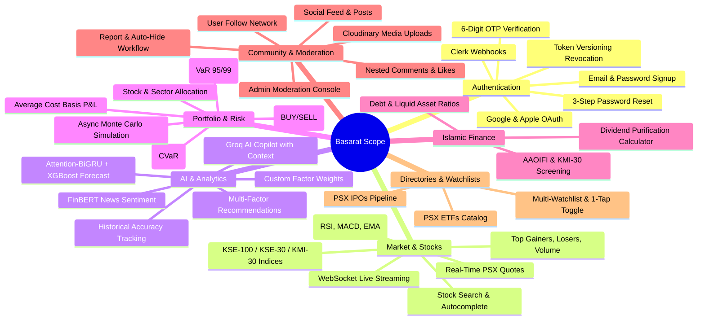

# Scope & Objectives — Basarat

## 1. Project Objectives

### 1.1 Primary Objectives
1. **Democratize PSX Financial Intelligence:** Deliver institutional-grade market data, quantitative rankings, and machine learning forecasting directly to Pakistani retail investors.
2. **Automate Islamic Shariah Compliance:** Provide transparent, automated screening of PSX equities against AAOIFI and KMI-30 Islamic finance guidelines, including precise dividend purification calculations.
3. **Provide Advanced Portfolio Risk Tooling:** Offer retail and individual asset managers accessible Value-at-Risk (VaR), Conditional VaR (CVaR), and Monte Carlo stress testing for their PSX holdings.
4. **Deliver Context-Augmented AI Assistance:** Enable an intelligent, guardrailed conversational AI copilot capable of evaluating portfolios, answering equity questions, and analyzing market trends in real time.
5. **Foster an Educated Social Trading Community:** Provide a moderated, spam-resilient community platform for discussing PSX market moves, sharing investment theses, and tracking verified sentiment.

### 1.2 Secondary Objectives
- Build an extensible, asynchronous microservices-ready architecture using modern Python (FastAPI, Celery, SQLAlchemy Async) and React (Vite).
- Ensure high data integrity with automated database migrations, strict foreign key constraints, and unit/integration/e2e test suites.
- Provide a responsive, low-latency user experience across desktop and mobile browsers via WebSocket quote streaming and SSE AI response generation.

---

## 2. In-Scope Functionality (Present Implementation)

The following components and capabilities are implemented and in active operation:

---

## 3. Out-of-Scope Functionality (Current Version)

The following capabilities are deliberately excluded from the current release:

1. **Live Broker Order Execution (Direct Trading):** Basarat is an analytical and intelligence decision-support platform; it does not execute live monetary trades or connect to FIX/broker order routing interfaces.
2. **Mutual Funds & Fixed Income / Sukuk Trading:** The current release focuses exclusively on PSX equities, Exchange Traded Funds (ETFs), and Initial Public Offerings (IPOs). Government T-Bills, PIBs, and corporate Sukuk are out of scope.
3. **Forex & Commodity Trading:** PMEX (Pakistan Mercantile Exchange) commodities (Gold, Crude Oil) and currency pairs are not covered.
4. **Automated Algorithmic Trading Bots:** Automated trade execution based on recommendation engine signals is not provided.
5. **Direct Banking Payment Gateway:** The current platform does not process subscription billing or monetary transfers.

---

## 4. Assumptions & Constraints

### 4.1 Assumptions
- **PSX Availability:** Upstream PSX portal and announcement feeds are accessible during active market trading hours.
- **Market Hours:** Trading follows standard Pakistan Standard Time (PKT, UTC+5) hours: 09:15 to 15:30, Monday through Friday (excluding public and Islamic holidays).
- **Client Connectivity:** Web and mobile clients have stable Internet connectivity supporting standard HTTPS and WebSocket connections.
- **Third-Party API Availability:** Free/commercial tier limits on Groq, HuggingFace, and SendGrid remain accessible with fallback configurations active.

### 4.2 Constraints
- **Hardware & Resource Limits:** Production deployment on a single AWS EC2 instance requires strict memory management (e.g. `--max-tasks-per-child=1` on Celery workers to prevent memory bloat during ML model execution).
- **Public Scraper Throttling:** Absence of an official, direct institutional PSX data feed requires polite scraping intervals (minimum 2 seconds between requests) and circuit breaker pauses.
- **Language & Model Constraints:** FinBERT and Groq models operate primarily in English; Roman Urdu / Urdu sentiment analysis is in development.

---

## 5. Dependencies

### 5.1 Internal System Dependencies
- **PostgreSQL 16:** Required for all persistent transactional and relational storage.
- **Redis 7:** Required for API caching, session rate limiting, Celery task queueing, and WebSocket live pub/sub broadcast.
- **Celery & Celery Beat:** Required for daily market reconciliation, sentiment calculation, alert evaluation, and periodic scraping.

### 5.2 External Cloud Dependencies
- **Groq Cloud API:** Provides high-speed LPU inference for the Stock AI Assistant.
- **HuggingFace Inference API:** Provides hosted inference for the `ProsusAI/finbert` model.
- **SendGrid / SMTP Server:** Required for sending registration and password-reset OTP emails.
- **Google Cloud & Apple Developer Portals:** Required for social OAuth token validation.
- **Cloudinary:** Required for media storage for user-generated community posts.

---

## 6. Known Limitations

1. **Market Data Scraping Reliance:** Intraday quotes are captured via scraper pipelines rather than an official real-time socket feed from the exchange.
2. **Single-Worker Concurrency in Production Compose:** Production `docker-compose.production.yml` runs 1 Uvicorn worker and 1 Celery worker; high concurrent traffic will require horizontal scaling.
3. **Push Notifications Require Firebase Setup:** FCM push notifications operate in stub mode unless a valid Google service account JSON is mounted.

---

## 7. Future Expansion Roadmap

- **Phase 1 (Post-FYP / Near-Term):**
  - Native iOS and Android application releases using React Native or Flutter.
  - Integration with licensed PSX data vendors (Mettis Global / Capital Stake API) for sub-second quote feeds.
  - Urdu and Roman Urdu NLP sentiment classification engine.
- **Phase 2 (Medium-Term):**
  - Broker integration via PSX KiTS / FIX protocol to allow simulated and live trade execution.
  - Expansion to Mutual Funds, Fixed Income Securities, and Sovereign Sukuk screening.
  - Advanced Portfolio Rebalancing engine with Mean-Variance and Black-Litterman optimization.
- **Phase 3 (Long-Term):**
  - Social copy-trading and verified leaderboard rankings.
  - Regional market expansion across emerging South Asian and GCC equity exchanges.
