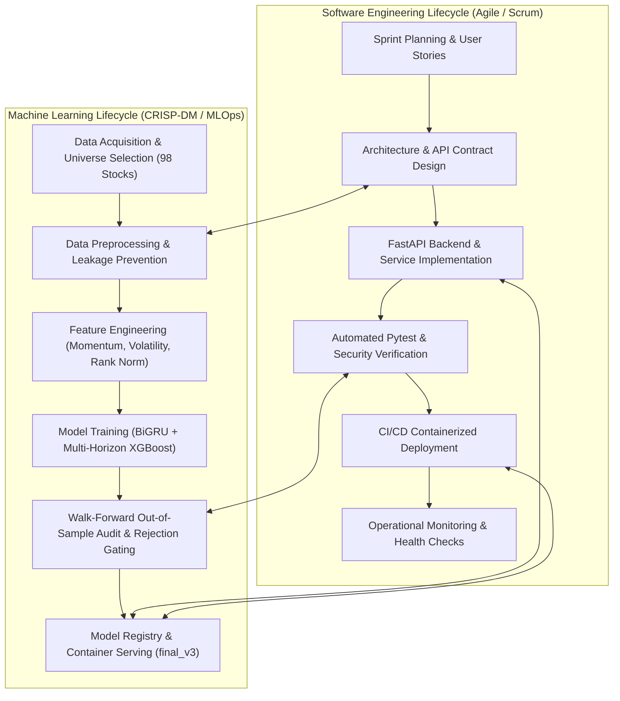
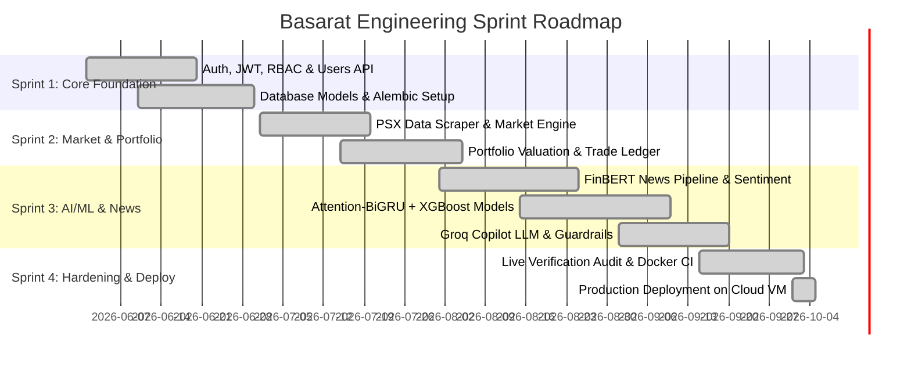
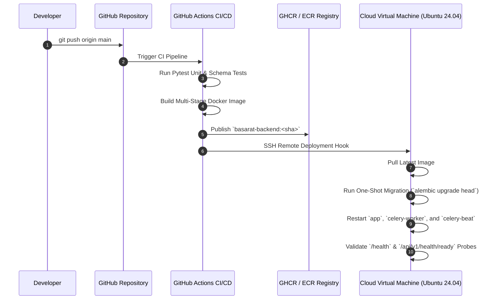

# Software Development Life Cycle (SDLC)

## Project: Basarat — Smart PSX Investment Intelligence Platform

**Document Version:** 2.0  
**Process Model:** Hybrid Agile-Scrum with CRISP-DM / MLOps Extensions  
**Target Platform:** Pakistan Stock Exchange (PSX) Mobile-First Backend Ecosystem

---

## 1. Executive Summary & SDLC Methodology Selection

The **Basarat** platform integrates conventional software engineering (high-throughput REST/WebSocket APIs, relational transaction ledgers, distributed task scheduling) with advanced machine learning (time-series forecasting, NLP sentiment classification, and LLM RAG copilot).

To accommodate this dual nature, the project adopts a **Hybrid Agile-Scrum methodology augmented with the CRISP-DM (Cross-Industry Standard Process for Data Mining) MLOps lifecycle**:



---

## 2. Phase-by-Phase SDLC Breakdown

---

### Phase 1: Requirement Analysis & Feasibility Study

#### Objectives:
- Identify friction points for Pakistani retail investors on the PSX.
- Formulate Software Requirement Specifications (SRS) for functional and non-functional requirements.
- Evaluate technical feasibility for real-time scraping, Shariah compliance, and AI inference latency.

#### Key Activities:
1. **Domain Research**: Analyzed PSX trading rules, circuit limits ($\pm 7.5\%$), and KMI-30 Shariah screening guidelines (AAOIFI standards).
2. **Stakeholder & User Persona Definition**: Retail investors, active swing traders, and Islamic investors.
3. **SRS Documentation**: Drafted [Functional Requirements (FR-01 to FR-16)](file:///d:/FYP/Basarat-fyp-official/docs/01-project/functional-requirements.md) and [NFRs](file:///d:/FYP/Basarat-fyp-official/docs/01-project/non-functional-requirements.md) (sub-second API responses, 99.9% availability, zero lookahead leakage).

#### Artifacts Delivered:
- [`docs/01-project/project-overview.md`](file:///d:/FYP/Basarat-fyp-official/docs/01-project/project-overview.md)
- [`docs/01-project/functional-requirements.md`](file:///d:/FYP/Basarat-fyp-official/docs/01-project/functional-requirements.md)
- [`docs/01-project/non-functional-requirements.md`](file:///d:/FYP/Basarat-fyp-official/docs/01-project/non-functional-requirements.md)

---

### Phase 2: System & Architectural Design

#### Objectives:
- Deconstruct the platform into high-level and low-level architectural components using the C4 model.
- Define relational database schemas, Redis key namespaces, and OpenAPI REST contracts.
- Establish Architectural Decision Records (ADRs) for database, caching, framework, and ML design.

#### Key Activities:
1. **High-Level Design (HLD)**: Designed layered monolith with distributed Celery worker fleet and Redis message bus.
2. **Low-Level Design (LLD)**: Created dependency injection class hierarchies, sequence diagrams for post-market pipelines, and WebSocket streaming protocols.
3. **Database Schema Design**: Designed 20+ relational PostgreSQL tables with foreign keys, composite time-series indices, and migration paths via Alembic.

#### Artifacts Delivered:
- [`docs/02-architecture/software-design-document.md`](file:///d:/FYP/Basarat-fyp-official/docs/02-architecture/software-design-document.md) (Master SDD)
- [`docs/02-architecture/system-architecture.md`](file:///d:/FYP/Basarat-fyp-official/docs/02-architecture/system-architecture.md) (HLD)
- [`docs/02-architecture/api-architecture.md`](file:///d:/FYP/Basarat-fyp-official/docs/02-architecture/api-architecture.md) (LLD)
- [`docs/02-architecture/database-design.md`](file:///d:/FYP/Basarat-fyp-official/docs/02-architecture/database-design.md) (ER Diagram & Data Dictionary)
- [`docs/02-architecture/decisions/`](file:///d:/FYP/Basarat-fyp-official/docs/02-architecture/decisions/) (ADR-001 to ADR-008)

---

### Phase 3: Implementation & Iterative Development

#### Objectives:
- Implement the FastAPI backend, domain services, and ML training/serving engines across modular sprints.
- Maintain code cleanliness, PEP 8 standards, and strict typing via Pydantic v2.

#### Sprints & Work Breakdown:



---

### Phase 4: Verification, Quality Assurance & ML Auditing

#### Objectives:
- Ensure 100% test pass rate across unit, integration, and live audit suites.
- Verify machine learning integrity (zero lookahead leakage, out-of-sample walk-forward validation).

#### Testing Pyramid:

```
                  /\
                 /  \     Live 80-Point Production Audit
                / E2E \    (scripts/run_live_oracle_comprehensive_audit.py)
               /-------\
              /  API    \   API Route Contract Tests
             /Integration\   (tests/api/ - 17 Test Suites)
            /-------------\
           /   Unit Tests  \  Isolated Unit Tests (204 Tests Passed)
          /_________________\  (tests/unit/ - Schemas, Security, ML, Services)
```

#### Key QA Milestones:
1. **Unit Test Suite**: 204/204 tests passed with 100% success (`pytest backend/tests/unit/`).
2. **ML Walk-Forward Audit**: Verified 18,919 out-of-sample predictions across 2020–2026 dataset; confirmed $57.56\%$ actionable accuracy at $\tau \ge 0.55$ and $65.38\%$ at $\tau \ge 0.60$.
3. **Security Audit**: Validated JWT expiration, Bcrypt password hashing (work factor 12), TrustedHost header verification, and SlowAPI rate limits.

---

### Phase 5: Deployment & Release Engineering

#### Objectives:
- Package application into reproducible, multi-stage Docker containers.
- Automate deployment via GitHub Actions CI/CD to cloud infrastructure.



---

### Phase 6: Operations, Maintenance & Continuous Monitoring

#### Objectives:
- Ensure high availability, automated recovery, and proactive drift detection.

#### Operational Infrastructure:
- **Health Probes**: Liveness probe at `/healthz` (200 OK) and readiness probe at `/readyz` (verifying Postgres, Redis, Celery, and loaded ML model states).
- **Automated Circuit Breakers**: Upstream PSX scraper automatically pauses for 900 seconds upon receiving HTTP 403/429 rate limit responses.
- **Single-Flight Locks**: Redis distributed locks (`SET key val NX EX 60`) guarantee single-writer execution for post-market workflows.

---

## 3. RACI Responsibility Matrix

| SDLC Phase / Deliverable | Project Lead | Backend Engineer | ML Engineer | QA / Tester | DevOps / SRE |
|---|:---:|:---:|:---:|:---:|:---:|
| **Requirements & SRS** | Accountable | Consulted | Consulted | Informed | Informed |
| **System Architecture (HLD/LLD)** | Accountable | Responsible | Responsible | Consulted | Consulted |
| **FastAPI Backend & Routers** | Informed | Responsible | Consulted | Consulted | Informed |
| **ML Pipelines (BiGRU / XGBoost)**| Informed | Consulted | Responsible | Consulted | Informed |
| **Database Migrations (Alembic)** | Informed | Responsible | Informed | Consulted | Responsible |
| **Unit & Integration Testing** | Informed | Responsible | Responsible | Accountable | Informed |
| **CI/CD Pipeline & Docker** | Informed | Consulted | Informed | Consulted | Responsible |
| **Production Health Monitoring** | Accountable | Responsible | Consulted | Informed | Responsible |

---

## 4. Technology & Tooling Ecosystem

| SDLC Phase | Tool / Technology | Purpose |
|---|---|---|
| **Planning & Tracking** | GitHub Projects / Issues | Task tracking, sprint planning, backlog management |
| **Architecture & Modeling**| Mermaid.js / Markdown | High-level C4 diagrams, ER diagrams, sequence flows |
| **Core Development** | Python 3.11 / 3.13, FastAPI | Asynchronous REST and WebSocket web API framework |
| **Database & Caching** | PostgreSQL 16, Redis 7, Alembic | Relational persistence, distributed caching, migrations |
| **Machine Learning** | TensorFlow / Keras, XGBoost, Scikit-Learn | Deep learning, gradient boosting, and preprocessing |
| **NLP & LLM** | HuggingFace FinBERT, Groq Cloud (Llama 3.3) | News sentiment classification, conversational Copilot RAG |
| **Testing & Quality** | Pytest, Faker, AnyIO, Postman | Automated unit testing, schema validation, live API tests |
| **Containerization** | Docker, Docker Compose | Multi-container micro-monolith isolation |
| **CI/CD & Hosting** | GitHub Actions, GHCR, Oracle Cloud Infrastructure (OCI ARM64 VM) | Automated build, test, and containerized deployment |
| **Monitoring** | FastAPI Health Probes, Celery Flower | Container liveness, readiness, and task queue monitoring |

---

## 5. Risk Management & Mitigation Matrix

| Identified Risk | Severity | Mitigation Strategy Implemented |
|---|:---:|---|
| **Upstream PSX Portal 403 / 429 Bans** | High | Implemented 900s circuit breaker, 150s batch throttling, and staged atomic publication (`ADR-007`). |
| **Data Lookahead Leakage in ML** | Critical | Enforced strict chronological walk-forward splits; verified zero correlation between features $\le T$ and targets $> T$. |
| **LLM Financial Misinformation / Hallucination** | High | Pre-inference query filtering, dynamic RAG context injection, and mandatory post-inference risk disclaimers (`ADR-008`). |
| **Database Connection Pool Exhaustion** | Medium | Configured asynchronous connection pooling (`asyncpg`, pool size=10) with transaction pooler isolation. |
| **Celery Task Backlog & Duplicate Execution** | Medium | Redis single-flight locks, separate worker queues for live vs ML tasks, and `task_acks_late=True`. |
