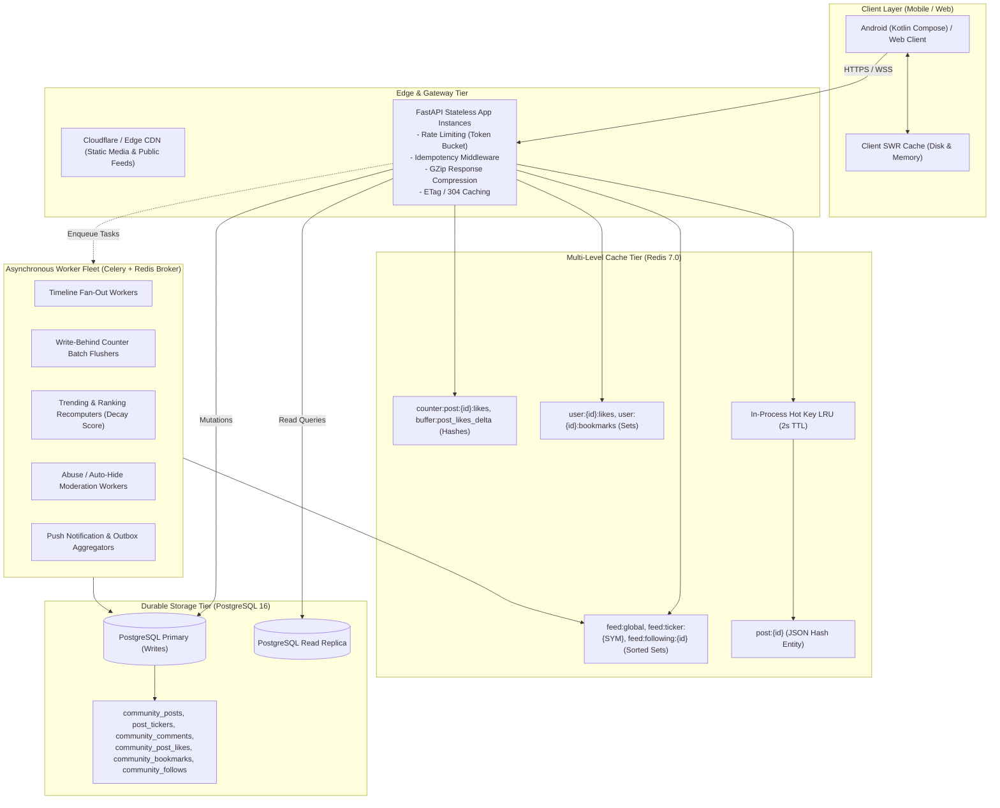

# Community & Social Feed Architecture (Enterprise Scale)

This document specifies the enterprise re-architecture of the **Basarat Community & Social Feed** module, designed to deliver sub-100ms server response times, high concurrent throughput, and zero-downtime scalability comparable to large financial social feeds (StockTwits, Twitter/X, Reddit).

---

## 1. System Architecture Diagram



---

## 2. Redis Key Schema & TTL Matrix

| Key Pattern | Redis Type | Description | Base TTL | Invalidation / Update Trigger |
|---|---|---|:---:|---|
| `post:{id}` | `String (JSON)` | Cached post entity with author snippet, media metadata, price snapshot, and tickers. | 3600s + Jitter | On post edit, delete, moderate auto-hide, or direct removal. |
| `user:{id}:profile` | `String (JSON)` | User summary (id, username, full_name, avatar_url, verified). | 1800s + Jitter | On user avatar or profile update. |
| `feed:global` | `Sorted Set` | Global market feed. Member: `post_id`, Score: `timestamp`. Capped at 1,000 items. | 900s + Jitter | On new published post (`ZADD`), post delete (`ZREM`). |
| `feed:ticker:{SYM}` | `Sorted Set` | Ticker-specific feed for symbol `SYM` (e.g. `feed:ticker:OGDC`). | 900s + Jitter | On new post mentioning cashtag `$SYM` (`ZADD`). |
| `feed:user:{id}` | `Sorted Set` | User's public posts feed. Member: `post_id`, Score: `timestamp`. | 900s + Jitter | On user new post, edit, or delete. |
| `feed:following:{id}` | `Sorted Set` | Personal timeline for follower. Populated by fan-out worker. | 900s + Jitter | Fan-out on write for regular users (&lt;10k followers). |
| `user:{id}:likes` | `Set` | Set of post IDs liked by user for O(1) `liked_by_me` check. | 900s + Jitter | `SADD` on like, `SREM` on unlike. |
| `user:{id}:bookmarks` | `Set` | Set of post IDs bookmarked by user for O(1) `bookmarked_by_me`. | 900s + Jitter | `SADD` on bookmark, `SREM` on unbookmark. |
| `counter:post:{id}:likes` | `String (Int)` | High-throughput live like counter. | 86400s | Incremented on like (`INCRBY 1`), decremented on unlike. |
| `buffer:post_likes_delta` | `Hash` | Write-behind delta accumulator (`post_id` -> `delta`). | N/A | Flushed every 5s by Celery task `flush_counter_deltas`. |
| `buffer:post_comments_delta`| `Hash` | Write-behind delta accumulator for comments count. | N/A | Flushed every 5s by Celery task. |
| `buffer:post_views_delta` | `Hash` | Sampled view counts accumulator. | N/A | Flushed every 5s by Celery task. |
| `trending:tickers` | `String (JSON)` | Precomputed top trending tickers in last 24h. | 120s | Recomputed every 60s by `recompute_trending_feeds`. |
| `trending:posts` | `String (JSON)` | Precomputed viral discussion post IDs. | 120s | Recomputed every 60s by `recompute_trending_feeds`. |
| `idempotency:{uid}:{key}` | `String (JSON)` | Cached HTTP status & response for duplicate write protection. | 86400s | Set on write, expires automatically. |
| `otp:verification:{email}` | `String` | Cached 6-digit signup OTP for sub-millisecond verification. | 600s | Set on signup, deleted on successful verification. |

---

## 3. Database Schema & Composite Indexes

```sql
-- 1. community_posts
CREATE TABLE community_posts (
    id VARCHAR(36) PRIMARY KEY,
    author_id VARCHAR(36) NOT NULL REFERENCES users(id) ON DELETE CASCADE,
    post_type VARCHAR(20) NOT NULL,
    stock_symbol VARCHAR(20) REFERENCES stocks(symbol),
    content TEXT NOT NULL,
    image_url VARCHAR(500),
    image_public_id VARCHAR(255),
    media_metadata TEXT,
    price_at_post DOUBLE PRECISION,
    like_count INTEGER NOT NULL DEFAULT 0,
    comment_count INTEGER NOT NULL DEFAULT 0,
    report_count INTEGER NOT NULL DEFAULT 0,
    view_count INTEGER NOT NULL DEFAULT 0,
    bookmark_count INTEGER NOT NULL DEFAULT 0,
    is_edited BOOLEAN NOT NULL DEFAULT FALSE,
    edited_at TIMESTAMP WITH TIME ZONE,
    status VARCHAR(30) NOT NULL DEFAULT 'PUBLISHED',
    removed_reason VARCHAR(30),
    created_at TIMESTAMP WITH TIME ZONE NOT NULL DEFAULT NOW(),
    updated_at TIMESTAMP WITH TIME ZONE NOT NULL DEFAULT NOW()
);

CREATE INDEX ix_community_posts_author_status_created ON community_posts (author_id, status, created_at DESC);
CREATE INDEX ix_community_posts_status_created_id ON community_posts (status, created_at DESC, id DESC);
CREATE INDEX ix_community_posts_stock_created ON community_posts (stock_symbol, created_at DESC);

-- 2. community_post_tickers (Junction table for O(1) cashtag feeds)
CREATE TABLE community_post_tickers (
    id VARCHAR(36) PRIMARY KEY,
    post_id VARCHAR(36) NOT NULL REFERENCES community_posts(id) ON DELETE CASCADE,
    ticker VARCHAR(20) NOT NULL,
    created_at TIMESTAMP WITH TIME ZONE NOT NULL DEFAULT NOW(),
    CONSTRAINT uq_community_post_tickers_post_ticker UNIQUE (post_id, ticker)
);
CREATE INDEX ix_community_post_tickers_ticker_created ON community_post_tickers (ticker, created_at DESC);
CREATE INDEX ix_community_post_tickers_ticker_id ON community_post_tickers (ticker, post_id);

-- 3. community_bookmarks
CREATE TABLE community_bookmarks (
    id VARCHAR(36) PRIMARY KEY,
    post_id VARCHAR(36) NOT NULL REFERENCES community_posts(id) ON DELETE CASCADE,
    user_id VARCHAR(36) NOT NULL REFERENCES users(id) ON DELETE CASCADE,
    created_at TIMESTAMP WITH TIME ZONE NOT NULL DEFAULT NOW(),
    CONSTRAINT uq_community_bookmarks_post_user UNIQUE (post_id, user_id)
);
CREATE INDEX ix_community_bookmarks_user_created ON community_bookmarks (user_id, created_at DESC);

-- 4. community_comments
CREATE TABLE community_comments (
    id VARCHAR(36) PRIMARY KEY,
    post_id VARCHAR(36) NOT NULL REFERENCES community_posts(id) ON DELETE CASCADE,
    author_id VARCHAR(36) NOT NULL REFERENCES users(id) ON DELETE CASCADE,
    parent_comment_id VARCHAR(36) REFERENCES community_comments(id) ON DELETE CASCADE,
    content TEXT NOT NULL,
    reply_count INTEGER NOT NULL DEFAULT 0,
    status VARCHAR(20) NOT NULL DEFAULT 'PUBLISHED',
    created_at TIMESTAMP WITH TIME ZONE NOT NULL DEFAULT NOW(),
    updated_at TIMESTAMP WITH TIME ZONE NOT NULL DEFAULT NOW()
);
CREATE INDEX ix_community_comments_post_parent_created ON community_comments (post_id, parent_comment_id, created_at ASC, id ASC);
```

---

## 4. Failure Mode Matrix & Degraded Resilience

| Failure Scenario | Impact | System Response & Degraded Behavior |
|---|---|---|
| **Redis Down / Unreachable** | Cache miss on feeds and entities. | Circuit breaker opens. API immediately falls back to PostgreSQL with tight query limits (`limit=20`) and indexed scans. Zero 500 errors. |
| **Celery / Queue Down** | Async fan-out and counter flush delayed. | Transactional outbox retains tasks in DB. Like counts served from database counters. User receives successful write response. |
| **Database Failover / Replica Lag** | Reads might be delayed by replica replication lag. | Read-your-own-writes session routing: after user creates post or like, their own feed reads from Primary or local cache for 30 seconds. |
| **Cloudinary / Object Storage Outage** | Direct media upload fails. | Pre-signed upload endpoint returns descriptive 503; text-only posting continues without disruption. |
| **High-Traffic Viral Post (Stampede)** | 100,000 users loading same post. | L1 in-process LRU cache (2.5s TTL) + Single-flight async mutex ensures only 1 DB/Redis read query executes. |

---

## 5. Operations & Scaling Runbook

### Threshold Scaling Guidelines
- **0 - 500 QPS**: Single FastAPI instance + PostgreSQL 16 + Redis 7.0 standalone.
- **500 - 5,000 QPS**: 4x FastAPI stateless replicas + PgBouncer connection pooling + Redis Read Replica for feeds.
- **5,000 - 50,000 QPS**: Redis Cluster (sharded by post/user ID) + OpenSearch for post search + CDN edge caching on ticker feeds.

### Disaster Recovery: Rebuild Caches from DB
Run the cache warmup / disaster recovery command:
```bash
python -m app.tasks.community_tasks
```
