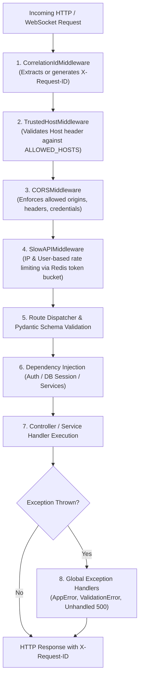
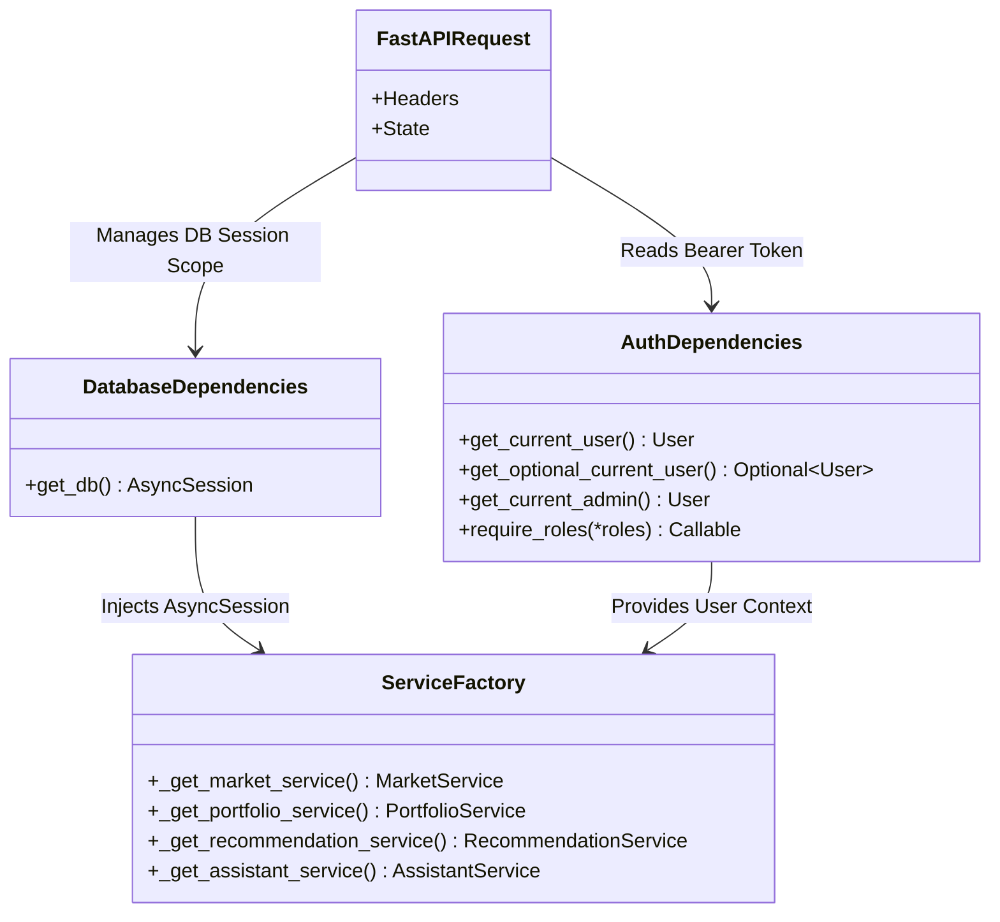
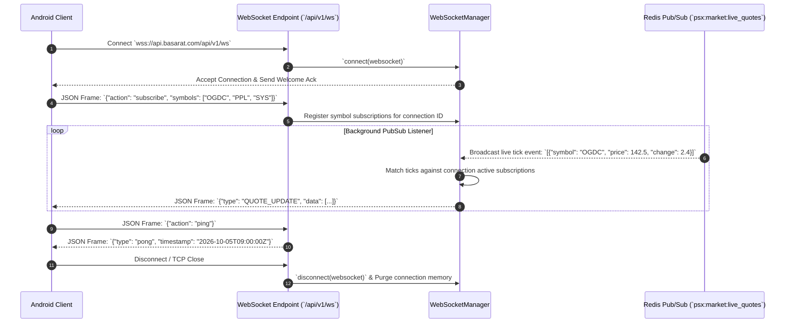

# API Architecture

## 1. Overview & API Principles

The Basarat API is designed as a **high-throughput, low-latency RESTful JSON and WebSocket interface** built on **FastAPI**. It exposes over 70 endpoints categorized into 22 domain routers, serving the mobile Android application and internal administrative tools.

### Core Architectural Principles:
1. **Predictable REST Resource Modeling**: Standard HTTP verbs (`GET`, `POST`, `PUT`, `PATCH`, `DELETE`) operating on normalized resource paths versioned under `/api/v1/`.
2. **Type Safety & Automatic Validation**: 100% of request payloads and response contracts are enforced using **Pydantic v2** models.
3. **Layered Decoupling**: Routers remain thin entry points that delegate complex domain logic to reusable services via FastAPI’s Dependency Injection system (`Depends()`).
4. **End-to-End Traceability**: Every request is tagged with a unique Correlation ID (`X-Request-ID`), propagated across application logs and response headers.
5. **Resilient Error Envelopes**: Structured error formats conforming to standard envelopes, avoiding raw server tracebacks in production.

---

## 2. Middleware Pipeline

Incoming HTTP requests pass through a sequence of security, rate limiting, and observability middlewares before reaching the route handlers:



---

## 3. Router Catalog & Domain Breakdown

The API is structured into 22 domain routers registered in `app/main.py`:

| Router Module | Mount Prefix | Auth Policy | Responsibility |
|---|---|---|---|
| `auth.py` | `/api/v1/auth` | Public / Partial | User registration, login, token refresh, OTP password resets, OAuth |
| `users.py` | `/api/v1/users` | Authenticated | User profile management, avatar updates, investor risk profiling |
| `devices.py` | `/api/v1/devices` | Authenticated | FCM device token registration for push notifications |
| `webhooks.py` | `/api/v1/webhooks` | Signature Verified | Third-party webhooks (e.g. Clerk authentication sync) |
| `market.py` | `/api/v1/market` | Public | Live market status, benchmark indices (KSE-100/30, KMI-30), top gainers/losers/volume |
| `stocks.py` | `/api/v1/stocks` | Public | Equities lookup, quotes, historical OHLCV candles, technical indicators, fundamentals |
| `watchlist.py` | `/api/v1/watchlists` | Authenticated | User watchlists, symbol target alerts, watchlist CRUD |
| `forecast.py` | `/api/v1/forecast` | Public | AI/ML directional price forecasts (GRU + XGBoost), target & stop-loss levels |
| `recommendations.py` | `/api/v1/recommendations` | Public / Authenticated | Multi-factor quantitative rankings, top stock picks, customizable weight presets |
| `portfolio.py` | `/api/v1/portfolio` | Authenticated | Multi-portfolio tracking, transaction ledger, mark-to-market valuation, P&L analytics |
| `risk.py` | `/api/v1/risk` | Authenticated | Portfolio risk metrics (VaR, CVaR, Sharpe ratio, beta, Monte Carlo simulations) |
| `sentiment.py` | `/api/v1/sentiment` | Public | FinBERT market mood, symbol sentiment scores, news sentiment trends |
| `news.py` | `/api/v1/news` | Public | Aggregated Pakistani financial news, category filters, market impact tags |
| `events.py` | `/api/v1/events` | Public | Corporate announcements, board meetings, dividend declarations, AGMs |
| `alerts.py` | `/api/v1/alerts` | Authenticated | Custom price alerts, percent-change triggers, alert rule management |
| `notifications.py` | `/api/v1/notifications` | Authenticated | In-app notification inbox, unread badges, mark-as-read actions |
| `shariah.py` | `/api/v1/shariah` | Public | KMI-30 & AAOIFI Shariah screening, debt/asset ratios, dividend purification metrics |
| `etfs.py` | `/api/v1/etfs` | Public / Admin CRUD | Exchange Traded Funds catalog, NAV histories, constituent holdings |
| `ipos.py` | `/api/v1/ipos` | Public / Admin CRUD | Upcoming and historical IPO listings, prospectus details, subscription timetables |
| `community/` | `/api/v1/community` | Authenticated | Social trading feed, ideas, comments, likes, user follows, investor profiles |
| `assistant/chat.py` | `/api/v1/assistant` | Authenticated | Basarat AI Copilot (Groq LLM), synchronous & SSE streaming chat, starter prompts |
| `admin/community.py`| `/api/v1/admin/community` | Admin Only | Moderation dashboard, flagged content review, user suspension |
| `ws.py` | `/api/v1/ws` | Public / Optional Token | Real-time WebSocket connection for live quotes & alert streaming |
| `health.py` | `/api/v1/health`, `/health` | Public | Container liveness (`/healthz`) and system readiness (`/readyz`) probes |

---

## 4. Dependency Injection Architecture

FastAPI’s Dependency Injection system manages resource lifecycles, database sessions, authentication, and service orchestration:



### Key Dependency Implementations:
- **`get_db()` (`app/db/session.py`)**: Yields an asynchronous SQLAlchemy `AsyncSession`. Automatically commits on clean completion and rolls back on unhandled exceptions.
- **`get_current_user()` (`app/core/authorization.py`)**: Validates JWT Bearer access token signature, checks expiration, queries the active user record from database, and raises `401 Unauthorized` if invalid.
- **`get_current_admin()` (`app/core/authorization.py`)**: Ensures `user.is_admin == True`, raising `403 Forbidden` for non-privileged accounts.

---

## 5. WebSocket Architecture & Streaming Protocol

Real-time market streaming is powered by `app/services/websocket_manager.py` and `app/api/v1/ws.py`.



---

## 6. Standard Error Envelopes

All errors returned by the API adhere to consistent JSON structures:

### 6.1 Standard Domain Error (`AppError` Subclasses)
```json
{
  "success": false,
  "error": {
    "code": "STOCK_NOT_FOUND",
    "message": "Stock symbol 'XYZ' not found in active PSX universe",
    "details": null
  },
  "request_id": "8de414d4-12ad-4958-9ca1-b7e81117cfb8"
}
```

### 6.2 Validation Error (Pydantic / 422 Unprocessable Entity)
```json
{
  "success": false,
  "error": {
    "code": "VALIDATION_ERROR",
    "message": "Invalid request payload parameters",
    "details": [
      {
        "loc": ["body", "quantity"],
        "msg": "Input should be greater than 0",
        "type": "greater_than"
      }
    ]
  },
  "request_id": "8de414d4-12ad-4958-9ca1-b7e81117cfb8"
}
```

### 6.3 Rate Limit Error (429 Too Many Requests)
```json
{
  "success": false,
  "error": {
    "code": "RATE_LIMIT_EXCEEDED",
    "message": "Too many requests. Limit: 5 per 1 minute. Please retry after 42 seconds."
  },
  "request_id": "8de414d4-12ad-4958-9ca1-b7e81117cfb8"
}
```

---

## 7. Caching & Single-Flight Concurrency Controls

To protect external upstream data providers (PSX portals, news feeds) from redundant load and race conditions during high client concurrency:

1. **Redis Key Caching**:
   - Market Summary / Gainers / Losers: Cached with 60s TTL.
   - Stock Overview & Technicals: Cached with 120s TTL intraday.
   - ML Forecasts & Recommendations: Cached until next post-market generation (TTL up to 24 hours).
2. **Single-Flight Distributed Locking**:
   - Redis locks (`SET key val NX EX 30`) ensure that only **one worker or request** triggers an upstream scrape or computation. Concurrent requests wait on the lock or consume the existing cached payload, preventing cache stampedes.
