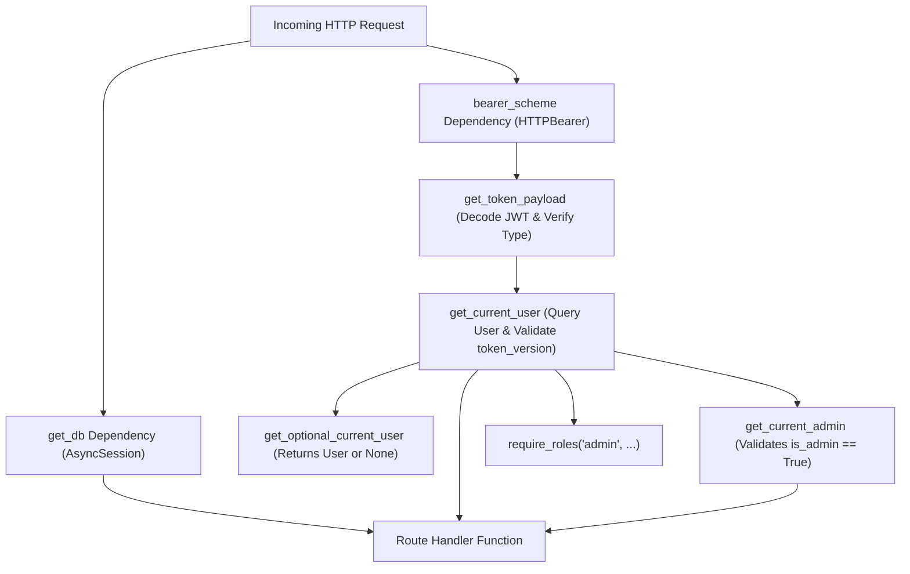

# API Architecture & Design — Basarat

## 1. API Paradigms & Protocols

Basarat exposes three primary API transport paradigms:

1. **RESTful HTTP/JSON APIs (Primary Transport):** Synchronous request-response endpoints following resource-oriented REST conventions for all core business operations, user management, and transactional processing.
2. **Server-Sent Events (SSE):** Unidirectional text-stream transport (`text/event-stream`) used for the AI Copilot (`POST /api/v1/assistant/chat/stream`) to stream LLM tokens to clients with minimal perceived latency.
3. **Real-Time WebSockets (WSS):** Bidirectional persistent socket connections (`/api/v1/ws/market` and `/api/v1/ws/alerts`) for high-frequency live market quotes and instant price-trigger alerts.

---

## 2. URL Prefixing & Versioning Strategy

All public and authenticated routes are strictly prefixed with **`/api/v1`** (configured via `settings.API_V1_PREFIX`).

### Compatibility & Root Routing
- Root health probe: `GET /` returns API operational status (`online`), version, and OpenAPI schema URL.
- Health Probes: Mounted at both `/api/v1/health` and `/health` for container orchestration compatibility.
- WebSocket Routes: Mounted at both `/api/v1/ws/*` and `/ws/*` for legacy mobile client compatibility.

---

## 3. Router Hierarchy & Package Organization

The router structure is organized by domain module under `backend/app/api/v1/`:

```text
backend/app/api/v1/
├── auth.py             # Signup, login, refresh, logout, 3-step password reset, OAuth
├── users.py            # User profile, risk preferences, investment options
├── devices.py          # Push notification FCM device token management
├── webhooks.py         # Third-party callbacks (Clerk authentication webhooks)
├── market.py           # Market summaries, indices, gainers, losers, volume, curated
├── stocks.py           # Stock details, search, technical indicators, fundamentals
├── watchlist.py        # Custom watchlists, 1-tap toggle, baseline price tracking
├── forecast.py         # ML directional forecasts, forecast history, pipeline schedule
├── recommendations.py  # Multi-factor buy/hold/sell rankings, engine weights
├── portfolio.py        # Portfolio ledger, ACB calculations, P&L breakdown, allocation
├── prices.py           # Fast quote cache lookup for portfolio valuation UIs
├── risk.py             # VaR, CVaR, stress testing, async Monte Carlo simulation
├── sentiment.py        # FinBERT sentiment analysis, rolling aggregates, stock sentiment
├── news.py             # Paginated financial news feed, manual refresh, source health
├── events.py           # PSX corporate calendar, AGM dates, dividend payouts
├── alerts.py           # Custom price alert rules and user alert inbox
├── notifications.py    # Notification center read/unread inbox
├── shariah.py          # AAOIFI / KMI-30 compliance screening & dividend purification
├── community/          # Social trading feed sub-package
│   ├── posts.py        # Post CRUD, feed, keyword search, post likes, reporting
│   ├── comments.py     # Threaded comments on posts, comment reporting
│   ├── follows.py      # User follow/unfollow and follow network graphs
│   ├── profile.py      # Public and personal community profiles
│   └── notifications.py# Social notification feed (likes, comments, follows)
├── assistant/          # Stock AI Assistant sub-package
│   └── chat.py         # Standard REST chat, SSE stream, conversation management
├── etfs.py             # PSX ETF catalog, benchmark tracking, and admin CRUD
├── ipos.py             # PSX IPO pipeline, calendar, performance, and admin CRUD
├── admin/              # Administrative sub-package
│   └── community.py    # Review reported posts/comments, moderation actions log
├── ws.py               # WebSocket quote and alert streaming handlers
├── health.py           # Service liveness and dependency readiness probes
└── system.py           # Internal metrics and system diagnostics
```

---

## 4. Dependency Injection Architecture

FastAPI's dependency injection system is utilized across all routers to manage database sessions, authentication, and role authorization:



### Key Dependencies in [authorization.py](file:///d:/Ahmed%20Dev/Projects/Basarat-fyp-official/backend/app/core/authorization.py):
- `get_db -> AsyncSession`: Yields an isolated transactional async database session and ensures closure/rollback upon request completion.
- `get_token_payload -> dict`: Extracts and validates the Bearer token signature, expiration, and `type == "access"`.
- `get_current_user -> User`: Fetches the active user from the database, confirms `is_active == True`, and validates that the token's `tv` matches `User.token_version`.
- `get_optional_current_user -> User | None`: Silently extracts the authenticated user if a valid Bearer token is provided, returning `None` for anonymous callers without raising exceptions.
- `get_current_admin -> User`: Inherits from `get_current_user` and enforces `current_user.is_admin is True`, raising HTTP 403 `ForbiddenError` otherwise.

---

## 5. Schema Validation & Serialization with Pydantic v2

All incoming payloads and outgoing responses are strictly typed and validated using **Pydantic v2** models:

- **Strict Type Validation:** Automated coercion and validation for UUIDs, email formats, numeric decimal precision, and enumeration values.
- **Request Models:** Contain validation rules (e.g., minimum password lengths, non-empty content constraints, valid ticker symbols).
- **Response Models:** Explicitly whitelist fields to prevent leaking sensitive database attributes (e.g., `hashed_password`, `token_version` are excluded from user responses).
- **Decimal Precision:** Financial values (stock prices, portfolio balances, P&L) use `Decimal` / `float` with standardized 2-to-4 decimal places.

---

## 6. HTTP Status Code Strategy

The API enforces uniform, standard HTTP status codes:

| Status Code | Usage Scenario | Example Endpoints |
|---|---|---|
| **`200 OK`** | Successful retrieval, modification, or processing. | `GET /market/quotes`, `PATCH /users/me`, `POST /auth/login` |
| **`201 Created`** | Successful creation of a persistent resource. | `POST /portfolio/transactions`, `POST /community/posts`, `POST /watchlists` |
| **`202 Accepted`** | Asynchronous background task queued for processing. | `POST /risk/monte-carlo`, `POST /news/refresh` |
| **`204 No Content`** | Successful deletion with no body returned. | `DELETE /watchlists/{id}`, `DELETE /community/posts/{id}` |
| **`400 Bad Request`** | Malformed request or business logic validation failure. | `POST /auth/verify-email` (Invalid OTP), `POST /portfolio/transactions` (Insufficient shares) |
| **`401 Unauthorized`** | Missing, invalid, expired, or revoked Bearer token. | Any protected route called without valid credentials. |
| **`403 Forbidden`** | Authenticated user lacks permission (non-admin on admin route, inactive user). | `GET /admin/community/reports` called by regular user. |
| **`404 Not Found`** | Resource does not exist or user does not own the resource. | `GET /watchlists/{invalid_id}`, `GET /stocks/{invalid_symbol}` |
| **`409 Conflict`** | Resource duplication or unique constraint violation. | `POST /watchlists/{id}/items` (Symbol already in watchlist). |
| **`422 Unprocessable`** | Pydantic schema validation error (malformed JSON, invalid field types). | Payload missing required fields or invalid types. |
| **`429 Too Many Requests`** | Client exceeded sliding-window rate limit. | Rapid requests to `POST /auth/login` or `POST /news/refresh`. |
| **`500 Internal Error`** | Unhandled server exception. | Captured by global exception handler, logs traceback, returns safe generic JSON. |
| **`503 Service Unavailable`** | Critical subsystem or ML model artifact unavailable. | `GET /forecast/{symbol}` when ML artifacts failed to load at startup. |

---

## 7. Pagination, Filtering, Sorting & Search Conventions

### 7.1 Cursor & Offset Pagination
- **Offset Pagination:** Standard for admin, watchlist, and user transaction lists (`limit: int = 20`, `offset: int = 0`).
- **Cursor / Timestamp Pagination:** Used in high-volume time-series feeds (`News`, `Community Feed`):
  - Parameters: `limit: int = 20`, `before: datetime | None = None` (or `cursor: str`).
  - Allows seamless infinite scrolling without missing newly published items.

### 7.2 Filtering & Query Parameters
- **Symbol Filtering:** Multi-symbol queries accept comma-separated strings or repeated parameters (`GET /prices/bulk?symbols=ENGRO,LUCK,OGDC`).
- **Date Range Filtering:** Standardized ISO-8601 date parameters (`start_date=2026-01-01&end_date=2026-09-30`).
- **Sector & Category Filtering:** Case-insensitive string filters matching PSX sectors.

### 7.3 Search & Autocomplete
- Text search endpoints (e.g. `GET /stocks/search?q=eng`) perform case-insensitive substring matching on ticker symbols and company names, returning ranked matches with live quote badges.
