# Database Design

## Database Technology

| Aspect | Details |
|--------|---------|
| **DBMS** | PostgreSQL 16 |
| **ORM** | SQLAlchemy 2.x with async support (asyncpg driver) |
| **Sync Driver** | psycopg2 (for Celery tasks and Alembic migrations) |
| **Migration Tool** | Alembic |
| **Development** | Local PostgreSQL via Docker (postgres:16-alpine) |
| **Production** | Supabase managed PostgreSQL |

## Connection Management

- **Async Engine**: `pool_size=3`, `max_overflow=2`, `pool_recycle=1200`, `pool_pre_ping=True`
- **Sync Engine**: Lazy-initialized for Celery tasks, `pool_size=2`, `max_overflow=0`
- **Session**: Auto-commit on success, rollback on exception via `get_db()` dependency
- **Supabase Compatibility**: Automatic SSL configuration and `statement_cache_size=0` for transaction poolers (port 6543)

## Entity Relationship Diagram

```mermaid
erDiagram
    users ||--o{ refresh_tokens : "has"
    users ||--o{ password_reset_tokens : "has"
    users ||--o{ email_verification_tokens : "has"
    users ||--o{ devices : "has"
    users ||--o{ portfolio_transactions : "owns"
    users ||--o{ watchlists : "owns"
    users ||--o{ alerts : "has"
    users ||--o{ alert_rules : "has"
    users ||--o{ community_posts : "authors"
    users ||--o{ assistant_conversations : "has"
    users ||--o{ risk_assessments : "has"

    stocks ||--o{ stock_prices : "has"
    stocks ||--o{ portfolio_transactions : "referenced by"
    stocks ||--o{ community_posts : "tagged in"
    stocks ||--o{ sentiment_results : "has"
    stocks ||--o{ sentiment_aggregates : "has"
    stocks ||--o{ forecasts : "has"
    stocks ||--o{ shariah_screenings : "has"
    stocks ||--o{ news_article_symbols : "tagged in"

    watchlists ||--o{ watchlist_items : "contains"

    community_posts ||--o{ community_post_likes : "has"
    community_posts ||--o{ community_comments : "has"
    community_posts ||--o{ community_reports : "has"
    community_posts ||--o{ community_moderation_actions : "has"
    community_posts ||--o{ community_notifications : "triggers"

    community_comments ||--o{ community_reports : "has"
    community_comments ||--o{ community_moderation_actions : "has"

    users ||--o{ community_follows : "follower"
    users ||--o{ community_follows : "following"
    users ||--o{ community_notifications : "receives"

    assistant_conversations ||--o{ assistant_messages : "contains"

    news_articles ||--o{ news_article_symbols : "has"
    news_articles ||--o{ sentiment_results : "analyzed by"

    alert_rules ||--o{ alerts : "triggers"

    users {
        string id PK
        string email UK
        string username UK
        string hashed_password
        string full_name
        string avatar_url
        boolean is_active
        boolean is_verified
        boolean is_admin
        string oauth_provider
        string oauth_id
        string risk_tolerance
        json sector_preferences
        json recommendation_weights
        string investment_horizon
        json notification_preferences
        datetime created_at
        datetime updated_at
    }

    stocks {
        string id PK
        string symbol UK
        string name
        string sector
        string market
        boolean is_active
        datetime last_synced_at
    }

    predictions {
        int id PK
        string symbol
        string horizon
        datetime predicted_at
        string predicted_direction
        float bullish_pct
        float bearish_pct
        float sideways_pct
        date as_of_date
        date target_date
        string model_version
        string actual_direction
        boolean was_correct
        string gru_direction
        string xgb_direction
    }

    portfolio_transactions {
        string id PK
        string user_id FK
        string symbol FK
        enum transaction_type
        decimal quantity
        decimal price
        decimal fee
        date transaction_date
    }

    community_posts {
        string id PK
        string author_id FK
        string post_type
        string stock_symbol FK
        text content
        string image_url
        int like_count
        int comment_count
        int report_count
        string status
    }

    news_articles {
        string id PK
        string title
        string url
        string source
        string sentiment_label
        float sentiment_score
        datetime published_at
    }
```

## Database Tables Summary

| Table | Primary Key | Foreign Keys | Purpose |
|-------|------------|--------------|---------|
| `users` | `id` (UUID) | — | User accounts |
| `refresh_tokens` | `id` (UUID) | `user_id → users` | JWT refresh token tracking |
| `password_reset_tokens` | `id` (UUID) | `user_id → users` | Password reset OTP tokens |
| `email_verification_tokens` | `id` (UUID) | `user_id → users` | Email verification OTP tokens |
| `devices` | `id` (UUID) | `user_id → users` | FCM device registrations |
| `stocks` | `id` (UUID) | — | PSX stock master data |
| `stock_prices` | `id` (UUID) | `stock_id → stocks` | Historical OHLCV data |
| `predictions` | `id` (auto) | — | ML forecast predictions with audit trail |
| `forecasts` | `id` (UUID) | `stock_id → stocks` | Price-level forecasts |
| `portfolio_transactions` | `id` (UUID) | `user_id → users`, `symbol → stocks` | Buy/sell transactions |
| `watchlists` | `id` (UUID) | `user_id → users` | Named watchlists |
| `watchlist_items` | `id` (UUID) | `watchlist_id → watchlists` | Watchlist stock entries |
| `alerts` | `id` (UUID) | `user_id → users`, `rule_id → alert_rules` | Triggered alert notifications |
| `alert_rules` | `id` (UUID) | `user_id → users`, `stock_id → stocks` | User-defined alert conditions |
| `risk_assessments` | `id` (UUID) | `user_id → users` | Portfolio risk snapshots |
| `news_articles` | `id` (UUID) | — | Financial news articles |
| `news_article_symbols` | composite | `article_id → news_articles` | News ↔ stock symbol link |
| `news_source_state` | `source_key` | — | News scraper state tracking |
| `symbol_backfill_state` | `symbol` | — | Per-symbol backfill progress |
| `market_hours_config` | `id` (auto) | — | Market hours configuration |
| `sentiment_results` | `id` (UUID) | `news_article_id → news_articles`, `symbol → stocks` | Per-article sentiment scores |
| `sentiment_aggregates` | `id` (UUID) | `symbol → stocks` | Aggregated rolling sentiment |
| `market_events` | `id` (UUID) | — | Corporate events calendar |
| `shariah_screenings` | `id` (UUID) | `stock_id → stocks` | Shariah compliance results |
| `model_registry` | `id` (auto) | — | Trained model version tracking |
| `training_runs` | `id` (auto) | — | Retraining run audit log |
| `community_posts` | `id` (UUID) | `author_id → users`, `stock_symbol → stocks` | Social trading posts |
| `community_post_likes` | composite | `post_id → community_posts`, `user_id → users` | Post likes |
| `community_comments` | `id` (UUID) | `post_id → community_posts`, `author_id → users` | Comments (threaded) |
| `community_follows` | composite | `follower_id → users`, `following_id → users` | Follow relationships |
| `community_reports` | `id` (UUID) | `reporter_id → users`, `post_id`, `comment_id` | Content reports |
| `community_moderation_actions` | `id` (UUID) | `moderator_id → users`, `post_id`, `comment_id` | Moderation audit trail |
| `community_notifications` | `id` (UUID) | `recipient_id → users`, `actor_id → users` | Community notifications |
| `assistant_conversations` | `id` (UUID) | `user_id → users` | AI chat conversations |
| `assistant_messages` | `id` (UUID) | `conversation_id → assistant_conversations` | Chat messages |
| `etfs` | `id` (UUID) | — | ETF directory |
| `ipos` | `id` (UUID) | — | IPO listings |

## Important Constraints

- `predictions`: Unique constraint on `(symbol, horizon, as_of_date)`
- `community_posts`: Check constraint ensuring STOCK posts have a stock_symbol and GENERAL_MARKET posts do not
- `community_follows`: Check constraint preventing self-follow (`follower_id != following_id`)
- `community_reports`: Check constraint ensuring exactly one of `post_id` or `comment_id` is set
- `watchlists`: Partial unique index enforcing one default watchlist per user
- `watchlist_items`: Unique constraint on `(watchlist_id, symbol)`
- `news_articles`: Unique constraint on `content_hash`

## Migration History

19 Alembic migration files, from initial schema through community module, portfolio transactions, sentiment tables, news updates, assistant conversations, ETFs/IPOs, and constraint refinements.

## Transaction Handling

Sessions use auto-commit-on-success pattern in `get_db()`:
- Commit on normal exit
- Rollback on any exception
- Close in `finally` block

## Soft Delete Behavior

Community posts and comments use status-based soft deletion (`DELETED` status with `removed_reason`) rather than physical deletion. Posts can be `PUBLISHED`, `TEMPORARILY_HIDDEN`, or `DELETED`.
