# Database Design & Data Architecture — Basarat

## 1. Database Overview & Core Technology

Basarat uses **PostgreSQL 16** as its primary ACID-compliant relational datastore. The database layer is managed using **SQLAlchemy 2.0** declarative ORM mappings with explicit schema constraints, foreign key cascades, and comprehensive b-tree indexes.

### Dual-Driver Connection Strategy
1. **Asynchronous Driver (`asyncpg`):** Used by the FastAPI web application server (`postgresql+asyncpg://...`) to perform non-blocking asynchronous queries over connection pools.
2. **Synchronous Driver (`psycopg2`):** Used by Alembic migration scripts and synchronous Celery task worker routines (`postgresql+psycopg2://...`).

---

## 2. Entity-Relationship (ER) Diagram

```mermaid
erDiagram
    USERS ||--o{ REFRESH_TOKENS : "has"
    USERS ||--o{ PASSWORD_RESET_TOKENS : "has"
    USERS ||--o{ EMAIL_VERIFICATION_TOKENS : "has"
    USERS ||--o{ DEVICES : "owns"
    USERS ||--o{ WATCHLISTS : "creates"
    USERS ||--o{ PORTFOLIO_TRANSACTIONS : "records"
    USERS ||--o{ ALERTS : "receives"
    USERS ||--o{ ALERT_RULES : "configures"
    USERS ||--o{ ASSISTANT_CONVERSATIONS : "starts"
    USERS ||--o{ COMMUNITY_POSTS : "authors"
    USERS ||--o{ COMMUNITY_COMMENTS : "writes"
    USERS ||--o{ COMMUNITY_POST_LIKES : "likes"
    USERS ||--o{ COMMUNITY_FOLLOWS : "follows"
    USERS ||--o{ COMMUNITY_REPORTS : "submits"
    USERS ||--o{ RISK_ASSESSMENTS : "evaluated"

    STOCKS ||--o{ STOCK_PRICES : "has daily"
    STOCKS ||--o{ PORTFOLIO_TRANSACTIONS : "referenced in"
    STOCKS ||--o{ SHARIAH_SCREENINGS : "screened"
    STOCKS ||--o{ SENTIMENT_RESULTS : "analyzed in"
    STOCKS ||--o{ SENTIMENT_AGGREGATES : "aggregated"
    STOCKS ||--o{ NEWS_ARTICLE_SYMBOLS : "tagged in"
    STOCKS ||--o{ FORECASTS : "has"

    WATCHLISTS ||--o{ WATCHLIST_ITEMS : "contains"

    NEWS_ARTICLES ||--o{ NEWS_ARTICLE_SYMBOLS : "tags"
    NEWS_ARTICLES ||--o{ SENTIMENT_RESULTS : "scores"

    ASSISTANT_CONVERSATIONS ||--o{ ASSISTANT_MESSAGES : "contains"

    COMMUNITY_POSTS ||--o{ COMMUNITY_COMMENTS : "has"
    COMMUNITY_POSTS ||--o{ COMMUNITY_POST_LIKES : "receives"
    COMMUNITY_POSTS ||--o{ COMMUNITY_REPORTS : "reported"
    COMMUNITY_POSTS ||--o{ COMMUNITY_MODERATION_ACTIONS : "moderated"

    COMMUNITY_COMMENTS ||--o{ COMMUNITY_COMMENTS : "replies to"
    COMMUNITY_COMMENTS ||--o{ COMMUNITY_REPORTS : "reported"
    COMMUNITY_COMMENTS ||--o{ COMMUNITY_MODERATION_ACTIONS : "moderated"

    ALERT_RULES ||--o{ ALERTS : "triggers"

    USERS {
        string id PK
        string email UK
        string username UK
        string hashed_password
        string full_name
        string avatar_url
        boolean is_active
        boolean is_verified
        boolean is_admin
        string oauth_provider
        string oauth_id
        integer token_version
        string risk_tolerance
        json sector_preferences
        json recommendation_weights
        json notification_preferences
        datetime created_at
        datetime updated_at
    }

    STOCKS {
        string id PK
        string symbol UK
        string name
        string sector
        string market
        boolean is_active
        datetime last_synced_at
        datetime created_at
    }

    PORTFOLIO_TRANSACTIONS {
        string id PK
        string user_id FK
        string symbol FK
        string transaction_type
        numeric quantity
        numeric price
        numeric fee
        date transaction_date
        datetime created_at
        datetime updated_at
    }

    WATCHLISTS {
        string id PK
        string user_id FK
        string name
        string description
        boolean is_default
        datetime created_at
        datetime updated_at
    }

    WATCHLIST_ITEMS {
        string id PK
        string watchlist_id FK
        string symbol
        numeric added_price
        numeric target_price
        text notes
        datetime created_at
        datetime updated_at
    }

    PREDICTIONS {
        integer id PK
        string symbol UK
        string horizon UK
        date as_of_date UK
        datetime predicted_at
        string predicted_direction
        float bullish_pct
        float bearish_pct
        float sideways_pct
        float top_class_probability
        date target_date
        string model_version
        string actual_direction
        boolean was_correct
        string gru_direction
        string xgb_direction
        string gate_reason
    }

    NEWS_ARTICLES {
        string id PK
        string title
        string url
        string source
        string source_key
        string source_type
        string external_id
        string content_hash UK
        string sentiment_label
        numeric sentiment_score
        datetime published_at
        datetime created_at
    }

    SENTIMENT_RESULTS {
        string id PK
        string news_article_id FK
        string symbol FK
        string model_name
        string label
        numeric score
        datetime created_at
    }

    SENTIMENT_AGGREGATES {
        string id PK
        string symbol FK
        string period UK
        datetime period_start
        datetime period_end UK
        numeric overall_score
        string label
        integer article_count
        datetime computed_at
    }

    SHARIAH_SCREENINGS {
        string id PK
        string stock_id FK
        boolean is_shariah_compliant
        numeric debt_ratio
        numeric interest_income_ratio
        string screening_method
        datetime screened_at
    }

    COMMUNITY_POSTS {
        string id PK
        string author_id FK
        string post_type
        string stock_symbol FK
        text content
        string image_url
        integer like_count
        integer comment_count
        integer report_count
        string status
        string removed_reason
        datetime created_at
        datetime updated_at
    }

    COMMUNITY_COMMENTS {
        string id PK
        string post_id FK
        string author_id FK
        string parent_comment_id FK
        text content
        string status
        datetime created_at
        datetime updated_at
    }

    ASSISTANT_CONVERSATIONS {
        string id PK
        string user_id FK
        string title
        datetime created_at
        datetime updated_at
    }

    ASSISTANT_MESSAGES {
        string id PK
        string conversation_id FK
        string role
        text content
        datetime created_at
    }

    IPOS {
        string id PK
        string symbol UK
        string company_name
        string sector
        string status
        float issue_size_pkr
        float floor_price
        float strike_price
        date book_building_start
        date public_subscription_start
        date listing_date
        boolean is_shariah_compliant
        datetime created_at
    }

    ETFS {
        string id PK
        string symbol UK
        string name
        string fund_manager
        string category
        string benchmark_index
        boolean is_shariah_compliant
        float expense_ratio
        boolean is_active
        datetime created_at
    }
```

---

## 3. Detailed Table Specifications & Schema Definitions

### 3.1 Authentication & Identity Entities

#### `users`
Primary user identity and configuration table.
- `id` (String 36, PK): UUIDv4 hex string.
- `email` (String 255, Unique, Index, Not Null): Normalized lowercase email.
- `username` (String 100, Unique, Index, Not Null): Unique handle.
- `hashed_password` (String 255, Not Null): Salting bcrypt hash.
- `full_name` (String 255, Nullable): User display name.
- `avatar_url` (String 500, Nullable): Profile picture link.
- `is_active` (Boolean, Default True): Account lock flag.
- `is_verified` (Boolean, Default False): Email verification flag.
- `is_admin` (Boolean, Default False): Administrative authorization role.
- `oauth_provider` (String 50, Nullable): Provider identifier (`google` / `apple`).
- `oauth_id` (String 255, Index, Nullable): Unique subject ID from OAuth provider.
- `token_version` (Integer, Default 0, Server Default "0", Not Null): Incremented upon logout / password reset to invalidate outstanding JWTs.
- `risk_tolerance` (String 20, Default "moderate"): Conservative, Moderate, or Aggressive.
- `sector_preferences` (JSON, Nullable): Array of preferred sector strings.
- `recommendation_weights` (JSON, Nullable): Custom weighting dictionary for recommendation engine.
- `notification_preferences` (JSON, Nullable): Channel toggle dictionary (push, email, alerts).
- `created_at` / `updated_at` (DateTime with TimeZone, Server Default `func.now()`).

#### `refresh_tokens`
Tracks issued refresh tokens for rotation and selective revocation.
- `id` (String 36, PK): UUID hex.
- `jti` (String 64, Unique, Index, Not Null): Unique JWT ID.
- `user_id` (String 36, FK `users.id`, Index, Not Null): Owning user.
- `expires_at` (DateTime with TimeZone, Not Null): Absolute expiration.
- `revoked` (Boolean, Default False, Not Null): Revocation state.
- `revoked_at` (DateTime with TimeZone, Nullable): Timestamp of revocation.
- Indexes: `ix_refresh_tokens_user_revoked` (`user_id`, `revoked`).

#### `password_reset_tokens` & `email_verification_tokens`
Stores SHA-256 hashed 6-digit OTP codes for verification and password recovery.
- `id` (String 36, PK): UUID hex.
- `token_hash` (String 255, Unique, Index, Not Null): SHA-256 hash of the 6-digit OTP.
- `user_id` (String 36, FK `users.id`, Index, Not Null).
- `expires_at` (DateTime with TimeZone, Not Null): Default 10-minute expiry.
- `used` (Boolean, Default False, Not Null).

---

### 3.2 Market & Stock Entities

#### `stocks`
Directory of all PSX equities.
- `id` (String 36, PK): UUID hex.
- `symbol` (String 20, Unique, Index, Not Null): PSX ticker (e.g., `ENGRO`, `LUCK`, `OGDC`).
- `name` (String 255, Not Null): Full legal company name.
- `sector` (String 100, Nullable): Sector classification (e.g. `Commercial Banks`, `Cement`).
- `market` (String 50, Default "PSX"): Exchange identifier.
- `is_active` (Boolean, Default True): Trading active flag.
- `last_synced_at` (DateTime, Nullable): Timestamp of last fundamental sync.

#### `stock_prices`
Historical daily OHLCV candlestick records.
- `id` (String 36, PK): UUID hex.
- `stock_id` (String 36, FK `stocks.id`, Index, Not Null).
- `date` (Date, Index, Not Null): Trading calendar date.
- `open` / `high` / `low` / `close` / `adjusted_close` (Numeric 12, 2).
- `volume` (BigInteger / Integer, Default 0).

---

### 3.3 Portfolio & Watchlist Entities

#### `portfolio_transactions`
Audited transaction ledger for user equity portfolios.
- `id` (String 36, PK): UUID hex.
- `user_id` (String 36, FK `users.id` `ON DELETE CASCADE`, Index, Not Null).
- `symbol` (String 20, FK `stocks.symbol` `ON DELETE RESTRICT`, Index, Not Null).
- `transaction_type` (Enum `BUY`, `SELL`, Not Null).
- `quantity` (Numeric 18, 4, Not Null): Share quantity.
- `price` (Numeric 18, 4, Not Null): Execution price per share.
- `fee` (Numeric 18, 4, Default 0, Not Null): Brokerage commissions and taxes.
- `transaction_date` (Date, Index, Not Null).
- Indexes: `ix_portfolio_transactions_user_symbol` (`user_id`, `symbol`), `ix_portfolio_transactions_user_date` (`user_id`, `transaction_date`).

#### `watchlists` & `watchlist_items`
Multi-watchlist management with baseline price tracking.
- `watchlists.id` (String 36, PK), `user_id` (FK `users.id` `ON DELETE CASCADE`), `name` (String 100), `is_default` (Boolean).
- `watchlist_items.id` (String 36, PK), `watchlist_id` (FK `watchlists.id` `ON DELETE CASCADE`), `symbol` (String 20).
- `added_price` (Numeric 18, 4, Nullable): Stock price at the moment it was added to calculate performance since added.
- `target_price` (Numeric 18, 4, Nullable): User-defined target price alert.
- Unique Constraint: `uq_watchlist_symbol` (`watchlist_id`, `symbol`).

---

### 3.4 Machine Learning & Analytics Entities

#### `predictions`
Audit store for every served directional forecast.
- `id` (Integer, PK, Autoincrement).
- `symbol` (String 20, Index, Not Null).
- `horizon` (String 10, Default "1D").
- `as_of_date` (Date, Not Null): Feature date.
- `target_date` (Date, Index, Not Null): Forecast realization date.
- `predicted_direction` (String 20, Not Null): `bullish`, `bearish`, `sideways`.
- `bullish_pct` / `bearish_pct` / `sideways_pct` / `top_class_probability` (Float, Not Null).
- `actual_direction` (String 20, Nullable): Reconciled realized direction.
- `was_correct` (Boolean, Nullable): Outcome evaluation boolean.
- `gru_direction` / `gru_gap_pp` / `xgb_direction` / `xgb_gap_pp` / `gate_reason` (Sub-model audit fields).
- Unique Constraint: `uq_predictions_symbol_horizon_as_of` (`symbol`, `horizon`, `as_of_date`).

#### `model_registry` & `training_runs`
MLOps tracking for candidate and production model checkpoints.
- `model_registry`: Tracks `model_version`, `model_type` (`gru`/`xgboost`), `status` (`candidate`/`production`/`archived`), validation metrics (JSON), and file paths.
- `training_runs`: Records execution runs, candidate comparisons, and promotion decisions (`promoted`/`rejected`/`skipped`).

---

### 3.5 News, Sentiment & Shariah Entities

#### `news_articles` & `news_article_symbols`
Ingested financial disclosures and news.
- `news_articles`: `id` (PK), `title`, `url`, `source`, `source_key`, `content_hash` (Unique, SHA-256), `sentiment_label`, `sentiment_score`, `published_at`.
- `news_article_symbols`: Compound PK (`article_id`, `symbol`) mapping articles to stock tickers.

#### `sentiment_results` & `sentiment_aggregates`
FinBERT NLP sentiment scores.
- `sentiment_results`: Scores per article-stock pair with positive/neutral/negative confidence breakdown.
- `sentiment_aggregates`: Pre-computed rolling aggregates across 1D, 1W, 1M, 3M, 6M, 1Y with Unique Constraint on (`symbol`, `period`, `period_end`).

#### `shariah_screenings`
AAOIFI and KMI-30 Islamic compliance screening metrics.
- `id` (PK), `stock_id` (FK `stocks.id`), `is_shariah_compliant` (Boolean), `debt_ratio`, `interest_income_ratio`, `screening_method`, `screened_at`.

---

### 3.6 Community & Social Trading Entities

#### `community_posts`, `community_comments`, `community_reports`
Social trading platform entities with integrated moderation.
- `community_posts`: `id` (PK), `author_id` (FK `users.id` `ON DELETE CASCADE`), `post_type` (`STOCK`/`GENERAL_MARKET`), `stock_symbol` (FK `stocks.symbol`), `content`, `image_url`, `like_count`, `comment_count`, `report_count`, `status` (`PUBLISHED`/`TEMPORARILY_HIDDEN`/`DELETED`), `removed_reason`.
- Check Constraint: `ck_community_posts_type_stock_consistency` enforces that `STOCK` posts have a valid `stock_symbol` and `GENERAL_MARKET` posts have `stock_symbol IS NULL`.
- `community_reports`: `id` (PK), `reporter_id`, `post_id`, `comment_id`, `reason` (`SPAM`/`OFF_TOPIC`/`MISLEADING`/`ABUSIVE`/`OTHER`), `status` (`PENDING`/`DISMISSED`/`REVIEWED`).

---

## 4. Alembic Migration History & Governance

The schema is version-controlled through **Alembic** under `backend/alembic/versions/`:

| Revision ID | Description | Key Changes & Alterations |
|---|---|---|
| `6347e6f196a0` | Initial Schema | Base tables (`users`, `stocks`, `stock_prices`, `alerts`, `shariah_screenings`). |
| `a1b2c3d4e5f6` | Datetime UTC to func.now | Standardized SQL server-side timestamps. |
| `b2c3d4e5f6a7` | Notification Preferences | Added JSON `notification_preferences` column to `users`. |
| `c3d4e5f6a7b8` | Community Module | Added posts, comments, likes, follows, reports, moderation actions, and notifications. |
| `d4e5f6a7b8c9` | Portfolio Transactions | Added `portfolio_transactions` table with decimal precision and user/symbol indexes. |
| `e5f6a7b8c9d0` | Sentiment Tables | Added `sentiment_results` and `sentiment_aggregates`. |
| `f6a7b8c9d0e1` | News Module Updates | Added `news_articles`, junction table `news_article_symbols`, source states, and content hashes. |
| `g7h8i9j0k1l2` | Assistant Module | Added `assistant_conversations` and `assistant_messages` tables. |
| `h8i9j0k1l2m3` | Merge Schema Heads | Merged divergent branches `g7h8i9j0k1l2` and `e5f6a7b8c9d0` to establish a single linear head. |
| `i1j2k3l4m5n6` | Email Verification Tokens | Added `email_verification_tokens` table for OTP storage. |
| `j1k2l3m4n5o6` | Recommendation Weights | Added `recommendation_weights` JSON column to `users`. |
| `k2l3m4n5o6p7` | OAuth Provider & ID | Added `oauth_provider` and `oauth_id` columns to `users`. |
| `l3m4n5o6p7q8` | Watchlist Tables | Added `watchlists` and `watchlist_items` tables with unique constraint. |
| `1b3be1928fad` | Added Price to Watchlist | Added `added_price` to `watchlist_items` for baseline price tracking. |
| `m4n5o6p7q8r9` | IPOs and ETFs Tables | Added `ipos` and `etfs` directory tables. |
| `n5o6p7q8r9s0` | Prediction Unique Constraint | Enforced `uq_predictions_symbol_horizon_as_of` on `predictions`. |
| `o6p7q8r9s0t1` | Token Version & FCM Unique | Added `token_version` to `users` and enforced unique `fcm_token` on `devices`. |
