# Database Design

## 1. Database Overview & Technology Stack

The Basarat persistence layer uses a hybrid data architecture:
- **Primary Relational Database**: **PostgreSQL 16**, accessed asynchronously via **SQLAlchemy 2.0 Async ORM** and the high-performance **`asyncpg`** driver for the web API, and synchronously via **`psycopg2`** for Celery background tasks.
- **In-Memory Cache & Message Broker**: **Redis 7** (Alpine in Docker / Upstash in cloud) providing sub-millisecond caching, rate-limit counters, distributed locks, and Celery task broker queues.
- **Schema Migrations**: Managed via **Alembic**, ensuring reproducible, version-controlled database schema evolutions.

---

## 2. Entity-Relationship (ER) Diagram

The diagram below maps all core domain entities, their attributes, and relational foreign-key constraints across the system:

```mermaid
erDiagram
    %% User & Authentication Domain
    USERS ||--o{ REFRESH_TOKENS : "issues"
    USERS ||--o{ PASSWORD_RESET_TOKENS : "requests"
    USERS ||--o{ EMAIL_VERIFICATION_TOKENS : "verifies"
    USERS ||--o{ USER_DEVICES : "registers"
    USERS ||--o{ WATCHLISTS : "creates"
    USERS ||--o{ PORTFOLIOS : "owns"
    USERS ||--o{ ALERTS : "receives"
    USERS ||--o{ ALERT_RULES : "configures"
    USERS ||--o{ NOTIFICATIONS : "inbox"
    USERS ||--o{ COMMUNITY_POSTS : "authors"
    USERS ||--o{ COMMUNITY_COMMENTS : "writes"
    USERS ||--o{ COMMUNITY_POST_LIKES : "likes"
    USERS ||--o{ USER_FOLLOWS : "follows"
    USERS ||--o{ ASSISTANT_CONVERSATIONS : "initiates"

    %% Stock & Market Domain
    STOCKS ||--o{ STOCK_FUNDAMENTALS : "has"
    STOCKS ||--o{ STOCK_OHLCV : "historical"
    STOCKS ||--o{ WATCHLIST_ITEMS : "monitored_in"
    STOCKS ||--o{ PORTFOLIO_TRANSACTIONS : "traded_in"
    STOCKS ||--o{ PORTFOLIO_HOLDINGS : "held_in"
    STOCKS ||--o{ PREDICTIONS : "forecasted_in"
    STOCKS ||--o{ NEWS_TICKER_MENTIONS : "mentioned_in"
    STOCKS ||--o{ SENTIMENT_RESULTS : "scored_in"
    STOCKS ||--o{ SENTIMENT_AGGREGATES : "summarized_in"
    STOCKS ||--o{ ALERT_RULES : "triggers"

    %% ETF & IPO Domain
    ETFS ||--o{ ETF_HOLDINGS : "contains"
    STOCKS ||--o{ ETF_HOLDINGS : "composed_of"

    %% Portfolio Subsystem
    PORTFOLIOS ||--o{ PORTFOLIO_HOLDINGS : "contains"
    PORTFOLIOS ||--o{ PORTFOLIO_TRANSACTIONS : "records"
    PORTFOLIOS ||--o{ CASH_BALANCES : "tracks"

    %% Community Subsystem
    COMMUNITY_POSTS ||--o{ COMMUNITY_COMMENTS : "has"
    COMMUNITY_POSTS ||--o{ COMMUNITY_POST_LIKES : "receives"
    COMMUNITY_POSTS ||--o{ COMMUNITY_REPORTS : "reported_in"
    COMMUNITY_COMMENTS ||--o{ COMMUNITY_REPORTS : "reported_in"

    %% Assistant Subsystem
    ASSISTANT_CONVERSATIONS ||--o{ ASSISTANT_MESSAGES : "contains"

    %% News Subsystem
    NEWS_ARTICLES ||--o{ NEWS_TICKER_MENTIONS : "tags"
    NEWS_ARTICLES ||--o{ SENTIMENT_RESULTS : "analyzed_in"

    USERS {
        uuid id PK
        string email UK
        string username UK
        string hashed_password
        string full_name
        string avatar_url
        boolean is_active
        boolean is_verified
        boolean is_admin
        string oauth_provider
        string oauth_id
        string risk_tolerance
        string investment_horizon
        json sector_preferences
        json recommendation_weights
        json notification_preferences
        datetime created_at
        datetime updated_at
    }

    STOCKS {
        int id PK
        string symbol UK
        string name
        string sector
        string market
        boolean is_active
        boolean is_shariah_compliant
        datetime last_synced_at
    }

    STOCK_FUNDAMENTALS {
        int id PK
        string symbol FK
        float market_cap
        float pe_ratio
        float pb_ratio
        float eps
        float dividend_yield
        float roe
        float debt_to_equity
        float book_value
        float high_52w
        float low_52w
        datetime updated_at
    }

    PORTFOLIOS {
        uuid id PK
        uuid user_id FK
        string name
        string description
        boolean is_default
        datetime created_at
        datetime updated_at
    }

    PORTFOLIO_HOLDINGS {
        uuid id PK
        uuid portfolio_id FK
        string symbol FK
        float quantity
        float average_buy_price
        float total_cost
        datetime updated_at
    }

    PORTFOLIO_TRANSACTIONS {
        uuid id PK
        uuid portfolio_id FK
        uuid user_id FK
        string symbol FK
        string transaction_type
        float quantity
        float price_per_share
        float fees
        datetime transaction_date
        datetime created_at
    }

    PREDICTIONS {
        int id PK
        string symbol FK
        string horizon
        string predicted_direction
        float confidence
        float bullish_prob
        float bearish_prob
        float sideways_prob
        date as_of_date
        date target_date
        string model_version
        string actual_direction
        boolean was_correct
        datetime created_at
    }

    NEWS_ARTICLES {
        uuid id PK
        string title
        string url UK
        string source
        string summary
        text content
        datetime published_at
        string event_category
        string impact_level
        datetime created_at
    }

    ALERT_RULES {
        uuid id PK
        uuid user_id FK
        string symbol FK
        string condition_type
        float target_value
        boolean is_active
        boolean is_triggered
        datetime triggered_at
        datetime created_at
    }

    COMMUNITY_POSTS {
        uuid id PK
        uuid user_id FK
        string title
        text content
        string tagged_symbol
        string image_url
        int likes_count
        int comments_count
        boolean is_flagged
        datetime created_at
        datetime updated_at
    }
```

---

## 3. Core Database Tables & Data Dictionary

### 3.1 User & Security Tables

#### `users`
Stores primary user identity, authentication state, role-based access flags, and investment risk profiles.
- `id` (`UUID`, PK, default `gen_random_uuid()`)
- `email` (`VARCHAR(255)`, Unique, Not Null, Indexed)
- `username` (`VARCHAR(50)`, Unique, Not Null, Indexed)
- `hashed_password` (`VARCHAR(255)`, Nullable for pure OAuth users)
- `full_name` (`VARCHAR(100)`, Nullable)
- `avatar_url` (`VARCHAR(512)`, Nullable)
- `is_active` (`BOOLEAN`, Default `TRUE`)
- `is_verified` (`BOOLEAN`, Default `FALSE`)
- `is_admin` (`BOOLEAN`, Default `FALSE`)
- `oauth_provider` (`VARCHAR(32)`, Nullable — e.g. `'google'`, `'apple'`, `'clerk'`)
- `oauth_id` (`VARCHAR(255)`, Nullable, Indexed)
- `risk_tolerance` (`VARCHAR(32)`, Default `'moderate'` — `'conservative'`, `'moderate'`, `'aggressive'`)
- `investment_horizon` (`VARCHAR(32)`, Default `'medium_term'` — `'short_term'`, `'medium_term'`, `'long_term'`)
- `sector_preferences` (`JSONB`, Default `'[]'`)
- `recommendation_weights` (`JSONB`, Default `'{"technical": 0.35, "fundamental": 0.35, "forecast": 0.20, "sentiment": 0.10}'`)
- `notification_preferences` (`JSONB`, Default `'{"price_alerts": true, "news": true, "community": true, "push": true}'`)
- `created_at` / `updated_at` (`TIMESTAMPTZ`, Default `NOW()`)

#### `user_devices`
Stores registered Firebase Cloud Messaging (FCM) device tokens for mobile push notifications.
- `id` (`UUID`, PK)
- `user_id` (`UUID`, FK -> `users.id` ON DELETE CASCADE, Indexed)
- `fcm_token` (`VARCHAR(512)`, Unique, Not Null)
- `device_type` (`VARCHAR(32)`, e.g. `'android'`, `'ios'`)
- `device_model` (`VARCHAR(100)`, Nullable)
- `is_active` (`BOOLEAN`, Default `TRUE`)
- `last_used_at` (`TIMESTAMPTZ`, Default `NOW()`)

---

### 3.2 Market & Equities Tables

#### `stocks`
Master symbol directory for equities listed on the Pakistan Stock Exchange.
- `id` (`SERIAL`, PK)
- `symbol` (`VARCHAR(20)`, Unique, Not Null, Indexed) — e.g. `'OGDC'`, `'ENGRO'`, `'LUCK'`
- `name` (`VARCHAR(255)`, Not Null)
- `sector` (`VARCHAR(100)`, Not Null, Indexed) — e.g. `'Commercial Banks'`, `'Oil & Gas Exploration'`
- `market` (`VARCHAR(20)`, Default `'PSX'`, Indexed)
- `is_active` (`BOOLEAN`, Default `TRUE`)
- `is_shariah_compliant` (`BOOLEAN`, Default `FALSE`, Indexed)
- `last_synced_at` (`TIMESTAMPTZ`, Nullable)

#### `stock_fundamentals`
Financial valuation metrics and balance sheet ratios scraped and calculated for stocks.
- `id` (`SERIAL`, PK)
- `symbol` (`VARCHAR(20)`, FK -> `stocks.symbol` ON DELETE CASCADE, Unique, Indexed)
- `market_cap` (`DOUBLE PRECISION`, Nullable)
- `pe_ratio` (`DOUBLE PRECISION`, Nullable)
- `pb_ratio` (`DOUBLE PRECISION`, Nullable)
- `eps` (`DOUBLE PRECISION`, Nullable)
- `dividend_yield` (`DOUBLE PRECISION`, Nullable)
- `roe` (`DOUBLE PRECISION`, Nullable)
- `debt_to_equity` (`DOUBLE PRECISION`, Nullable)
- `book_value` (`DOUBLE PRECISION`, Nullable)
- `high_52w` (`DOUBLE PRECISION`, Nullable)
- `low_52w` (`DOUBLE PRECISION`, Nullable)
- `updated_at` (`TIMESTAMPTZ`, Default `NOW()`)

---

### 3.3 Portfolio & Holdings Tables

#### `portfolios`
Represents an investment portfolio container owned by a user.
- `id` (`UUID`, PK)
- `user_id` (`UUID`, FK -> `users.id` ON DELETE CASCADE, Indexed)
- `name` (`VARCHAR(100)`, Not Null, Default `'Main Portfolio'`)
- `description` (`TEXT`, Nullable)
- `is_default` (`BOOLEAN`, Default `TRUE`)
- `created_at` / `updated_at` (`TIMESTAMPTZ`, Default `NOW()`)

#### `portfolio_transactions`
Append-only trade ledger recording buy/sell transactions.
- `id` (`UUID`, PK)
- `portfolio_id` (`UUID`, FK -> `portfolios.id` ON DELETE CASCADE, Indexed)
- `user_id` (`UUID`, FK -> `users.id` ON DELETE CASCADE, Indexed)
- `symbol` (`VARCHAR(20)`, FK -> `stocks.symbol`, Indexed)
- `transaction_type` (`VARCHAR(10)`, Not Null) — `'BUY'` or `'SELL'`
- `quantity` (`DOUBLE PRECISION`, Not Null)
- `price_per_share` (`DOUBLE PRECISION`, Not Null)
- `fees` (`DOUBLE PRECISION`, Default `0.0`)
- `transaction_date` (`TIMESTAMPTZ`, Not Null)
- `notes` (`TEXT`, Nullable)
- `created_at` (`TIMESTAMPTZ`, Default `NOW()`)

#### `portfolio_holdings`
Materialized aggregate positions derived from transactions for fast portfolio valuation.
- `id` (`UUID`, PK)
- `portfolio_id` (`UUID`, FK -> `portfolios.id` ON DELETE CASCADE, Indexed)
- `symbol` (`VARCHAR(20)`, FK -> `stocks.symbol`, Indexed)
- `quantity` (`DOUBLE PRECISION`, Not Null)
- `average_buy_price` (`DOUBLE PRECISION`, Not Null)
- `total_cost` (`DOUBLE PRECISION`, Not Null)
- `updated_at` (`TIMESTAMPTZ`, Default `NOW()`)
- *Unique Constraint*: `(portfolio_id, symbol)`

---

### 3.4 AI, ML & Sentiment Tables

#### `predictions`
Stores directional model inference outputs across forecast horizons.
- `id` (`SERIAL`, PK)
- `symbol` (`VARCHAR(20)`, FK -> `stocks.symbol`, Indexed)
- `horizon` (`VARCHAR(10)`, Not Null, Indexed) — `'1D'`, `'7D'`, `'14D'`, `'30D'`
- `predicted_direction` (`VARCHAR(20)`, Not Null) — `'BULLISH'`, `'BEARISH'`, `'SIDEWAYS'`
- `confidence` (`DOUBLE PRECISION`, Not Null)
- `bullish_prob` (`DOUBLE PRECISION`, Not Null)
- `bearish_prob` (`DOUBLE PRECISION`, Not Null)
- `sideways_prob` (`DOUBLE PRECISION`, Not Null)
- `as_of_date` (`DATE`, Not Null, Indexed)
- `target_date` (`DATE`, Not Null, Indexed)
- `model_version` (`VARCHAR(50)`, Not Null)
- `actual_direction` (`VARCHAR(20)`, Nullable)
- `was_correct` (`BOOLEAN`, Nullable)
- `created_at` (`TIMESTAMPTZ`, Default `NOW()`)

#### `news_articles`
Financial news articles aggregated across multi-source scrapers and feeds.
- `id` (`UUID`, PK)
- `title` (`VARCHAR(512)`, Not Null)
- `url` (`VARCHAR(1024)`, Unique, Not Null)
- `source` (`VARCHAR(50)`, Not Null, Indexed) — e.g. `'Business Recorder'`, `'Dawn'`, `'PSX'`
- `summary` (`TEXT`, Nullable)
- `content` (`TEXT`, Nullable)
- `published_at` (`TIMESTAMPTZ`, Not Null, Indexed)
- `event_category` (`VARCHAR(50)`, Nullable, Indexed) — `'EARNINGS'`, `'DIVIDEND'`, `'REGULATORY'`
- `impact_level` (`VARCHAR(20)`, Default `'NEUTRAL'`) — `'HIGH'`, `'MEDIUM'`, `'LOW'`, `'NEUTRAL'`
- `created_at` (`TIMESTAMPTZ`, Default `NOW()`)

#### `sentiment_results`
NLP FinBERT sentiment scores for news articles and corporate announcements.
- `id` (`SERIAL`, PK)
- `article_id` (`UUID`, FK -> `news_articles.id` ON DELETE CASCADE, Indexed)
- `symbol` (`VARCHAR(20)`, FK -> `stocks.symbol`, Nullable, Indexed)
- `sentiment` (`VARCHAR(20)`, Not Null) — `'POSITIVE'`, `'NEGATIVE'`, `'NEUTRAL'`
- `positive_score` (`DOUBLE PRECISION`, Not Null)
- `negative_score` (`DOUBLE PRECISION`, Not Null)
- `neutral_score` (`DOUBLE PRECISION`, Not Null)
- `compound_score` (`DOUBLE PRECISION`, Not Null)
- `created_at` (`TIMESTAMPTZ`, Default `NOW()`)

---

## 4. Redis Key Namespaces & Data Structure Specifications

Redis 7 serves as the high-speed data bus and cache tier. Keys are organized under explicit domain prefixes:

| Redis Key Pattern | Type | TTL | Purpose |
|---|---|---|---|
| `market:quotes:live` | String (JSON) | 90s | Complete live quotes snapshot for all active PSX symbols |
| `market:indices` | String (JSON) | 120s | Benchmark index snapshot (KSE-100, KSE-30, KMI-30, ALLSHR) |
| `market:gainers` / `market:losers` | String (JSON) | 90s | Top gainers and losers rankings |
| `stock:{symbol}:quote` | String (JSON) | 60s | Individual real-time quote record for symbol |
| `stock:{symbol}:technicals` | String (JSON) | 300s | Calculated technical indicators (RSI, MACD, BB, SMA) |
| `stock:{symbol}:shariah` | String (JSON) | 3600s | Shariah compliance screening status and financial ratios |
| `recs:top_picks` | String (JSON) | 3600s | Top quantitative buy/sell stock recommendations |
| `assistant:context:{symbol}` | String (JSON) | 300s | Pre-warmed RAG context for AI Copilot chat |
| `lock:scraper:daily_close` | String | 300s | Distributed single-flight lock for post-market scraper |
| `lock:scraper:market_live` | String | 45s | Distributed single-flight lock for live market refresher |
| `ratelimit:{ip_or_user}:{route}` | String (Int) | 60s | Token bucket / rolling counter for SlowAPI rate limiter |
| `psx:market:live_quotes` | Pub/Sub Channel | N/A | Real-time quote broadcast channel to WebSocket Manager |

---

## 5. Database Connection Pooling & Performance Optimization

1. **Connection Pooling Strategy**:
   - **FastAPI Async Engine (`asyncpg`)**: `pool_size=10`, `max_overflow=5`, `pool_recycle=1200`, `pool_pre_ping=True`.
   - **Celery Sync Engine (`psycopg2`)**: `pool_size=5`, `max_overflow=2`, with explicit session lifecycles per background task.
   - **Supabase / Transaction Poolers**: Fully configured for transaction pooling (port 6543) with `statement_cache_size=0` to prevent prepared statement collisions.

2. **Index Strategy**:
   - B-Tree indexes on all Foreign Keys (`user_id`, `portfolio_id`, `symbol`, `article_id`).
   - Composite indexes for time-series queries:
     - `predictions(symbol, horizon, target_date)`
     - `portfolio_transactions(portfolio_id, transaction_date DESC)`
     - `news_articles(published_at DESC)`
     - `sentiment_results(symbol, created_at DESC)`
