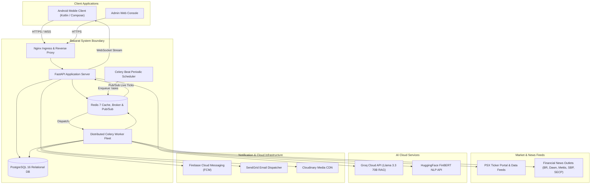
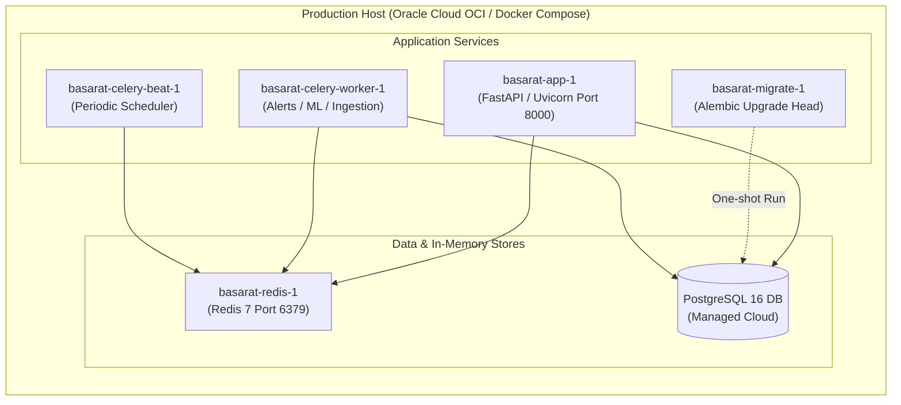
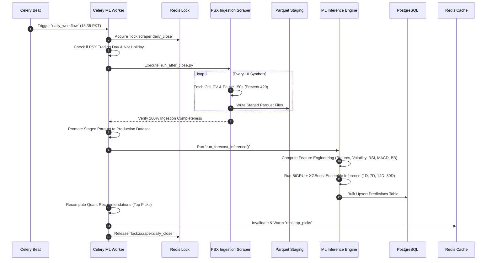
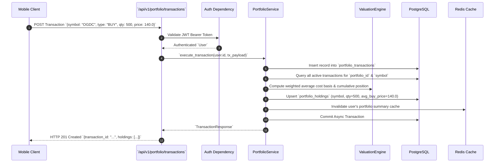

# Software Design Document (SDD)

## Project: Basarat — Smart PSX Investment Intelligence Platform

**Document Version:** 2.0  
**Status:** Approved  
**Author:** Engineering Team  
**Architecture:** Layered Asynchronous Monolith + Distributed Event/Task Workers

---

## 1. Introduction & Executive Summary

### 1.1 Purpose
This Software Design Document (SDD) provides a comprehensive description of the software architecture and system design for **Basarat**, an end-to-end investment intelligence platform targeting the Pakistan Stock Exchange (PSX). It encompasses both **High-Level Design (HLD)** and **Low-Level Design (LLD)** to serve as an authoritative technical blueprint for engineers, evaluators, and system architects.

### 1.2 System Scope
The Basarat platform ingests real-time and end-of-day market feeds, corporate disclosures, and multi-source financial news, processing this data through an AI/ML intelligence pipeline (BiGRU + XGBoost price forecasting, FinBERT NLP sentiment scoring, and quantitative multi-factor ranking). It delivers this intelligence via a mobile-first RESTful API, Server-Sent Events (SSE) streaming, and real-time WebSocket live quote broadcast to an Android client.

---

## PART I: HIGH-LEVEL DESIGN (HLD)

---

## 2. High-Level Architectural Design

### 2.1 C4 Context Diagram (System Ecosystem)

### 2.2 Container & Infrastructure Architecture

### 2.3 Layered System Decomposition

The system is partitioned into 6 distinct tiers:
1. **Presentation & Routing Tier (`app/api/v1/`)**: 22 modular routers handling REST endpoints and WebSocket handshakes.
2. **Security & Middleware Tier (`app/core/`)**: Correlation IDs (`X-Request-ID`), TrustedHost filtering, CORS origin control, SlowAPI rate-limiting, and error transformation.
3. **Domain Business Logic Tier (`app/services/`)**: 32 domain services encapsulating financial computations, news pipelines, recommendation engines, and chat orchestration.
4. **Machine Learning Tier (`app/ml/` & `models/production/`)**: Versioned serving and training code in `app/ml/`, with active serialized forecast artifacts in `models/production/v3/`.
5. **Asynchronous Task Processing Tier (`app/tasks/`)**: Celery workers executing post-close pipelines, intraday market caches, news ingestion, and alert monitoring.
6. **Persistence & Cache Tier (`app/models/`, `app/db/`, Redis)**: SQLAlchemy relational models and database access in `app/models/` and `app/db/`, plus Redis in-memory pub/sub/cache structures. This is separate from serialized ML artifacts in `models/`.

---

## PART II: LOW-LEVEL DESIGN (LLD)

---

## 3. Detailed Component & Class Design

### 3.1 Service Dependency Injection Class Diagram

```mermaid
classDiagram
    class BaseService {
        #AsyncSession db
        +__init__(db: AsyncSession)
    }

    class MarketService {
        +get_live_market_summary() MarketSummaryResponse
        +get_benchmark_indices() List~IndexQuote~
        +get_top_gainers_losers() GainersLosersResponse
    }

    class StockService {
        +get_stock_overview(symbol: str) StockOverview
        +get_historical_ohlcv(symbol: str, range: str) List~OHLCV~
        +calculate_technical_indicators(symbol: str) TechnicalIndicators
    }

    class PortfolioService {
        -ValuationEngine valuation_engine
        +get_portfolio_summary(user_id: UUID) PortfolioSummary
        +execute_transaction(user_id: UUID, tx: TransactionCreate) TransactionResponse
        +get_holdings_with_pnl(user_id: UUID) List~HoldingResponse~
    }

    class RiskService {
        +calculate_parametric_var(user_id: UUID, confidence: float) VaRResult
        +run_monte_carlo_simulation(user_id: UUID, simulations: int) MonteCarloResult
        +execute_historical_stress_test(user_id: UUID, scenario: str) StressTestResult
    }

    class AssistantService {
        -GroqClient groq_client
        -AssistantSafety safety_guard
        -AssistantContextCache context_cache
        +chat(user_id: UUID, message: str) ChatResponse
        +chat_stream(user_id: UUID, message: str) AsyncGenerator
    }

    BaseService <|-- MarketService
    BaseService <|-- StockService
    BaseService <|-- PortfolioService
    BaseService <|-- RiskService
    BaseService <|-- AssistantService
```

---

## 4. Subsystem Execution Sequences

### 4.1 End-to-End Daily Post-Close Workflow Sequence

### 4.2 Real-Time Portfolio Transaction Execution & P&L Recalculation

---

## 5. Architectural Design Patterns Applied

| Pattern | Implementation in Basarat | Benefit |
|---|---|---|
| **Dependency Injection** | FastAPI `Depends(get_db)`, `Depends(get_current_user)`, `Depends(_get_service)` | Loose coupling, testability with mock dependencies. |
| **Repository / Service** | `app/services/` encapsulating business rules, `app/db/` handling transactions | Clear separation between transport (API) and business logic. |
| **Publish / Subscribe** | Redis Channel `psx:market:live_quotes` consumed by `WebSocketManager` | Decouples live market ingestion from thousands of concurrent WebSocket client connections. |
| **Single-Flight Lock** | Redis `SET lock:key token NX EX 60` in scrapers and daily workflows | Guarantees single-writer execution, eliminating race conditions and duplicate upstream API calls. |
| **Circuit Breaker** | `MARKET_CIRCUIT_BREAKER_SECONDS` (900s) on PSX HTTP 403/429 responses | Protects system and IP from permanent upstream bans during PSX portal disruptions. |
| **Retrieval-Augmented Generation (RAG)** | `AssistantService` dynamically enriching Groq prompt with live ticker metrics | Eliminates LLM hallucinations on stock metrics and guarantees up-to-date analysis. |
| **Defense-in-Depth Security** | Correlation IDs, TrustedHost, CORS, SlowAPI rate limiting, Bcrypt work factor 12 | Comprehensive protection against OWASP Top 10 web vulnerabilities. |
