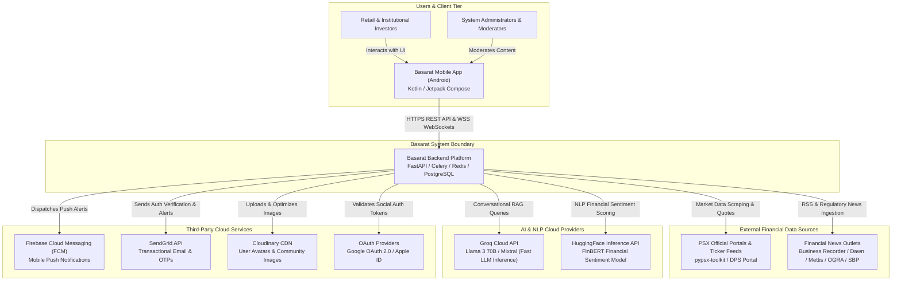
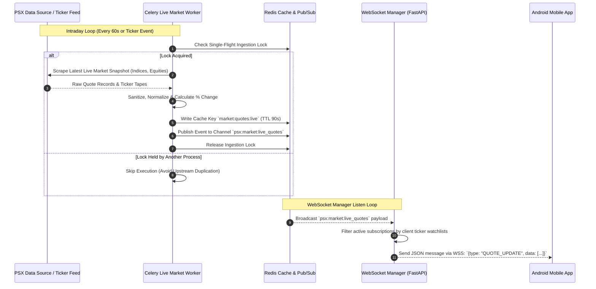
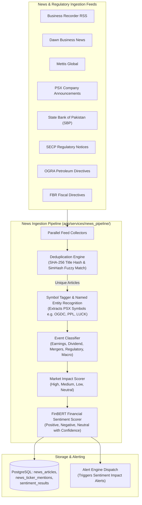
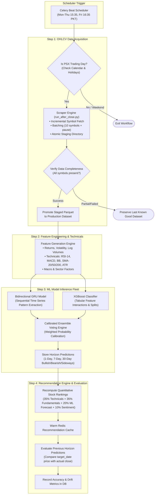
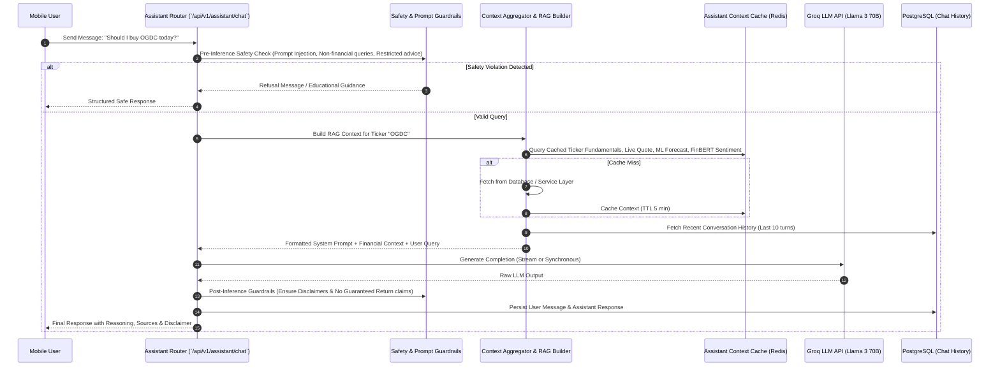
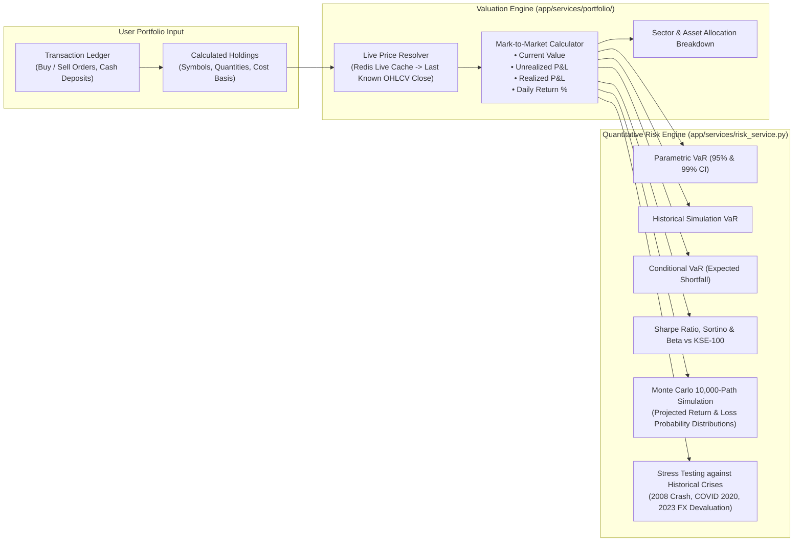

# System Architecture

## 1. Executive Architecture Summary

**Basarat** is a high-performance, mobile-first investment intelligence platform tailored for the **Pakistan Stock Exchange (PSX)**. The backend system is designed around a **modular layered architecture** coupled with an asynchronous, distributed event and task processing pipeline powered by **FastAPI**, **Celery**, **PostgreSQL 16**, and **Redis 7**.

The platform is engineered to deliver real-time stock quotes, AI-driven directional price forecasts (GRU + XGBoost ensemble), FinBERT natural language sentiment analysis, automated quantitative stock recommendations, multi-portfolio tracking with P&L and risk analytics (VaR / CVaR / Monte Carlo), Shariah compliance screening, an AI-powered conversational investment copilot (Groq LLM), and a social trading community feed.

---

## 2. High-Level Architecture (C4 Model)

### 2.1 C4 Level 1: System Context Diagram

The System Context diagram illustrates how external users, client applications, and external systems interact with the Basarat backend.



---

### 2.2 C4 Level 2: Container Architecture Diagram

The Container diagram illustrates the runtime deployment topology of Docker containers and data stores within the Basarat infrastructure.

```mermaid
flowchart TD
    subgraph Client ["Client Device"]
        APP["Android Mobile Client"]
    end

    subgraph Ingress ["Edge & Security Ingress"]
        NGINX["Nginx Reverse Proxy<br/>TLS Termination, Rate Limiting (20 req/s, burst 50),<br/>Request Routing, Static Asset Cache"]
    end

    subgraph AppContainer ["Core API Service Container (FastAPI)"]
        UVICORN["Uvicorn ASGI Server<br/>(Worker Pool)"]
        FASTAPI["FastAPI Web Framework"]
        MIDDLEWARE["Middleware Stack<br/>• Correlation ID (X-Request-ID)<br/>• TrustedHost Security<br/>• CORS Origin Enforcer<br/>• SlowAPI Rate Limiter<br/>• RFC 7807 Error Handler"]
        ROUTERS["API v1 Route Handlers<br/>(22 Domain Routers)"]
        DEP_INJ["Dependency Injection & Auth<br/>(get_db, get_current_user, RBAC)"]
        SERVICES["Domain Services Layer<br/>(Market, Portfolio, Risk, Recommendations, etc.)"]
        WS_MGR["WebSocket Manager<br/>(Live Quote Streamer & Topic Broadcaster)"]
        ML_ENGINE["ML Inference Engine<br/>(Loaded GRU + XGBoost Models)"]
    end

    subgraph WorkerFleet ["Distributed Celery Workers"]
        WORKER_GENERAL["Celery General Worker<br/>(Alerts, Notifications, Emails, Community)"]
        WORKER_ML["Celery Data & ML Worker<br/>(Daily Workflow, Ingestion, Predictions, Retraining)"]
        WORKER_MARKET["Celery Live Worker<br/>(Intraday Market Snapshots & News Ingestion)"]
    end

    subgraph Scheduler ["Task Scheduler"]
        BEAT["Celery Beat Scheduler<br/>(Crontab & Periodic Dispatcher)"]
    end

    subgraph DataStorage ["Data & Cache Storage Tier"]
        POSTGRES[("PostgreSQL 16 Database<br/>(SQLAlchemy Async ORM / asyncpg)<br/>20+ Domain Tables & Migrations")]
        REDIS[("Redis 7 In-Memory Cache & Broker<br/>• Celery Task Queue Broker<br/>• Live Ticker & Market Snapshot Cache<br/>• Single-Flight Locks & Dedup Keys<br/>• Rate Limit Token Buckets<br/>• WebSocket Pub/Sub Bus")]
    end

    subgraph MigrationService ["One-Shot Migration Container"]
        ALEMBIC["Alembic Migration Runner<br/>(Runs before API startup on deployment)"]
    end

    APP -->|HTTPS REST (Port 443)| NGINX
    APP -->|WSS WebSockets (Port 443)| NGINX

    NGINX -->|HTTP Reverse Proxy (Port 8000)| UVICORN
    UVICORN --> FASTAPI
    FASTAPI --> MIDDLEWARE
    MIDDLEWARE --> ROUTERS
    ROUTERS --> DEP_INJ
    DEP_INJ --> SERVICES
    SERVICES --> ML_ENGINE
    SERVICES --> WS_MGR

    SERVICES -->|Async SQL (asyncpg)| POSTGRES
    SERVICES -->|Cache Read/Write / Locks| REDIS
    WS_MGR -->|Pub/Sub Subscribe| REDIS

    BEAT -->|Enqueue Periodic Tasks| REDIS
    REDIS -->|Task Dispatch| WORKER_GENERAL
    REDIS -->|Task Dispatch| WORKER_ML
    REDIS -->|Task Dispatch| WORKER_MARKET

    WORKER_GENERAL -->|Sync SQL (psycopg2)| POSTGRES
    WORKER_ML -->|Sync SQL (psycopg2)| POSTGRES
    WORKER_MARKET -->|Sync SQL (psycopg2)| POSTGRES

    WORKER_GENERAL -->|Read/Write Cache & State| REDIS
    WORKER_ML -->|Read/Write Cache & State| REDIS
    WORKER_MARKET -->|Publish Live Quotes| REDIS

    ALEMBIC -.->|Run Schema Upgrades| POSTGRES
```

---

## 3. Component Architecture & Layering

The system is organized into distinct functional layers adhering to separation of concerns and dependency inversion principles:

```mermaid
graph TD
    subgraph L1 ["1. API Presentation Layer (app/api/v1/)"]
        A1[Auth & User Routers]
        A2[Market & Stock Routers]
        A3[Portfolio & Risk Routers]
        A4[AI Assistant & Recommendations]
        A5[News, Sentiment & Events]
        A6[Alerts, Devices & Notifications]
        A7[Community & Social Routers]
        A8[Shariah, ETFs, IPOs, Health]
    end

    subgraph L2 ["2. Security & Middleware Layer (app/core/)"]
        M1[Correlation ID Middleware]
        M2[TrustedHost & CORS Security]
        M3[SlowAPI Rate Limiting]
        M4[Authentication & RBAC Dependencies]
        M5[Global Exception Handlers]
    end

    subgraph L3 ["3. Domain Service Layer (app/services/)"]
        S1[MarketService & LiveBus]
        S2[StockService & PriceCacheService]
        S3[PortfolioService & ValuationEngine]
        S4[RiskService & MonteCarloEngine]
        S5[RecommendationService]
        S6[SentimentService & FinBERT]
        S7[AssistantService & GroqClient]
        S8[NewsPipeline Ingestion Engine]
        S9[AlertService & NotificationService]
        S10[ShariahScreeningService]
        S11[CommunityService & Moderation]
        S12[WebSocketManager]
    end

    subgraph L4 ["4. ML & Analytics Layer (app/ml/ & backend/models/)"]
        ML1[BiGRU Neural Network Horizon Forecaster]
        ML2[XGBoost Gradient Boosted Classifier]
        ML3[Ensemble Voting & Calibration Engine]
        ML4[Technical Indicator Calculation TA-Lib]
        ML5[Model Evaluation & Drift Tracker]
    end

    subgraph L5 ["5. Background Job Subsystem (app/tasks/)"]
        T1[daily_workflow: Close OHLCV -> ML -> Eval]
        T2[refresh_market_cache: Intraday 60s quotes]
        T3[scrape_news & sentiment_tasks: Ingestion]
        T4[alert_tasks: Real-time price trigger evaluation]
        T5[risk_tasks: Portfolio stress & breach checks]
        T6[weekly_retraining: Model hyperparameter tuning]
    end

    subgraph L6 ["6. Data Persistence & Cache Layer"]
        D1[(PostgreSQL 16 Database)]
        D2[(Redis 7 Cache / Broker / PubSub)]
    end

    L1 --> L2
    L2 --> L3
    L3 --> L4
    L3 --> L6
    L5 --> L3
    L5 --> L4
    L5 --> L6
```



---

## 4. Low-Level Subsystem Architecture & Workflows

### 4.1 Real-Time Market Data Ingestion & WebSocket Streaming Bus

The platform provides sub-second live PSX ticker quotes to mobile clients using a Redis Pub/Sub backplane that coordinates distributed Celery workers with asynchronous FastAPI WebSocket connection pools.



---

### 4.2 Multi-Source News Ingestion, NLP Sentiment Scoring & Deduplication Pipeline

The news ingestion engine aggregates articles and corporate announcements across 8 Pakistani financial and regulatory portals, filters duplicates, scores sentiment using FinBERT, links stock symbols, and tags market impact.



---

### 4.3 Post-Market Automated Daily Workflow & ML Forecasting Inference

Every trading day after market close (Mon–Thu 15:35 PKT, Fri 16:35 PKT), Celery Beat kicks off the mission-critical automated pipeline:



---

### 4.4 AI Investment Assistant (Copilot) RAG Architecture & Safety Guardrails

The Basarat AI Copilot leverages Groq’s ultra-low latency Llama-3-70B model infused with live market quotes, technical indicators, portfolio status, and Shariah screening data, protected by strict financial safety guardrails.



---

### 4.5 Portfolio Valuation Engine & Quantitative Risk Analytics (VaR / Monte Carlo)

The portfolio and risk sub-systems perform real-time mark-to-market valuations, sector exposure audits, and statistical risk simulations (Value at Risk, Conditional VaR, and Monte Carlo scenarios).



---

## 5. Security & Network Architecture

1. **Edge Protection & Rate Limiting**:
   - **Nginx Ingress**: Rate limits client requests (20 requests/second per IP with burst capacity of 50).
   - **SlowAPI Application Rate Limiting**: Enforces strict endpoint-specific limits (e.g., Auth Login 5/min, Password Reset 3/min, AI Chat 15/min).
   - **TrustedHostMiddleware**: Enforces valid `Host` headers; rejects wildcard (`*`) and localhost in production.
   - **CORSMiddleware**: Restricts origins strictly to configured mobile and web client domains.

2. **Authentication & Session Security**:
   - **JWT Tokens**: Cryptographically signed access tokens (HS256) with short lifetimes (60 minutes) and rotating refresh tokens (7 days).
   - **Bcrypt Password Hashing**: Passwords salted and hashed with work factor 12.
   - **Request Correlation**: Middleware automatically assigns or propagates an `X-Request-ID` across every incoming request and downstream response.

3. **Production Isolation**:
   - Database operations use parameterized queries exclusively through SQLAlchemy ORM, mitigating SQL injection risks.
   - External credentials (Firebase Service Account, Database Passwords, SendGrid Keys, Groq API Keys) are injected strictly via container environment variables and never baked into Docker images.
