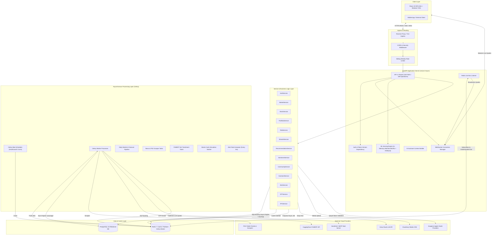
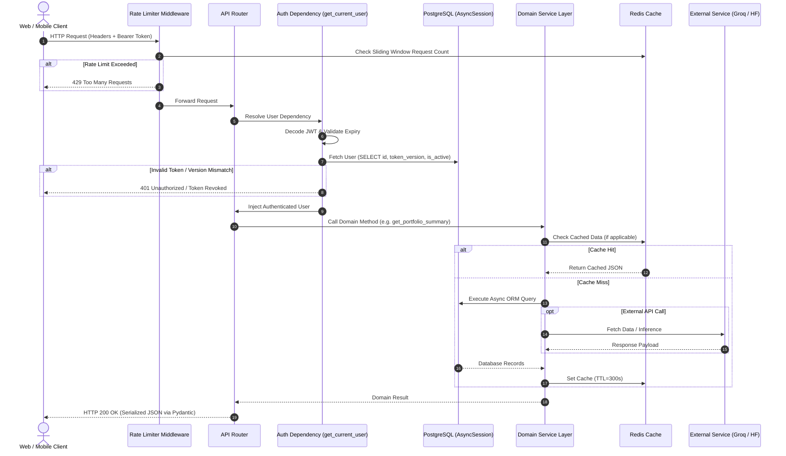
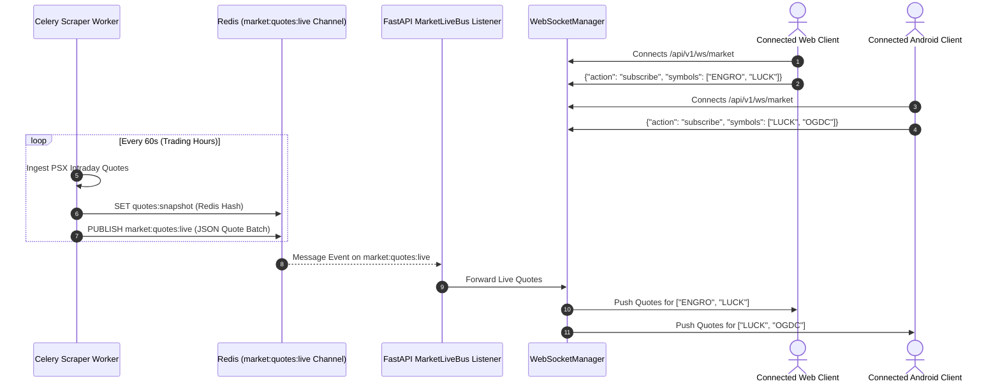
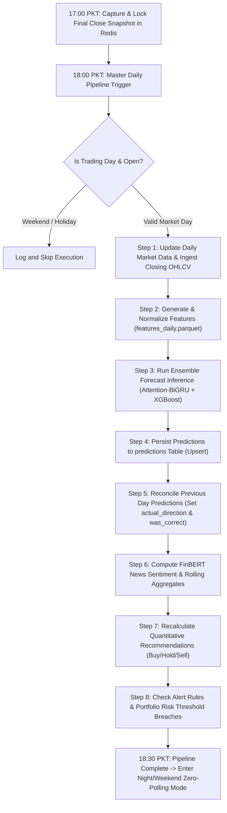

# System Architecture — Basarat

## 1. Architectural Style & High-Level Overview

Basarat is designed as a **High-Performance Asynchronous Modular Monolith** with decoupled asynchronous background workers, an in-memory pub/sub message bus, and a decoupled modern Single-Page Application (SPA) frontend.

The system combines synchronous low-latency REST and WebSocket APIs (for client interactions, live quote streaming, and AI conversations) with distributed asynchronous task processing (for market scraping, ML inference, financial NLP sentiment scoring, portfolio risk simulations, and cron workflows).



---

## 2. Layered Architecture & Module Separation

The codebase follows a clean, decoupled layered design pattern:

```text
backend/app/
├── api/            # Controller / Router layer (HTTP & WebSocket endpoints)
│   └── v1/         # Versioned endpoints, route definitions, parameter validation
├── core/           # Infrastructure & cross-cutting concerns (config, security, rate limit, logging)
├── db/             # Database connection, base declarative class, async & sync session managers
├── models/         # SQLAlchemy 2.0 ORM models and relationship definitions
├── schemas/        # Pydantic v2 schemas for request validation and response serialization
├── services/       # Core business logic, calculation engines, external API clients
├── repository/     # Specialized data access repositories (Portfolio, Sentiment)
├── ml/             # Machine learning training, feature pipelines, model loaders, inference engine
├── tasks/          # Celery asynchronous jobs, daily pipelines, scraping, monitoring
└── ws/             # WebSocket route handlers and protocol definitions
```

### 2.1 API & Presentation Layer (`app.api.v1`)
- **FastAPI Application (`main.py`):** Instantiates the ASGI application, sets up middleware (CORS, rate limiting, exception handlers), mounts routers with prefix `/api/v1`, and controls the asynchronous startup/shutdown lifespan.
- **Dependency Injection:** Endpoints declare explicit dependencies for authentication (`get_current_user`), authorization (`get_current_admin`), and database sessions (`get_db`).
- **Data Validation:** Pydantic v2 schemas rigorously validate query parameters, URL path variables, and JSON request bodies before reaching service handlers.

### 2.2 Service & Domain Layer (`app.services`)
- Encapsulates all financial algorithms, business logic, and transactional orchestration.
- **Stateless Design:** Services are instantiated per request or task with an injected `AsyncSession` or database connection, ensuring clean concurrency and transaction isolation.
- Key services include [MarketService](file:///d:/Ahmed%20Dev/Projects/Basarat-fyp-official/backend/app/services/market_service.py), [StockService](file:///d:/Ahmed%20Dev/Projects/Basarat-fyp-official/backend/app/services/stock_service.py), [PortfolioService](file:///d:/Ahmed%20Dev/Projects/Basarat-fyp-official/backend/app/services/portfolio_service.py), [RiskService](file:///d:/Ahmed%20Dev/Projects/Basarat-fyp-official/backend/app/services/risk_service.py), [ShariahService](file:///d:/Ahmed%20Dev/Projects/Basarat-fyp-official/backend/app/services/shariah_service.py), [RecommendationService](file:///d:/Ahmed%20Dev/Projects/Basarat-fyp-official/backend/app/services/recommendation_service.py), [AssistantService](file:///d:/Ahmed%20Dev/Projects/Basarat-fyp-official/backend/app/services/assistant_service.py), and [CommunityService](file:///d:/Ahmed%20Dev/Projects/Basarat-fyp-official/backend/app/services/community_service.py).

### 2.3 Machine Learning & Inference Subsystem (`app.ml`)
- **In-Memory Model Loading:** [model_loader.py](file:///d:/Ahmed%20Dev/Projects/Basarat-fyp-official/backend/app/ml/serving/model_loader.py) initializes model weights, scalers, and feature metadata into a singleton during application startup.
- **Ensemble Architecture:** [inference.py](file:///d:/Ahmed%20Dev/Projects/Basarat-fyp-official/backend/app/ml/serving/inference.py) combines the stationary Attention-BiGRU model (45-day window, 79 normalized features) with XGBoost v4 (fundamentals and event indicators).
- **Gating & Auditing:** Automated gating rules evaluate class probabilities and prediction gaps; full predictions and sub-model votes are persisted into the `predictions` table.

### 2.4 Data Persistence & Cache Layer (`app.db`, `app.cache`, `app.core.redis`)
- **Dual Database Driver Strategy:**
  - **Asynchronous (`asyncpg`):** Used exclusively by the FastAPI web server for high-concurrency non-blocking I/O.
  - **Synchronous (`psycopg2`):** Used by Celery worker processes and Alembic migration scripts.
- **Redis Multi-DB Partitioning:**
  - `DB 0`: Application query caching (`CACHE_TTL_SECONDS=300`), rate limiting counters, and pub/sub live bus.
  - `DB 1`: Celery message broker queue.
  - `DB 2`: Celery task result backend.

---

## 3. Request Lifecycle

A typical authenticated request follows a strictly controlled lifecycle:



---

## 4. Live Quote Streaming & WebSocket Architecture

To achieve sub-second market quote delivery without overloading the upstream exchange or locking the web server, Basarat implements a distributed Redis Pub/Sub Live Bus pattern:



---

## 5. Daily Asynchronous Pipeline Workflow & Off-Hours Snapshot Caching

The platform enforces a strict market-gated execution cycle:

1. **Intraday Trading Session (Mon–Fri 09:15–15:30 PKT):** High-frequency 1-minute quote scrapes, 5-minute alert checks, and 30-minute news ingestion.
2. **Market Close Final Snapshot (Mon–Fri 17:00 PKT):** Ingests official closing quotes and locks the daily snapshot in Redis with a 7-day fallback TTL.
3. **Master Daily Pipeline (Mon–Fri 18:00 PKT):** Reconciles past predictions, saves today's OHLCV, generates ML features, runs forecast inference, and updates recommendations.
4. **Nights & Weekends (Off-Hours):** All recurring polling tasks halt. The saved 17:00/18:00 snapshot serves all user requests in `<5ms` from Redis/PostgreSQL without triggering background scraping.


