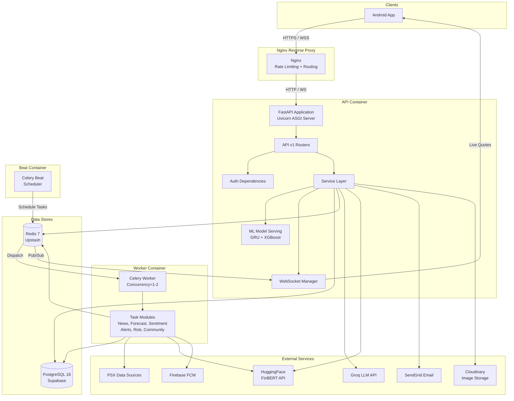
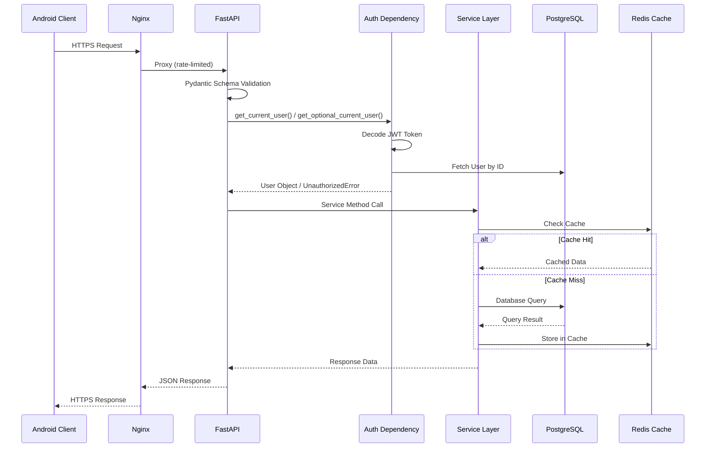

# System Architecture

## Architectural Style

Basarat follows a **layered monolithic architecture** with background processing via Celery. The system is organized as:

- **API Layer** — FastAPI routers handling HTTP/WebSocket requests
- **Service Layer** — Business logic and orchestration
- **Repository Layer** — Database access (partially; most services query directly via SQLAlchemy)
- **Data Layer** — PostgreSQL (persistent), Redis (cache/broker)
- **ML Layer** — Model serving, training, and inference
- **Task Layer** — Celery workers for background processing

## High-Level Architecture Diagram



## Major Layers

### 1. API Layer (`app/api/v1/`)

FastAPI routers organized by domain. Each router receives HTTP requests, validates input via Pydantic schemas, calls service-layer functions, and returns structured responses.

**22 route modules** organized across 14 functional modules.

### 2. Service Layer (`app/services/`)

Business logic and orchestration. Services are injected into routes via FastAPI `Depends()`. Key services:

| Service | Responsibility |
|---------|---------------|
| `auth_service.py` | Authentication, OAuth, token management |
| `market_service.py` | PSX market data aggregation and caching |
| `stock_service.py` | Individual stock data and technicals |
| `portfolio_service.py` | Portfolio management and P&L calculation |
| `risk_service.py` | VaR, CVaR, Monte Carlo, stress tests |
| `sentiment_service.py` | FinBERT sentiment analysis |
| `recommendation_service.py` | Quantitative stock rankings |
| `assistant_service.py` | AI chatbot orchestration |
| `community_service.py` | Social trading features |
| `news_service.py` | News retrieval and filtering |
| `watchlist_service.py` | Watchlist CRUD |
| `websocket_manager.py` | WebSocket connection management |
| `notification_service.py` | Firebase FCM push delivery |
| `email_service.py` | SendGrid transactional email |
| `cloudinary_service.py` | Image upload/deletion |

### 3. Data Layer

- **PostgreSQL** — Primary persistent store via SQLAlchemy 2.x async ORM
- **Redis** — Cache (market data, recommendations), message broker (Celery), and pub/sub (live quotes)

### 4. ML Layer (`app/ml/`)

- **Serving** (`app/ml/serving/`) — Model loading, inference, prediction storage, promotion logic
- **Training** (`app/ml/training/`, `app/ml/v2/`, `app/ml/v3/`) — Training pipelines, feature engineering
- **Models** — GRU (TensorFlow), XGBoost, with ensemble combination

### 5. Task Layer (`app/tasks/`)

Celery tasks for background processing:

| Task Module | Schedule | Purpose |
|------------|----------|---------|
| `daily_workflow.py` | Mon-Thu 15:35, Fri 16:35 PKT | Refresh final OHLCV closes, then run features → predictions → evaluation; skips weekends/holidays |
| `data/scraper/run_after_close.py` | Called by daily workflow | Incremental per-symbol refresh; pauses 150 seconds after each 10 symbols and rebuilds the combined model-input file |
| `weekly_retraining.py` | Sunday 04:00 PKT | Retrain models with promotion gates |
| `refresh_market_cache.py` | Every 60s (intraday) | Refresh live market snapshots in Redis |
| `scrape_news.py` | Every 30 min | News ingestion from PSX/Mettis/OGRA/FBR |
| `sentiment_tasks.py` | Hourly | Rescore failed sentiment + aggregate computation |
| `alert_tasks.py` | Every 5 min | Evaluate alert rules and watchlist targets |
| `risk_tasks.py` | Mon-Fri 18:30 PKT | Portfolio risk breach monitoring |
| `model_monitoring.py` | Daily 06:00/07:00 | Performance monitoring and drift detection |
| `community_tasks.py` | As triggered | Community-related background tasks |
| `push_notifications.py` | As triggered | Firebase push notification delivery |

## Request Lifecycle



## Dependency Flow

```
Routes → Authorization Dependencies → Services → {Database, Redis, External APIs}
                                    → ML Serving → {Model Files, Feature Data}
Celery Beat → Redis Broker → Celery Worker → Tasks → {Database, Redis, External APIs}
```

## Configuration Architecture

All configuration flows through `app/core/config.py` (`Settings` class using Pydantic BaseSettings):
- `.env` file for default values
- Environment variable overrides for Docker/production
- Runtime validation (production safety checks for localhost URLs, weak secrets, debug mode)
