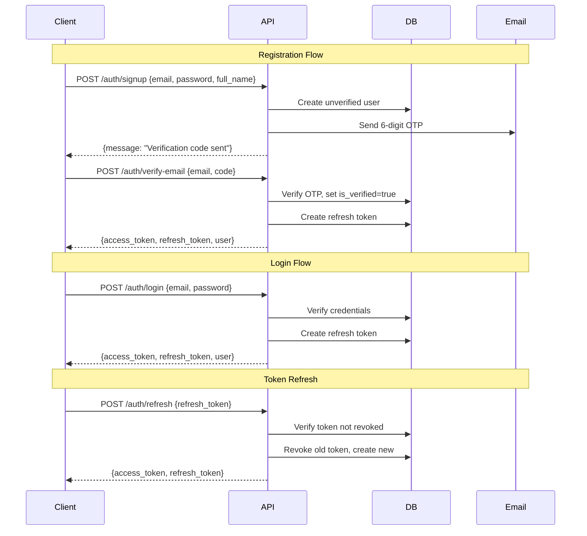

# Authentication

## Authentication Provider
Self-hosted JWT authentication implemented in `app/core/security.py` and `app/services/auth_service.py`.

## Supported Auth Methods

| Method | Flow |
|--------|------|
| **Email/Password** | Signup with OTP verification -> Login -> JWT tokens |
| **Google OAuth** | Google ID Token -> Server verification -> JWT tokens |
| **Apple OAuth** | Apple Identity Token -> Server verification -> JWT tokens |

## JWT Token Flow

### Access Token
- Algorithm: HS256
- Expiry: 30 minutes (configurable via `ACCESS_TOKEN_EXPIRE_MINUTES`)
- Payload: `{"sub": "<user_id>", "exp": <timestamp>, "type": "access", "jti": "<unique_id>"}`
- Usage: `Authorization: Bearer <access_token>`

### Refresh Token
- Algorithm: HS256
- Expiry: 7 days (configurable via `REFRESH_TOKEN_EXPIRE_DAYS`)
- Payload: `{"sub": "<user_id>", "exp": <timestamp>, "type": "refresh", "jti": "<unique_id>"}`
- Storage: Stored in `refresh_tokens` database table with `revoked` flag
- Rotation: Each use issues a new refresh token; old one is revoked

## Authentication Flow Diagram

## Token Validation
The `get_current_user` dependency in `app/core/authorization.py`:
1. Extracts Bearer token from Authorization header
2. Decodes JWT using SECRET_KEY
3. Verifies token type is "access" and not expired
4. Fetches user from database by ID (from `sub` claim)
5. Checks user `is_active` flag
6. Returns User object or raises UnauthorizedError/ForbiddenError

## Security Features
- **Refresh token rotation**: Prevents token reuse attacks
- **Revocation detection**: Reused revoked tokens trigger global session invalidation
- **Rate limiting**: Auth endpoints limited to 3-15 requests/minute
- **OTP verification**: 6-digit codes with 10-minute expiry
- **Password reset grant tokens**: Short-lived (15 min) JWT grants
- **Password changed alerts**: Email notification on password change
- **Session revocation**: Password changes revoke all other sessions
