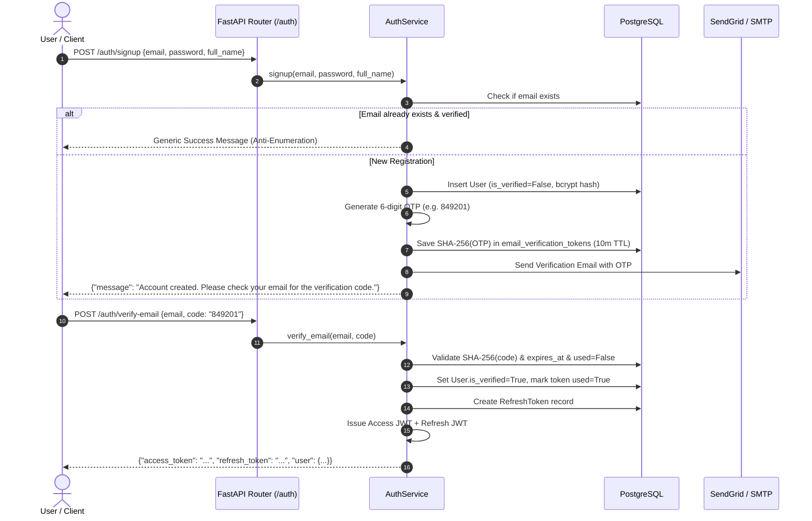
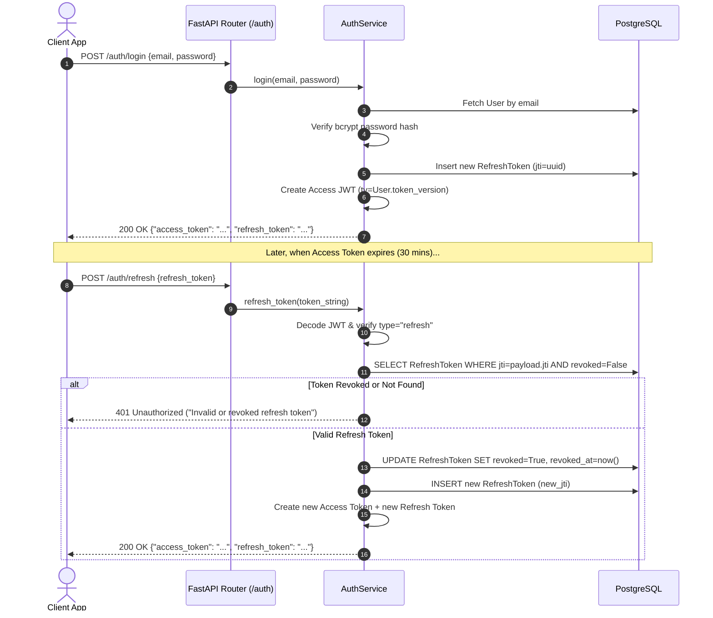
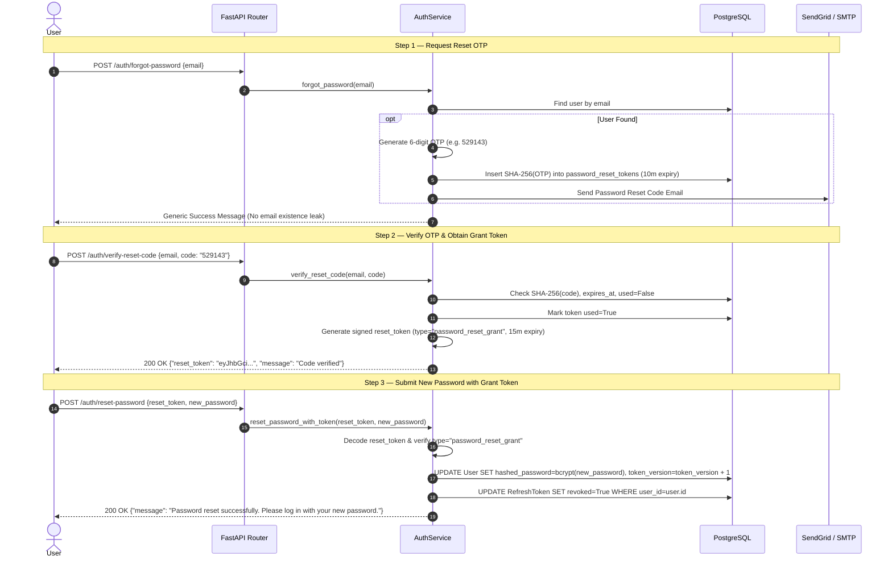

# Authentication & Session Architecture — Basarat

## 1. Authentication Overview

Basarat implements a hybrid **Self-Contained JWT with Database-Backed Revocation and Rotation** authentication system:

- **Access Tokens:** Signed HMAC-SHA256 (`HS256`) JSON Web Tokens with a **30-minute lifetime**, carrying the user ID (`sub`), token type (`type="access"`), and the user's current token version (`tv`).
- **Refresh Tokens:** Long-lived (**7 days**) signed JWTs (`type="refresh"`), tracked in the `refresh_tokens` PostgreSQL table by a unique UUID `jti` for explicit revocation and rotation.
- **Immediate Revocation:** The system enforces an atomic integer `User.token_version` check on every authenticated request. Incrementing this counter immediately and globally invalidates all outstanding access JWTs across all active client devices.
- **Social OAuth:** Federated identity support for Google OAuth 2.0 and Apple Sign-In.
- **3-Step Password Reset:** High-security password recovery using 6-digit SHA-256 hashed OTPs, time-limited JWT grant tokens, and anti-enumeration protection.

---

## 2. JWT Payload Specifications

### 2.1 Access Token Payload
```json
{
  "sub": "b2f6c8d1-4e9a-4c28-98e1-567890abcdef",
  "type": "access",
  "jti": "a1b2c3d4e5f678901234567890abcdef",
  "tv": 3,
  "exp": 1727694600
}
```
- `sub`: Unique UUID string of the authenticated user.
- `type`: Must equal `"access"`. Tokens with any other type are rejected by `get_token_payload`.
- `jti`: Unique token identifier.
- `tv`: Token version number matching `User.token_version` in the database.
- `exp`: Unix expiration timestamp (Current time + `ACCESS_TOKEN_EXPIRE_MINUTES`).

### 2.2 Refresh Token Payload
```json
{
  "sub": "b2f6c8d1-4e9a-4c28-98e1-567890abcdef",
  "type": "refresh",
  "jti": "f9e8d7c6b5a432109876543210fedcba",
  "exp": 1728299400
}
```

### 2.3 Password Reset Grant Token Payload
```json
{
  "sub": "b2f6c8d1-4e9a-4c28-98e1-567890abcdef",
  "email": "investor@example.pk",
  "type": "password_reset_grant",
  "jti": "1234567890abcdef1234567890abcdef",
  "exp": 1727693700
}
```

---

## 3. Core Authentication Flows

### 3.1 User Registration & Email OTP Verification



---

### 3.2 Standard Login & Refresh Token Rotation



---

### 3.3 3-Step Secure Password Reset Flow



---

## 4. Immediate Session Invalidation Mechanism (`token_version`)

To prevent compromised or stale access tokens from accessing protected resources:

1. The `users` table holds a column `token_version: int` (default 0).
2. The authentication dependency [get_current_user](file:///d:/Ahmed%20Dev/Projects/Basarat-fyp-official/backend/app/core/authorization.py#L26-L49) extracts `tv` from the token payload:
   ```python
   user = await db.get(User, user_id)
   if int(payload.get("tv", 0)) != int(user.token_version):
       raise UnauthorizedError("Token has been revoked. Please log in again.")
   ```
3. When a user logs out (`POST /auth/logout`), changes password (`POST /auth/change-password`), or resets password (`POST /auth/reset-password`), `User.token_version` is atomically incremented by `1`.
4. All existing access tokens immediately fail subsequent requests with HTTP 401.

---

## 5. Third-Party Identity Federation (Google & Apple)

- **Google OAuth (`POST /auth/google`):** Verifies the Google ID token using `google-auth` / Google's public keys. If valid, retrieves the user by `oauth_id` or creates a verified user record and issues Basarat JWTs.
- **Apple OAuth (`POST /auth/apple`):** Decodes Apple's identity token, verifies the cryptographic signature with Apple's JSON Web Key Set (JWKS), and issues Basarat JWTs.
- **Clerk Webhooks (`POST /webhooks/clerk`):** Implements HMAC-SHA256 signature verification via `svix` using `CLERK_WEBHOOK_SECRET` for synchronization with external Clerk authentication directories.
