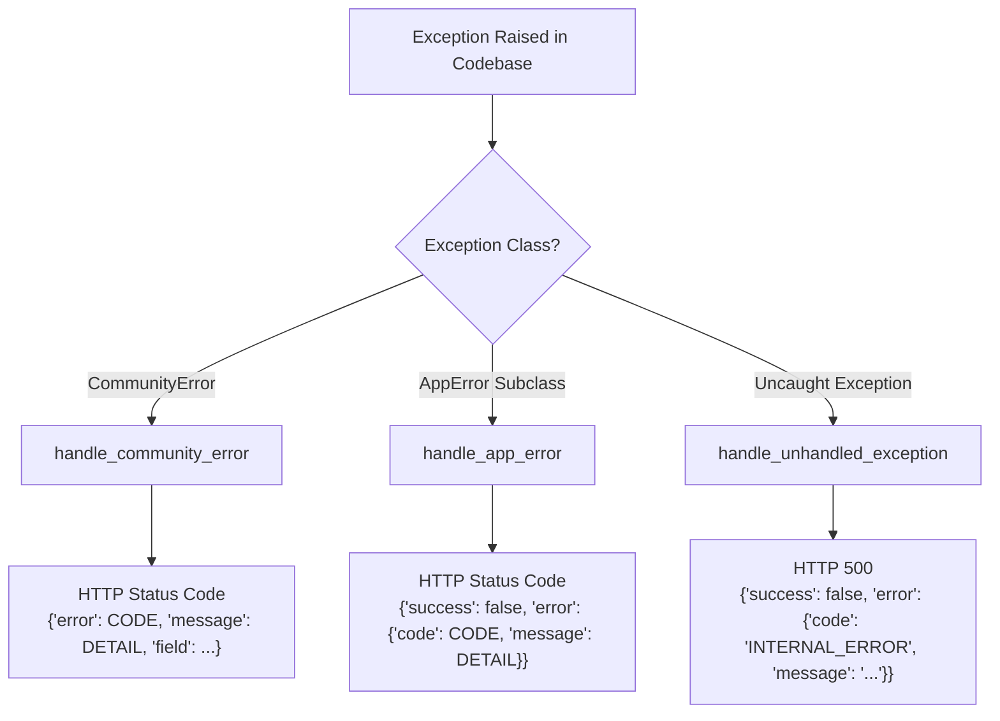

# Error Handling & Exception Architecture — Basarat

## 1. Centralized Exception Handling Architecture

Basarat implements a structured, centralized exception handling strategy registered during FastAPI application initialization ([app/main.py](file:///d:/Ahmed%20Dev/Projects/Basarat-fyp-official/backend/app/main.py#L129)).

All internal domain exceptions inherit from a unified base class `AppError` defined in [app/core/exceptions.py](file:///d:/Ahmed%20Dev/Projects/Basarat-fyp-official/backend/app/core/exceptions.py). When an exception is raised in any service, repository, or router handler, FastAPI intercepts it and formats a standard JSON response with matching HTTP status codes.



---

## 2. Core Exception Hierarchy

```python
Exception
└── AppError (status_code: 500, code: "INTERNAL_ERROR")
    ├── BadRequestError (status_code: 400, code: "BAD_REQUEST")
    ├── UnauthorizedError (status_code: 401, code: "UNAUTHORIZED")
    ├── ForbiddenError (status_code: 403, code: "FORBIDDEN")
    ├── NotFoundError (status_code: 404, code: "NOT_FOUND")
    ├── ConflictError (status_code: 409, code: "CONFLICT")
    ├── ValidationFailedError (status_code: 422, code: "VALIDATION_FAILED")
    ├── ServiceUnavailableError (status_code: 503, code: "SERVICE_UNAVAILABLE")
    └── CommunityError (status_code: 400+, code: "COMMUNITY_ERROR")
```

---

## 3. Error Response Schemas & Formats

### 3.1 Standard API Error Format (General Modules)
Used by Auth, Portfolio, Market, Forecast, Recommendations, Risk, Shariah, News, and Watchlists:

```json
{
  "success": false,
  "error": {
    "code": "NOT_FOUND",
    "message": "Stock with symbol 'INVALID' not found"
  }
}
```

#### Example Error Classes & Status Codes:
- **`UnauthorizedError` (HTTP 401):**
  ```json
  {
    "success": false,
    "error": {
      "code": "UNAUTHORIZED",
      "message": "Token has been revoked. Please log in again."
    }
  }
  ```
- **`ForbiddenError` (HTTP 403):**
  ```json
  {
    "success": false,
    "error": {
      "code": "FORBIDDEN",
      "message": "Admin privileges required"
    }
  }
  ```
- **`ConflictError` (HTTP 409):**
  ```json
  {
    "success": false,
    "error": {
      "code": "CONFLICT",
      "message": "Stock 'ENGRO' is already in this watchlist"
    }
  }
  ```
- **`ServiceUnavailableError` (HTTP 503):**
  ```json
  {
    "success": false,
    "error": {
      "code": "SERVICE_UNAVAILABLE",
      "message": "ML model artifacts are currently loading or unavailable"
    }
  }
  ```

---

### 3.2 Community Module Error Format (`CommunityError`)
The Community and Moderation sub-package utilizes a direct contract shape optimized for mobile feed error rendering:

```json
{
  "error": "POST_AUTO_HIDDEN",
  "message": "This post has been temporarily hidden due to community reports",
  "field": "status",
  "retryAfterSeconds": 300
}
```

---

### 3.3 Pydantic Request Validation Error Format (HTTP 422)
When incoming JSON payloads or URL parameters fail Pydantic v2 validation:

```json
{
  "detail": [
    {
      "type": "string_too_short",
      "loc": ["body", "password"],
      "msg": "String should have at least 8 characters",
      "input": "123",
      "ctx": { "min_length": 8 }
    }
  ]
}
```

---

### 3.4 Rate Limit Error Format (HTTP 429)
When a client IP exceeds sliding-window rate limits:

```json
{
  "detail": "Rate limit exceeded. Try again in 60 seconds."
}
```

---

### 3.5 Unhandled Internal Server Errors (HTTP 500)
Any unexpected runtime error (e.g. database disconnect, unhandled library exception) is caught by the top-level handler:

```json
{
  "success": false,
  "error": {
    "code": "INTERNAL_ERROR",
    "message": "An unexpected error occurred"
  }
}
```

> [!NOTE]
> Detailed exception tracebacks are logged on the server using `log.exception(...)` but are **never exposed in HTTP response bodies** to prevent security disclosures.
