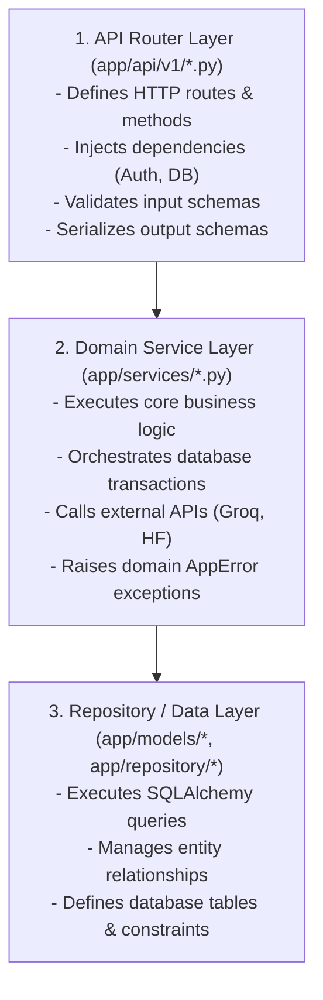

# Coding Standards & Architecture Conventions — Basarat

## 1. Python & Backend Code Standards

### 1.1 Python Style & Linting
- **Language Standard:** Python 3.11+.
- **PEP 8 Adherence:** Enforced via **Ruff** (configuration in `pyproject.toml` / `.ruff_cache`).
- **Line Length:** Maximum 120 characters for code; maximum 100 characters for docstrings.
- **Imports Sorting:** Grouped in standard order:
  1. Standard library imports (`datetime`, `os`, `uuid`, `logging`).
  2. Third-party dependencies (`fastapi`, `sqlalchemy`, `pydantic`, `celery`).
  3. Internal application packages (`app.core.*`, `app.models.*`, `app.schemas.*`, `app.services.*`).

### 1.2 Type Hinting & Annotations
- Explicit type hints are mandatory on all function signatures, route dependencies, and service methods.
- Use modern Python 3.10+ union syntax (`str | None`, `dict[str, Any]`, `list[User]`) rather than legacy `typing.Optional` or `typing.Union`.
- For asynchronous database queries, explicitly annotate `AsyncSession` and `Mapped[...]` model attributes.

---

## 2. Structural Patterns & Layer Responsibilities



### 2.1 Router Guidelines
- Routers must **never** write raw SQL or complex business algorithms directly inside handler functions.
- Route handlers must delegate business processing to dedicated Service classes.
- Return types must specify Pydantic response models (`response_model=...`) to ensure OpenAPI documentation accuracy and field filtering.

### 2.2 Service Layer Guidelines
- Services accept `AsyncSession` (or DB connection) via their constructor (`__init__(self, db: AsyncSession)`).
- Services are responsible for raising specific `AppError` subclasses (e.g. `NotFoundError`, `BadRequestError`, `ForbiddenError`) when domain rules are violated.
- Sensitive credentials or settings must be read via `get_settings()` from `app.core.config`, never via direct `os.environ` calls.

---

## 3. Asynchronous vs. Synchronous Execution Rules

> [!IMPORTANT]
> To prevent locking the Uvicorn ASGI event loop and degrading API responsiveness:

1. **Never use blocking I/O in `async def` route handlers:**
   - Use `httpx.AsyncClient` instead of `requests`.
   - Use `AsyncSession` and `await db.execute(...)` instead of blocking synchronous query methods.
   - Use `redis.asyncio` for non-blocking cache lookups.
2. **CPU-Intensive Tasks Must Be Offloaded:**
   - 10,000-path Monte Carlo simulations, heavy Pandas feature engineering, and neural network retraining must be queued to Celery background workers.
3. **Celery Worker Sync Handling:**
   - Celery tasks run synchronously; they must use synchronous SQLAlchemy sessions (`psycopg2`) or properly dispose of parent connection pools upon process forking (`@worker_process_init.connect`).

---

## 4. Error Handling & Exception Patterns

- **Never return raw error dictionaries from route handlers:** Always raise an instance of `AppError`.
- **Use Domain Exception Classes:**
  ```python
  # Correct
  if not stock:
      raise NotFoundError(f"Stock '{symbol}' not found")
  if transaction.quantity > available_shares:
      raise BadRequestError("Insufficient shares to execute SELL transaction")
  ```
- **Catching External API Failures:** Wrap third-party API calls (SendGrid, Groq, HuggingFace) in `try...except` blocks with appropriate logging (`log.exception(...)`) and graceful heuristic fallback paths.

---

## 5. Database & ORM Best Practices

- **Explicit Foreign Key Cascades:** Always define explicit `ondelete` rules on foreign keys (`ondelete="CASCADE"` for owned sub-items like watchlists/posts; `ondelete="RESTRICT"` for critical audit ledgers like transactions referencing stocks).
- **Index Optimization:** Add explicit indexes for frequently queried columns (`user_id`, `symbol`, `status`, compound queries on `(symbol, date)`).
- **Eager Loading Strategy:** Use `lazy="selectin"` for common relational associations on User and Post models to prevent N+1 query problems in async contexts.

---

## 6. Frontend Code Standards (React 19 + Vite)

- **Component Modularity:** Reusable UI elements (badges, charts, modals) reside in `frontend/src/components/`.
- **API Client Isolation:** All HTTP and WebSocket network requests are encapsulated in `frontend/src/api/` (`auth.js`, `dashboard.js`, `forecast.js`, `liveStream.js`).
- **Offline & Fallback Resilience:** Dedicated fallback modules (`forecastFallback.js`, `newsFallback.js`, `riskFallback.js`, `sentimentFallback.js`) provide offline demo data when backend services are disconnected.
- **Custom CSS Design Tokens:** Maintain consistent styling using curated color palettes, dark theme backgrounds (`#0B0E17`, `#131826`), smooth borders, and responsive grid layouts in `App.css`.
