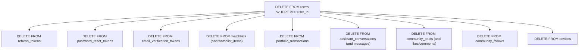

# Data Protection & Privacy Architecture — Basarat

## 1. Sensitive Data Classification

Basarat classifies system data into four security tiers:

| Tier | Classification | Data Elements | Storage Location | Protection Controls |
|---|---|---|---|---|
| **Tier 1** | Critical Secrets | User Passwords, `SECRET_KEY`, OAuth Client Secrets, SendGrid/Groq/HF API Keys. | PostgreSQL (`hashed_password`), `.env` / Environment | Salted `bcrypt` hashing, never logged, excluded from Git, masked in errors. |
| **Tier 2** | User PII & Credentials | User Emails, Usernames, Full Names, Refresh Tokens, OTP Verification Codes. | PostgreSQL (`users`, `refresh_tokens`, `email_verification_tokens`) | SHA-256 OTP hashing, token rotation, private schema serialization. |
| **Tier 3** | Confidential Financial Data | Portfolio Transactions, Cash/Asset Values, Custom Watchlists, AI Chat Conversations. | PostgreSQL (`portfolio_transactions`, `watchlists`, `assistant_messages`) | Strict foreign-key ownership constraints, isolated query tenant boundaries. |
| **Tier 4** | Public Market Data | PSX Daily OHLCV Prices, Quotes, Technicals, Fundamentals, Shariah Screenings, News. | PostgreSQL (`stocks`, `stock_prices`), Redis Cache | Publicly accessible, Redis in-memory caching with TTLs. |

---

## 2. Cryptographic Controls & Data at Rest

### 2.1 Password Storage
- Passwords are encrypted using **salted `bcrypt`** (`bcrypt.gensalt()`). The cost factor (work factor) ensures resistance against hardware-accelerated dictionary and rainbow table attacks.
- Plaintext passwords exist in memory only during the brief execution of hashing and verification functions and are never written to disk or logs.

### 2.2 Verification Codes & Password Reset Tokens
- One-Time Passcodes (OTPs) are **never stored in plaintext** in the database.
- The 6-digit random code is hashed with **SHA-256** before insertion into `email_verification_tokens` and `password_reset_tokens`. Database compromises do not expose valid reset codes.
- All verification tokens include absolute expiration timestamps (default 10 minutes) and boolean `used` tracking flags.

### 2.3 Refresh Token Security
- Refresh tokens are tracked by random UUID `jti` in `refresh_tokens`.
- On user logout, session invalidation, or token refresh, tokens are marked `revoked=True` with timestamp `revoked_at`.

---

## 3. Data in Transit (Transport Layer Security)

- **HTTPS / TLS 1.3:** Production deployments mandate encrypted HTTPS for all REST API endpoints and Server-Sent Events (SSE).
- **Secure WebSockets (WSS):** WebSocket connections (`wss://api.basarat.pk/api/v1/ws/market`) are encrypted end-to-end to prevent eavesdropping and man-in-the-middle tampering of financial quote streams.
- **Database & Cache Ingress Encryption:** Cloud PostgreSQL (Supabase/AWS RDS) connections enforce SSL (`sslmode=require`), and cloud Redis (Upstash) connections enforce TLS encryption (`rediss://...`).

---

## 4. Secret Management & Configuration Hygiene

- Secrets and credentials (`SECRET_KEY`, `DATABASE_URL`, `GROQ_API_KEY`, `SENDGRID_API_KEY`) are managed through environment variables loaded via Pydantic `BaseSettings`.
- `.env` files are strictly excluded from version control via `.gitignore`.
- [config.py](file:///d:/Ahmed%20Dev/Projects/Basarat-fyp-official/backend/app/core/config.py) validates that `SECRET_KEY` is not set to insecure default strings (e.g. `change-me-in-production`, `secret`, `changeme`) outside local development.

---

## 5. Data Isolation & Account Deletion (Cascade Behavior)

User data is strictly isolated by foreign key constraints. When a user account is deleted, foreign key `ON DELETE CASCADE` rules automatically remove all associated private records:

> [!NOTE]
> Equities and historical market data records in the `stocks` table are protected with `ON DELETE RESTRICT` to ensure market data integrity is never compromised by user account lifecycles.
