# Security Architecture & Code Review — Basarat

## 1. Executive Summary & Security Posture

This security review evaluates the Basarat application against industry standards (OWASP Top 10 API Security Risks). The platform demonstrates strong defenses in authentication lifecycle management, parameter validation, ORM SQL injection prevention, and AI safety guardrails, while maintaining transparent records of areas requiring further infrastructure hardening.

---

## 2. Security Controls Categorization

```mermaid
flowchart TD
    subgraph Implemented["Implemented Controls"]
        direction TB
        I1["Bcrypt Password Hashing with Salts"]
        I2["JWT Token Versioning Revocation"]
        I3["Refresh Token Rotation & Database Tracking"]
        I4["Anti-Enumeration on Signup/Password Reset"]
        I5["Pydantic v2 Strong Typing & Input Validation"]
        I6["SQLAlchemy 2.0 Parameterized ORM Queries"]
        I7["Production CORS Wildcard Disallowance"]
        I8["AI Prompt Injection Scanning & Guardrails"]
        I9["Global Error Masking (No 500 Stack Traces)"]
    end

    subgraph Partial["Partial Controls"]
        direction TB
        P1["IP Rate Limiting (X-Forwarded-For single-hop trust)"]
        P2["Community Media Upload File-Size Validation"]
        P3["Clerk HMAC Signature Webhook Verification"]
    end

    subgraph Recommended["Missing / Recommended Controls"]
        direction TB
        R1["Web Application Firewall (WAF) & DDoS Ingress"]
        R2["Strict HSTS & Content Security Policy (CSP) Headers"]
        R3["Granular Role-Based Access Control (RBAC) Hierarchy"]
        R4["Automated Dynamic Secret Scanning & KMS Integration"]
    end
```



---

## 3. Detailed Security Domain Review

### 3.1 Authentication & Credential Storage
- **Password Security:** Passwords are never stored in plaintext. They are hashed using salted `bcrypt` (`bcrypt.gensalt()`) before writing to PostgreSQL. Passwords submitted during login are compared using `bcrypt.checkpw()`.
- **Anti-Enumeration Protections:** Signup (`POST /auth/signup`) and password reset requests (`POST /auth/forgot-password`) return identical generic HTTP responses regardless of whether the submitted email address is registered, preventing attacker account discovery.
- **Immediate Token Invalidation:** When a user logs out or changes credentials, the database counter `User.token_version` is incremented. The `get_current_user` dependency verifies that `payload["tv"] == user.token_version`, instantly invalidating any stolen or active access JWTs.
- **Refresh Token Rotation:** Refresh tokens are tracked in `refresh_tokens` by UUID `jti`. Each refresh invocation consumes and revokes the submitted token and issues a new one.

### 3.2 SQL Injection & Parameter Tampering Defenses
- **100% Parameterized ORM Queries:** All database queries are constructed using SQLAlchemy 2.0 declarative constructs (`select(...)`, `update(...)`, `delete(...)`) and compiled by `asyncpg` with parameterized placeholders (`$1, $2, ...`).
- **No Dynamic String Concatenation:** Raw SQL string formatting is strictly prohibited across all service and repository classes.

### 3.3 Input Validation & Type Safety
- **Pydantic v2 Schema Enforcement:** Every API route strictly validates query parameters, route parameters, and JSON request bodies before executing application handlers.
- **Constraint Validations:** Enforces length constraints on usernames, email regex validation, non-empty string checks on posts, and bounded numeric ranges on portfolio quantities.

### 3.4 Cross-Origin Resource Sharing (CORS) & Ingress Policy
- **Development Mode:** In `development` and `test` environments, `CORS_ORIGINS` defaults to `["*"]` to facilitate local web and mobile emulation.
- **Staging / Production Mode:** [app/main.py](file:///d:/Ahmed%20Dev/Projects/Basarat-fyp-official/backend/app/main.py#L132-L150) explicitly rejects wildcard origins (`*`) during application startup, requiring an explicit domain whitelist (e.g. `["https://app.basarat.pk"]`).

### 3.5 AI Prompt Injection Defense & Safety Guardrails
- **Prompt Injection Filter ([assistant_safety.py](file:///d:/Ahmed%20Dev/Projects/Basarat-fyp-official/backend/app/services/assistant_safety.py)):** Scans user chat queries for prompt injection signatures (e.g., `"ignore previous instructions"`, `"system prompt"`, `"DAN mode"`).
- **Intent Classification:** Verifies that queries relate to financial analysis, PSX equities, or platform capabilities; non-financial queries are redirected.
- **Mandatory Financial Disclaimers:** Appends statutory financial non-advisory disclaimers to all AI-generated investment answers.

### 3.6 File Upload & Media Storage Protections
- **Size Limitation:** File uploads for community attachments are limited to 10MB (`MAX_FILE_SIZE_MB=10`).
- **Cloud Storage Offloading:** Images are streamed directly to **Cloudinary** CDN storage, avoiding persistent local disk storage of user files on web servers.

### 3.7 Error Disclosure & Information Leakage Prevention
- Centralized exception handlers catch all unhandled exceptions, log the full traceback internally using Python's standard `logging` library, and return a clean, uninformative generic response:
  ```json
  {
    "success": false,
    "error": {
      "code": "INTERNAL_ERROR",
      "message": "An unexpected error occurred"
    }
  }
  ```
- Database schema names, SQL errors, internal server file paths, and stack traces are **never** returned to API clients.

---

## 4. Known Security Gaps & Hardening Recommendations

1. **Proxy IP Spoofing Risk in Rate Limiting:**
   - *Current State:* [rate_limiter.py](file:///d:/Ahmed%20Dev/Projects/Basarat-fyp-official/backend/app/core/rate_limiter.py) extracts the client IP using the first entry in `X-Forwarded-For`.
   - *Risk:* An attacker could spoof headers if the reverse proxy does not sanitize untrusted upstream client headers.
   - *Fix:* Configure reverse proxy (Nginx/Cloudflare) to overwrite `X-Forwarded-For` with the true client IP and populate `TRUSTED_PROXY_IPS` in `.env`.
2. **Missing Granular RBAC Permissions:**
   - *Current State:* Single binary flag `User.is_admin`.
   - *Recommendation:* Implement granular role permissions (e.g. `ADMIN`, `MODERATOR`, `SUPPORT`) as the moderation team scales.
3. **Automated Secret Rotation:**
   - *Current State:* Secrets (`SECRET_KEY`, database credentials, API keys) are loaded from `.env` files.
   - *Recommendation:* Integrate AWS Secrets Manager or HashiCorp Vault for production automated secret rotation.
