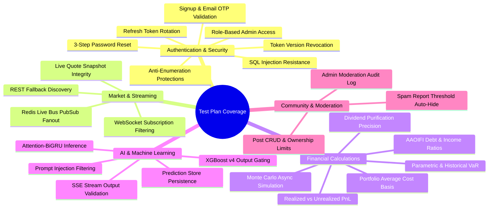

# Master Test Plan — Basarat

## 1. Objectives & Testing Scope

The primary objective of the Basarat Master Test Plan is to validate the functional accuracy, security guarantees, performance thresholds, and financial mathematical correctness of the platform across both development and production-like environments.

---

## 2. Test Environments & Configuration

| Environment | Purpose | Database | Redis | External Services | Execution Cadence |
|---|---|---|---|---|---|
| **Local Unit / Test** | Developer testing & pre-commit validation. | PostgreSQL (Local Docker) / In-Memory Session | Mock Redis / Local Redis | Mocked (SendGrid, Groq, HF) | On Every Commit / Edit |
| **CI / Ephemeral** | Pull Request validation & regression gate. | PostgreSQL 16 Service Container | Redis 7 Service Container | Mocked / Sandbox Keys | On Every Push / PR |
| **Staging / EC2** | Pre-release live environment testing. | Managed Supabase PostgreSQL | Managed Upstash Redis | Live External Cloud APIs | On Pre-Release Deployment |

---

## 3. Entry & Exit Criteria

### 3.1 Entry Criteria
- Source code compiles and passes Ruff linting without fatal syntax errors.
- Alembic database migrations apply successfully from scratch (`alembic upgrade head`).
- All required environment variables are populated in the test runner configuration.

### 3.2 Exit Criteria
- **100% Pass Rate** across all unit, API contract, and security test suites.
- **Zero Critical / High Security Vulnerabilities** detected during security and authorization test passes.
- OpenAPI schema validates successfully against all mounted route handlers.
- All financial calculation algorithms (Average Cost Basis, Realized/Unrealized P&L, VaR 95/99, Shariah ratios) produce verified deterministic results.

---

## 4. Test Categories & Module Coverage

---

## 5. Existing vs. Required vs. Recommended Tests

### 5.1 Existing Tests (Verified in Codebase)
- Complete API route contract suite across 18 modules in `backend/tests/api/`.
- Full Swagger audit suite in `backend/tests/e2e_full_swagger_audit.py`.
- Security tests validating token versioning, password reset, and SQL injection in `backend/tests/security/test_security.py`.
- Unit tests for financial calculations, technical indicators, and assistant safety in `backend/tests/unit/`.
- Live WebSocket subscription and message handling in `backend/tests/test_websockets_suite.py`.

### 5.2 Required Pre-Release Regression Tests
- **Database Re-Migration Smoke Test:** Validating `alembic downgrade base` and `alembic upgrade head` on clean PostgreSQL instances.
- **Monte Carlo Async Polling Test:** Testing full lifecycle: `POST /risk/monte-carlo` -> task queuing -> worker processing -> `GET /risk/monte-carlo/{id}` completion.
- **Password Reset End-to-End Test:** Verification that step 3 resets the password, updates the hash, and prevents old passwords from logging in.

### 5.3 Recommended Future QA Extensions
- Automated Cross-Browser UI Testing (Playwright / Cypress) for React components.
- Mobile Client Push Notification delivery verification using Firebase test credentials.
- Automated Chaos Engineering tests simulating upstream PSX network drops and API timeouts.
