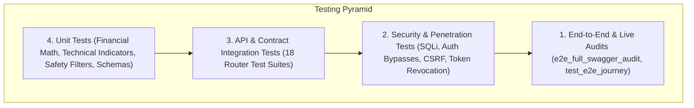

# Testing Strategy & QA Architecture — Basarat

## 1. Testing Philosophy & Pyramid

Basarat employs a multi-tiered automated quality assurance strategy to guarantee the accuracy of financial calculations, API contract integrity, security controls, and machine learning inference pipelines:



---

## 2. Testing Levels & Directory Mapping

| Testing Level | Scope & Focus | Directory Path | Key Test Modules |
|---|---|---|---|
| **Unit Testing** | Core algorithms, financial formulas (ACB, P&L, VaR), AI safety filters, Pydantic schemas, and technical indicators. | `backend/tests/unit/` | `test_alert_evaluation.py`, `test_assistant_safety.py`, `test_recommendation_engine.py`, `test_schemas.py`, `test_security.py` |
| **API Contract Testing** | Validating HTTP status codes, request/response schemas, parameter validations, and error formats across all 146 routes. | `backend/tests/api/` | `test_auth_api.py`, `test_portfolio_api.py`, `test_market_api.py`, `test_forecast_api.py`, `test_risk_api.py`, `test_shariah_api.py` |
| **Security Testing** | Testing token version revocation, refresh rotation, anti-enumeration, SQL injection prevention, and authorization boundaries. | `backend/tests/security/` | `test_security.py`, `test_authorization.py` |
| **Integration Testing** | Multi-step workflows (Signup -> OTP -> Login -> Create Portfolio -> Add Trade -> Verify Summary). | `backend/tests/integration/` | `test_auth_integration.py` |
| **End-to-End (E2E) & Live Audits** | Full journey simulation across all platform capabilities, WebSocket streams, and live PSX data integrity audits. | `backend/tests/e2e/` & root | `test_e2e_journey.py`, `e2e_full_swagger_audit.py`, `test_websockets_suite.py` |
| **Performance Testing** | Concurrent request benchmarks and caching efficiency checks. | `backend/tests/performance/` | `test_performance.py` |

---

## 3. Test Fixtures & Harness Architecture (`conftest.py`)

The centralized test harness in [backend/tests/conftest.py](file:///d:/Ahmed%20Dev/Projects/Basarat-fyp-official/backend/tests/conftest.py) provides reusable async fixtures:

```python
# Key Fixtures Provided in conftest.py:
- db_session: AsyncSession fixture with rollback transaction isolation per test.
- client: httpx.AsyncClient configured against FastAPI app with base_url="http://test".
- test_user: Pre-seeded verified standard user record.
- test_admin: Pre-seeded administrative user record (is_admin=True).
- auth_headers: HTTP Authorization header dictionary with valid access JWT for test_user.
- admin_headers: HTTP Authorization header dictionary with valid access JWT for test_admin.
- seeded_portfolio: Pre-seeded portfolio transactions for ACB and P&L testing.
- mock_redis: In-memory mock Redis client simulating cache gets, sets, and pub/sub.
```

---

## 4. External Service Mocking Strategy

To ensure fast, deterministic, and offline-capable test runs, third-party cloud services are mocked:

- **SendGrid / SMTP Email:** Mocked to intercept outgoing HTML payloads and verify OTP token formats without making external network calls.
- **Groq Cloud LLM:** Mocked to return deterministic financial assistant text and stream simulated SSE chunks.
- **HuggingFace FinBERT API:** Mocked to return standard JSON polarity matrices (`positive: 0.85, neutral: 0.10, negative: 0.05`).
- **Cloudinary:** Mocked to return simulated secure CDN image URLs (`https://res.cloudinary.com/...`).

---

## 5. Test Execution Commands

```bash
# Inside backend/ directory

# Run complete test suite
pytest

# Run with verbose output and short traceback
pytest -v --tb=short

# Run specific domain tests
pytest tests/api/test_portfolio_api.py
pytest tests/security/test_security.py
pytest tests/unit/test_assistant_safety.py

# Run exhaustive OpenAPI Swagger audit suite
pytest tests/e2e_full_swagger_audit.py
```

---

## 6. Identified Testing Gaps & Recommendations

1. **Frontend Automated E2E Tests:**
   - *Current State:* Frontend uses fallback mock data wrappers and manual browser validation.
   - *Recommendation:* Implement Playwright / Cypress end-to-end browser test suites for automated UI journey verification.
2. **Stress & Load Testing (Locust):**
   - *Current State:* `test_performance.py` provides baseline concurrency tests.
   - *Recommendation:* Build dedicated Locust load-testing scenarios simulating 1,000+ concurrent WebSocket quote subscribers.
