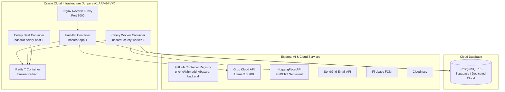

# Infrastructure

## Current Production Architecture

## Infrastructure Components

| Component | Technology | Purpose |
|-----------|-----------|---------|
| **Application Server** | Uvicorn (ASGI) / FastAPI | Asynchronous REST and WebSocket web API |
| **Reverse Proxy** | Nginx | Reverse proxy, rate limiting, and CORS |
| **Container Runtime** | Docker Engine & Compose v2 | Container orchestration |
| **Database** | PostgreSQL 16 | Primary relational persistence |
| **Cache/Broker** | Redis 7 (In-Memory) | Caching, Celery task broker, pub/sub quotes |
| **Image Registry** | GitHub Container Registry (GHCR) | Immutable Docker image distribution |
| **CI/CD** | GitHub Actions | Automated build, test, and deployment pipeline |
| **Compute** | Oracle Cloud Infrastructure (OCI) | Ampere A1 4 OCPU 24GB ARM64 Ubuntu VM |
| **Object Storage** | Cloudinary | Community post images |

## Recommended Production Improvements

> The following are **not currently implemented**.

1. **Load Balancer**: AWS ALB for TLS termination and multi-instance routing
2. **Multi-AZ**: Multiple EC2 instances across availability zones
3. **Secrets Manager**: AWS Secrets Manager instead of EC2 `.env` file
4. **Monitoring**: Datadog/CloudWatch for metrics and alerting
5. **Log Aggregation**: CloudWatch Logs or ELK stack
6. **Database Backups**: Automated backup verification (Supabase provides backups)
