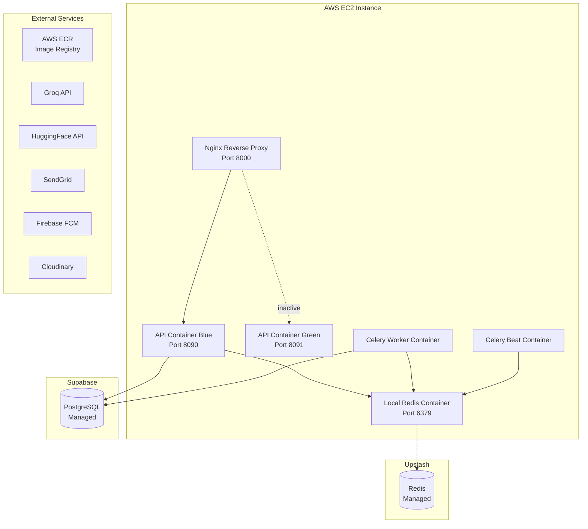

# Infrastructure

## Current Production Architecture

## Infrastructure Components

| Component | Technology | Purpose |
|-----------|-----------|---------|
| **Application Server** | Uvicorn (ASGI) | FastAPI application serving |
| **Reverse Proxy** | Nginx | Rate limiting, TLS termination, blue-green routing |
| **Container Runtime** | Docker Engine | Container orchestration |
| **Database** | PostgreSQL 16 (Supabase) | Primary data store |
| **Cache/Broker** | Redis 7 (local + Upstash) | Caching, Celery broker, pub/sub |
| **Image Registry** | AWS ECR | Docker image storage |
| **CI/CD** | GitHub Actions | Build, test, deploy automation |
| **Compute** | AWS EC2 | Self-hosted runner + application hosting |
| **Object Storage** | Cloudinary | Community post images |

## Recommended Production Improvements

> The following are **not currently implemented**.

1. **Load Balancer**: AWS ALB for TLS termination and multi-instance routing
2. **Multi-AZ**: Multiple EC2 instances across availability zones
3. **Secrets Manager**: AWS Secrets Manager instead of EC2 `.env` file
4. **Monitoring**: Datadog/CloudWatch for metrics and alerting
5. **Log Aggregation**: CloudWatch Logs or ELK stack
6. **Database Backups**: Automated backup verification (Supabase provides backups)
