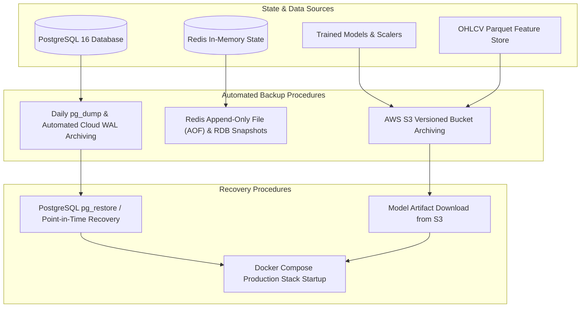

# Backup, Disaster Recovery & Business Continuity — Basarat

## 1. Backup Architecture & Target RPO / RTO

Basarat defines strict operational targets for data persistence, system resilience, and disaster recovery:

- **Recovery Point Objective (RPO):** $< 1\text{ hour}$ for transactional user portfolios and audit logs; $< 24\text{ hours}$ for historical market feature parquets.
- **Recovery Time Objective (RTO):** $< 15\text{ minutes}$ for complete API service restoration from cold backup.



---

## 2. Backup Procedures & Schedules

### 2.1 PostgreSQL Database Backups
1. **Automated Cloud Snapshots:** When using managed PostgreSQL (Supabase / AWS RDS / Neon), continuous Write-Ahead Log (WAL) archiving provides Point-in-Time Recovery (PITR) up to 7–30 days.
2. **Manual Daily Logical Dump (`pg_dump`):**
   ```bash
   # Execute compressed logical backup
   pg_dump -h localhost -U postgres -d basarat -F c -b -v -f "/opt/basarat/backups/basarat_$(date +%Y%m%d_%H%M%S).dump"
   ```

### 2.2 Redis In-Memory State
- Redis persistence is configured using **RDB Snapshots** (`save 900 1`, `save 300 10`) and **Append-Only File (AOF)** (`appendonly yes`).
- Redis cache data is transient; a complete Redis loss is automatically re-warmed by Celery tasks within 60 seconds without data corruption.

### 2.3 ML Model Artifacts & Feature Parquet Files
- Model weights (`gru_best_weights.weights.h5`, `xgb_model.ubj`, `gru_scaler.joblib`) and `features_daily.parquet` are stored in named host volumes (`gru-candidates`, `xgb-candidates`, `feature-data`) and archived to versioned cloud storage (AWS S3).

---

## 3. Disaster Recovery & Restoration Runbook

### Step 1: Database Restoration
To restore a logical dump onto a fresh PostgreSQL instance:
```bash
# 1. Drop existing connections and recreate empty database
dropdb -h localhost -U postgres basarat
createdb -h localhost -U postgres basarat

# 2. Restore schema and data from dump file
pg_restore -h localhost -U postgres -d basarat -v "/opt/basarat/backups/basarat_backup.dump"
```

### Step 2: Database Migration Alignment
Verify that the restored database matches the latest Alembic migration version:
```bash
cd /opt/basarat/backend
alembic current
alembic upgrade head
```

### Step 3: Re-warm In-Memory Caches & Market Data
```bash
# Start Docker stack
docker compose -f docker-compose.production.yml up -d

# Trigger initial cache warm-up task
docker compose -f docker-compose.production.yml exec celery-worker python -c "
from app.tasks.refresh_market_cache import refresh_market_cache
refresh_market_cache.delay(refresh_reference=True, refresh_constituents=True)
"
```
