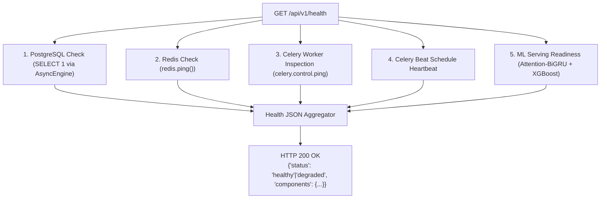
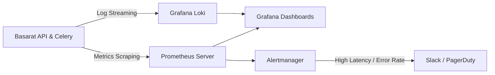

# Observability & Monitoring Architecture — Basarat

## 1. Existing Health Probes & Observability

Basarat provides built-in HTTP health and readiness probes to monitor application subsystems, database connectivity, cache health, and background worker queues.



---

## 2. Health & Diagnostic Endpoints

### 2.1 Complete Health Probe (`GET /api/v1/health` and `GET /health`)
Evaluates all internal and external dependencies and returns component-level diagnostics:

```json
{
  "status": "healthy",
  "version": "1.0.0",
  "environment": "production",
  "components": {
    "database": { "status": "healthy", "latency_ms": 4.2 },
    "redis": { "status": "healthy", "latency_ms": 1.1 },
    "celery_workers": { "status": "healthy", "active_workers": 1 },
    "celery_beat": { "status": "healthy", "schedule_count": 10 },
    "ml_models": { "status": "healthy", "gru_ready": true, "xgb_ready": true }
  }
}
```

### 2.2 Container Readiness Probe (`GET /api/v1/health/ready` and `GET /health/ready`)
Fast, non-blocking check used by load balancers and container orchestrators:
```json
{
  "status": "ready"
}
```

### 2.3 WebSocket Connection & Subscription Metrics (`GET /api/v1/ws/stats`)
Returns real-time metrics on connected WebSocket clients and active symbol subscriptions:
```json
{
  "active_connections": 42,
  "unique_subscribed_symbols": 128,
  "total_subscriptions": 310,
  "live_bus_connected": true
}
```

### 2.4 News Ingestion Source Health (`GET /api/v1/news/sources`)
Tracks scraping status, consecutive failure counts, and last successful ingestion timestamp for each external news portal.

---

## 3. Machine Learning Model Monitoring & Drift Detection

The platform includes automated Celery monitoring tasks in [app/tasks/model_monitoring.py](file:///d:/Ahmed%20Dev/Projects/Basarat-fyp-official/backend/app/tasks/model_monitoring.py):

1. **Daily Accuracy Monitoring (`crontab(hour=6, minute=0)`):**
   - Compares the previous 30 days of predictions against realized closing prices.
   - Calculates empirical rolling accuracy, directional precision, and F1 score per stock.
2. **Feature & Prediction Drift Detection (`crontab(hour=7, minute=0)`):**
   - Computes Population Stability Index (PSI) and Kolmogorov-Smirnov (KS) tests on incoming technical feature distributions.
   - Detects market regime shifts or anomalous volatility surges, logging warnings when drift exceeds predefined thresholds.

---

## 4. Recommended Production Monitoring & Alerting Stack

For enterprise deployments, the following observability stack is recommended:



### Recommended Alerting Thresholds:
- **API Error Rate:** P99 5xx error rate $> 1\%$ for 5 consecutive minutes.
- **API Latency:** P95 response time $> 1000\text{ms}$ for 5 consecutive minutes.
- **Database Connection Pool Exhaustion:** Active pool connections $> 85\%$ capacity.
- **Scraper Circuit Breaker Triggered:** PSX scraping paused due to HTTP 429/403.
- **Celery Queue Backlog:** Unprocessed task count $> 500$ messages.
