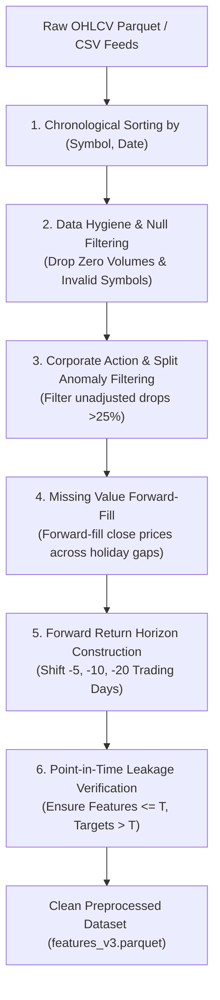

# Data Preprocessing Documentation

## 1. Overview & Preprocessing Pipeline

Data preprocessing transforms raw, noisy PSX market feeds and scraper outputs into clean, leakage-free tabular and sequential structures suitable for deep learning (BiGRU) and gradient boosting (XGBoost) models.

---

## 2. Data Hygiene & Anomaly Cleaning

### 2.1 Corporate Action & Unadjusted Split Handling
When companies issue large bonus shares (e.g. 1-for-1 bonus) or stock splits without historical price back-adjustment, the raw closing price drops by $50\%$ overnight. If unhandled, this induces massive false "bearish" training signals.
- **Filter Rule**: Daily percentage drops exceeding $25\%$ without corresponding index-wide collapse are isolated and flagged.
- **Formula**:
  $$\text{daily\_pct\_change}_t = \frac{\text{Close}_t - \text{Close}_{t-1}}{\text{Close}_{t-1}}$$

### 2.2 Inactive & Illiquid Equities Filtering
- Ticker symbols with fewer than **60 consecutive historical trading days** (insufficient warmup for rolling 60-day indicators) are excluded.
- Sessions where $\text{Volume} = 0$ (suspended or non-trading days) preserve the previous day's closing price via forward-fill ($\text{ffill}$), while the volume is explicitly set to $0$.

---

## 3. Forward Horizon Labeling & Target Construction

The target variable represents the **forward multi-day investment outcome** relative to the KSE-100 index (market-neutral excess return):

### 3.1 Mathematical Formulation of Forward Returns

1. **5-Day Calendar-Aware Forward Return**:
   $$R_{i, t}^{(5D)} = \frac{\text{Close}_{i, t+5} - \text{Close}_{i, t}}{\text{Close}_{i, t}}$$

2. **10-Day Calendar-Aware Forward Return**:
   $$R_{i, t}^{(10D)} = \frac{\text{Close}_{i, t+10} - \text{Close}_{i, t}}{\text{Close}_{i, t}}$$

3. **20-Day Calendar-Aware Forward Return**:
   $$R_{i, t}^{(20D)} = \frac{\text{Close}_{i, t+20} - \text{Close}_{i, t}}{\text{Close}_{i, t}}$$

### 3.2 Market-Neutral Excess Return
To eliminate broad market beta and predict pure alpha (stock selection ability), the benchmark index return over the same horizon is subtracted:
$$\text{Excess\_Return}_{i, t}^{(H)} = R_{i, t}^{(H)} - R_{\text{KSE100}, t}^{(H)}$$

### 3.3 Target Categorization & Discretization

The model targets a 3-class directional formulation or a binary market-neutral decile formulation:

#### 3-Class Formulation (Bullish / Bearish / Sideways):
$$y_{i, t} = \begin{cases} 
\text{BULLISH (0)} & \text{if } R_{i, t}^{(H)} \ge +1.0\% \\
\text{BEARISH (1)} & \text{if } R_{i, t}^{(H)} \le -1.0\% \\
\text{SIDEWAYS (2)} & \text{if } -1.0\% < R_{i, t}^{(H)} < +1.0\%
\end{cases}$$

#### Cross-Sectional Alpha Decile Formulation (v3):
In version 3 (`feature_engineer_v3.py`), the daily cross-section is partitioned into **Top 30% Relative Winners** ($y=0$, Outperformers) versus **Bottom 30% Relative Losers** ($y=1$, Underperformers), rejecting the ambiguous middle 40%.

---

## 4. Point-in-Time Data Leakage Prevention

Strict algorithmic safeguards guarantee zero lookahead bias:

| Safeguard | Mechanism | Verification Check |
|---|---|---|
| **Causal Rolling Windows** | All technical indicators (SMA, EMA, RSI, ATR, Volatility) use `.rolling(W)` with trailing windows ending at session $T$. | No backward-looking negative indices in feature transforms. |
| **Shifted Target Labels** | Target returns are computed using negative shifts (`shift(-5)`), moving future prices strictly into the label column. | `leakage_checker.py` asserts zero correlation between feature values at $T$ and labels computed with data $> T$. |
| **Strict Chronological Splits** | Train, Validation, and Test sets are split along fixed dates without shuffling across time. | Test period strictly follows Validation period. |
| **Out-of-Sample Scaler Fitting** | RobustScaler and QuantileTransforms are fitted exclusively on the Training set and frozen before applying to Test data. | Scaler mean and scale parameters originate purely from $T \le T_{\text{train\_end}}$. |
