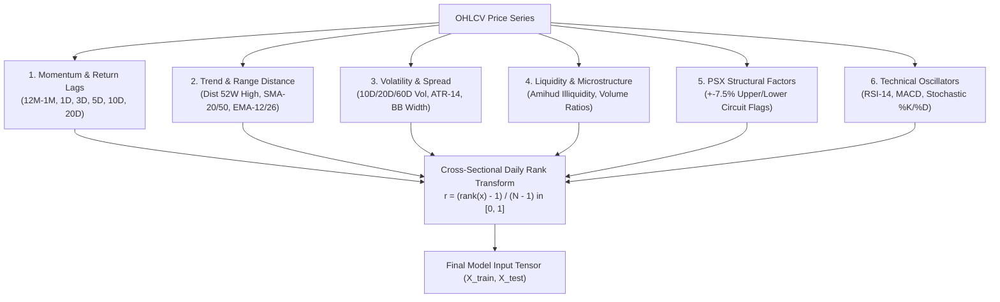

# Feature Engineering Documentation

## 1. Overview

Feature engineering in Basarat translates raw price and volume histories into high-signal quantitative alpha factors and normalized time-series representations. In `feature_engineer_v3.py`, all features undergo daily **Cross-Sectional Rank Normalization** ($csrank \in [0, 1]$), creating market-neutral, regime-invariant signals across the entire 98-equity PSX universe.

---

## 2. Institutional Alpha Factors & Mathematical Formulas

---

### 2.1 Price Momentum & Return Lag Factors

| Feature Name | Mathematical Definition | Economic / Financial Rationale |
|---|---|---|
| `mom_12m_1m` | $\frac{\text{Close}_t}{\text{Close}_{t-252}} - \frac{\text{Close}_t}{\text{Close}_{t-21}}$ | **Jegadeesh & Titman (1993) Institutional Momentum**: 12-month return skipping the most recent 1-month to isolate intermediate trend from short-term micro-reversal. |
| `ret_1d` | $\frac{\text{Close}_t - \text{Close}_{t-1}}{\text{Close}_{t-1}}$ | 1-Day instantaneous return (short-term price shock). |
| `ret_3d` | $\frac{\text{Close}_t - \text{Close}_{t-3}}{\text{Close}_{t-3}}$ | 3-Day short-term swing return. |
| `ret_5d` | $\frac{\text{Close}_t - \text{Close}_{t-5}}{\text{Close}_{t-5}}$ | 1-Week cumulative return. |
| `ret_10d` | $\frac{\text{Close}_t - \text{Close}_{t-10}}{\text{Close}_{t-10}}$ | 2-Week intermediate return. |
| `ret_20d` | $\frac{\text{Close}_t - \text{Close}_{t-20}}{\text{Close}_{t-20}}$ | 1-Month cumulative return. |

---

### 2.2 Trend & Price Distance Indicators

| Feature Name | Mathematical Definition | Economic / Financial Rationale |
|---|---|---|
| `dist_52w_high` | $\text{clip}\left(\frac{\text{Close}_t}{\max_{252}(\text{High})} - 1.0, -0.90, 0.0\right)$ | **52-Week High Anchor Effect (George & Hwang 2004)**: Measures psychological distance to annual high; stocks near 52W high demonstrate persistent alpha. |
| `dist_sma20` | $\frac{\text{Close}_t - \text{SMA}_{20}(Close)}{\text{SMA}_{20}(Close)}$ | Mean-reversion distance from 20-day simple moving average. |
| `dist_sma50` | $\frac{\text{Close}_t - \text{SMA}_{50}(Close)}{\text{SMA}_{50}(Close)}$ | Intermediate trend strength relative to 50-day moving average. |
| `dist_ema12` | $\frac{\text{Close}_t - \text{EMA}_{12}(Close)}{\text{EMA}_{12}(Close)}$ | Short-term exponential moving average deviation. |
| `dist_ema26` | $\frac{\text{Close}_t - \text{EMA}_{26}(Close)}{\text{EMA}_{26}(Close)}$ | Base trend exponential moving average deviation. |

---

### 2.3 Volatility, Range & Dispersion Metrics

| Feature Name | Mathematical Definition | Economic / Financial Rationale |
|---|---|---|
| `volatility_10d`| $\text{std}\left(\ln\left(\frac{\text{Close}_t}{\text{Close}_{t-1}}\right), 10\right)$ | 10-day realized price return volatility. |
| `volatility_20d`| $\text{std}\left(\ln\left(\frac{\text{Close}_t}{\text{Close}_{t-1}}\right), 20\right)$ | 20-day realized monthly volatility. |
| `volatility_60d`| $\text{std}\left(\ln\left(\frac{\text{Close}_t}{\text{Close}_{t-1}}\right), 60\right)$ | 60-day quarterly baseline volatility. |
| `norm_atr14` | $\frac{\text{ATR}_{14}(t)}{\text{Close}_t}$ | Price-normalized 14-day Average True Range. |
| `hl_range` | $\frac{\text{High}_t - \text{Low}_t}{\text{Close}_t}$ | Intraday total price range (trading dispersion). |
| `co_range` | $\frac{\text{Close}_t - \text{Open}_t}{\text{Open}_t}$ | Intraday candle body spread. |
| `bb_width` | $\frac{\text{UpperBB}_{20,2} - \text{LowerBB}_{20,2}}{\text{SMA}_{20}}$ | Bollinger Band width measuring volatility compression/expansion. |
| `bb_pct_b` | $\frac{\text{Close}_t - \text{LowerBB}_{20,2}}{\text{UpperBB}_{20,2} - \text{LowerBB}_{20,2}}$ | Bollinger %B oscillator locating price within envelope $[0, 1]$. |

---

### 2.4 Liquidity & Market Microstructure

| Feature Name | Mathematical Definition | Economic / Financial Rationale |
|---|---|---|
| `amihud_illiquidity` | $\ln\left(1 + \frac{|\text{ret\_1d}_t|}{\text{Turnover}_t + 10^{-3}} \times 10^8\right)$ | **Amihud (2002) Illiquidity Measure**: Captures price impact per unit of trading volume; identifies liquidity squeeze risks in mid/small caps. |
| `vol_ratio_5d` | $\frac{\text{Volume}_t}{\text{SMA}_5(\text{Volume})}$ | Relative volume surge above 5-day average. |
| `vol_ratio_20d`| $\frac{\text{Volume}_t}{\text{SMA}_{20}(\text{Volume})}$ | Institutional accumulation flag (volume breakout). |

---

### 2.5 PSX Structural & Regulatory Circuit Limits

| Feature Name | Mathematical Definition | Economic / Financial Rationale |
|---|---|---|
| `is_upper_circuit` | $\mathbb{I}(\text{daily\_pct\_change}_t \ge +0.074)$ | PSX statutory upper lock limit indicator (buyers locked, liquidity dry-up). |
| `is_lower_circuit` | $\mathbb{I}(\text{daily\_pct\_change}_t \le -0.074)$ | PSX statutory lower lock limit indicator (sellers locked, distress signal). |

---

### 2.6 Technical Oscillators

| Feature Name | Formulation | Range |
|---|---|---|
| `rsi_14` | Wilder's 14-day Relative Strength Index | $[0, 100]$ |
| `macd_line` | $\text{EMA}_{12}(\text{Close}) - \text{EMA}_{26}(\text{Close})$ | Unbounded |
| `macd_signal` | $\text{EMA}_9(\text{MACD\_Line})$ | Unbounded |
| `macd_hist` | $\text{MACD\_Line} - \text{MACD\_Signal}$ | Momentum oscillator |
| `stoch_k` | $\frac{\text{Close}_t - \min_{14}(\text{Low})}{\max_{14}(\text{High}) - \min_{14}(\text{Low})} \times 100$ | $[0, 100]$ |
| `stoch_d` | $\text{SMA}_3(\text{Stoch\_K})$ | $[0, 100]$ |

---

## 3. Cross-Sectional Rank Normalization

To ensure uniform scaling across market cycles (e.g. 2020 COVID crash vs 2024 bull run), all continuous features are rank-transformed cross-sectionally across all $N$ active equities on each trading session date $t$:

$$r_{i, t} = \frac{\text{Rank}(x_{i, t}) - 1}{N_t - 1} \in [0, 1]$$

Where:
- $\text{Rank}(x_{i, t}) \in \{1, 2, \dots, N_t\}$ is the ordinal rank of equity $i$'s feature on date $t$.
- $r_{i, t} = 0.0$ corresponds to the lowest value in the cross-section on that day.
- $r_{i, t} = 1.0$ corresponds to the highest value in the cross-section on that day.

**Benefits**:
1. Eliminates sensitivity to absolute price levels (e.g. PKR 1,000 stocks vs PKR 20 stocks).
2. Robust to outliers without requiring destructive Winsorization.
3. Stabilizes neural network gradient descent and tree split selection.
