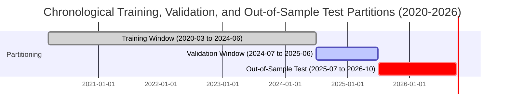

# Model Training Documentation

## 1. Walk-Forward Temporal Split Design

The predictive ensemble is trained on historical PSX daily market data spanning **March 12, 2020 through October 2, 2026** (151,484 normalized daily rows across 100 listed equities).

To prevent lookahead bias and leakage, the dataset is partitioned chronologically:



### Partition Breakdown:
- **Training Set ($\sim 70\%$)**: `2020-03-12` to `2024-06-30` (~106,000 daily observations).
- **Validation Set ($\sim 15\%$)**: `2024-07-01` to `2025-06-30` (Used for early stopping, tree depth tuning, and probability threshold calibration).
- **Out-of-Sample Test Set ($\sim 15\%$)**: `2025-07-01` to `2026-10-02` (Holdout test dataset representing ~22,700 forward holding evaluations).

---

## 2. Loss Functions & Optimization

### 2.1 Attention-BiGRU Training
- **Loss Function**: `binary_crossentropy` on directional label ($y \in \{0, 1\}$).
- **Optimizer**: `Adam(learning_rate=4e-4)`.
- **Regularization**: Spatial Dropout (0.10), GRU recurrent dropout (0.15), Dense dropout (0.20), Layer Normalization after recurrent cells.
- **Batch Size**: 128 sequence windows of 45-day lookback.
- **Early Stopping**: 15 epochs patience on validation loss.

### 2.2 XGBoost Multi-Horizon Training (`train_all_horizons.py`)
- **Horizons Trained**: `5D` (1-Week), `10D` (2-Week), and `20D` (1-Month).
- **Objective**: `binary:logistic` / `logloss`.
- **Tree Parameters**: `n_estimators=1500`, `learning_rate=0.02`, `max_depth=4`, `min_child_weight=100`, `subsample=0.80`, `colsample_bytree=0.60`, `reg_lambda=10.0`, `reg_alpha=1.0`.
- **Early Stopping**: 40 rounds on validation log-loss.

---

## 3. Dual-Model Artifact Registry

Upon successful training, artifacts are exported to [`backend/models/production/v3/`](../../backend/models/production/v3/):

```
backend/models/production/v3/
├── gru_model.keras                 # Full Attention-BiGRU Keras model
├── gru_best_weights.weights.h5     # Checkpointed weights
├── gru_scaler.joblib               # RobustScaler fit on 2020-2024 train data
├── gru_features.json               # 79 input sequential feature names
├── xgb_model.ubj                   # Production 5D (1W) XGBoost model
├── xgb_model_10d.ubj               # Production 10D (2W) XGBoost model
├── xgb_model_20d.ubj               # Production 20D (1M) XGBoost model
├── xgb_features.json               # 70 cross-sectional rank feature names
├── model_manifest.json             # Deployment manifest & validation gate status
└── multi_horizon_summary.json      # Empirical validation scores across 5D, 10D, 20D
```
