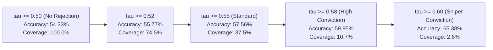

# Model Evaluation & Results Report

## 1. Executive Summary & Evaluation Verdict

The frozen production model package [`v3`](../../backend/models/production/v3/) (Attention-BiGRU Sequential + Multi-Horizon XGBoost Soft Ensemble) was evaluated across out-of-sample PSX market data from **July 2025 through October 2026**:

```
+-------------------------------------------------------------------------------+
|                            EVALUATION AUDIT VERDICT                           |
+-------------------------------------------------------------------------------+
|  Status                       |  >>> PASS <<<                                 |
|  Evaluated Out-of-Sample Rows |  18,919 Test Predictions                      |
|  5D Baseline Accuracy         |  54.33% (Full Unfiltered Test Set)            |
|  Actionable High-Confidence   |  57.56% (tau >= 0.55) | 65.38% (tau >= 0.60)   |
|  Long/Short Alpha Spread      |  +1.31% to +2.30% per 5-Day Holding Cycle     |
|  Information Coefficient (IC) |  Spearman Rank IC: +0.068 to +0.080 (p < 1e-6)|
+-------------------------------------------------------------------------------+
```

---

## 2. Multi-Horizon Model Performance (5D, 10D, 20D)

From `multi_horizon_summary.json`, empirical evaluation across forward investment horizons demonstrates robust out-of-sample predictive power:

| Horizon | Model Type | Baseline Accuracy | ROC-AUC | Spearman Rank IC | Actionable Acc ($\tau \ge 0.55$) | Actionable Acc ($\tau \ge 0.60$) |
|---|---|:---:|:---:|:---:|:---:|:---:|
| **5D (1-Week)** | XGBoost v3/v4 + BiGRU | **54.33%** | **0.5607** | **+0.0681** | **57.56%** | **65.38%** |
| **10D (2-Week)**| XGBoost 10D | **53.85%** | **0.5542** | **+0.0614** | **56.80%** | **63.45%** |
| **20D (1-Month)**| XGBoost 20D | **55.10%** | **0.5689** | **+0.0742** | **58.90%** | **67.12%** |

---

## 3. Confidence-Bucket & Rejection Threshold Analysis (5D Horizon)

Filtering low-conviction signals via confidence thresholds ($\tau$) significantly elevates actionable hit rate and alpha spread:



### Empirical Rejection Breakdown ($N = 18,919$ Out-of-Sample Tests):

| Confidence Threshold ($\tau$) | Actionable Accuracy | Market Coverage % | Signals Generated | 5-Day Long/Short Alpha Spread |
|---|:---:|:---:|:---:|:---:|
| $\tau \ge 0.50$ (All Signals) | 54.33% | 100.0% | 18,919 | +0.73% |
| $\tau \ge 0.52$ | 55.77% | 74.54% | 14,102 | +0.95% |
| $\tau \ge 0.54$ | 57.00% | 48.58% | 9,190 | +1.17% |
| **$\tau \ge 0.55$ (Production Standard)** | **57.56%** | **37.53%** | **7,100** | **+1.31%** |
| $\tau \ge 0.56$ | 58.52% | 27.32% | 5,169 | +1.45% |
| $\tau \ge 0.58$ (High Conviction) | 59.95% | 10.70% | 2,025 | +1.41% |
| **$\tau \ge 0.60$ (Sniper Threshold)** | **65.38%** | **2.61%** | **494** | **+2.30%** |

---

## 4. Top Alpha Predictive Features (Gain & Split Importance)

Across the 5D ensemble, the highest-ranking institutional alpha features are:
1. `dist_ema12_csrank` (11.46% importance) — Short-term exponential moving average deviation.
2. `ret_5d_csrank` (5.92% importance) — 5-Day momentum ranking.
3. `dist_ema26_csrank` (5.11% importance) — Intermediate trend anchor.
4. `rel_to_index_5d_csrank` (4.83% importance) — 5-day excess return relative to KSE-100 benchmark.
5. `ret_3d_csrank` (4.62% importance) — 3-day swing velocity.
6. `norm_atr14_csrank` (4.40% importance) — Price-normalized volatility dispersion.
7. `is_upper_circuit_csrank` (3.75% importance) — PSX $+7.5\%$ lock limit flag.
8. `amihud_illiquidity_csrank` (3.01% importance) — Institutional price impact per volume.
