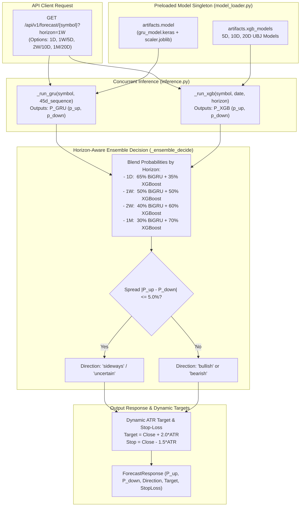

# ML Deployment & Inference Documentation

## 1. Dual-Model Serving Architecture

In production, both **Attention-BiGRU v2** and **Multi-Horizon XGBoost v4** are preloaded into memory at application startup, executed concurrently per inference request, and blended via dynamic horizon weights.



---

## 2. Dynamic Target & Stop-Loss Calculation

For every generated prediction, actionable risk-reward parameters are computed dynamically using price volatility and Average True Range (ATR):

### 2.1 Bullish Signals ($P_{\text{Bullish}} > 50\%$):
$$\text{Target Price} = \text{Close} + (2.0 \times \text{ATR}_{14})$$
$$\text{Stop Loss} = \text{Close} - (1.5 \times \text{ATR}_{14})$$
$$\text{Risk-to-Reward Ratio} = \frac{\text{Target Price} - \text{Close}}{\text{Close} - \text{Stop Loss}} = \frac{2.0}{1.5} \approx 1.33$$

### 2.2 Bearish Signals ($P_{\text{Bearish}} > 50\%$):
$$\text{Target Price} = \text{Close} - (2.0 \times \text{ATR}_{14})$$
$$\text{Stop Loss} = \text{Close} + (1.5 \times \text{ATR}_{14})$$

---

## 3. Quantitative Recommendation Engine Integration

Predictions feed into the multi-factor ranking service (`app/services/recommendation_service.py`):

$$\text{Final Score} = 0.35 \cdot S_{\text{Tech}} + 0.35 \cdot S_{\text{Fund}} + 0.20 \cdot S_{\text{ML\_Forecast}} + 0.10 \cdot S_{\text{Sentiment}}$$

Where:
- $S_{\text{Tech}} \in [0, 100]$: RSI, MACD histogram, and Bollinger position composite.
- $S_{\text{Fund}} \in [0, 100]$: P/E percentile, ROE, Dividend Yield, and Debt-to-Equity.
- $S_{\text{ML\_Forecast}} \in [0, 100]$: $100 \times P_{\text{Bullish}}$ from calibrated model output.
- $S_{\text{Sentiment}} \in [0, 100]$: $50 + (50 \times \text{FinBERT Compound Score})$.

---

## 4. Production Artifacts Layout

```
backend/models/production/v3/
├── gru_model.keras                 # Keras Attention-BiGRU sequential model
├── gru_best_weights.weights.h5     # Checkpointed neural weights
├── gru_scaler.joblib               # RobustScaler fitted on training dataset
├── gru_features.json               # 79 sequential feature names
├── xgb_model.ubj                   # 5D (1-Week) production model
├── xgb_model_10d.ubj               # 10D (2-Week) production model
├── xgb_model_20d.ubj               # 20D (1-Month) production model
├── xgb_features.json               # 70 cross-sectional rank feature names
├── model_manifest.json             # Manifest verifying active production status
└── multi_horizon_summary.json      # Empirical validation scores (5D, 10D, 20D)
```
