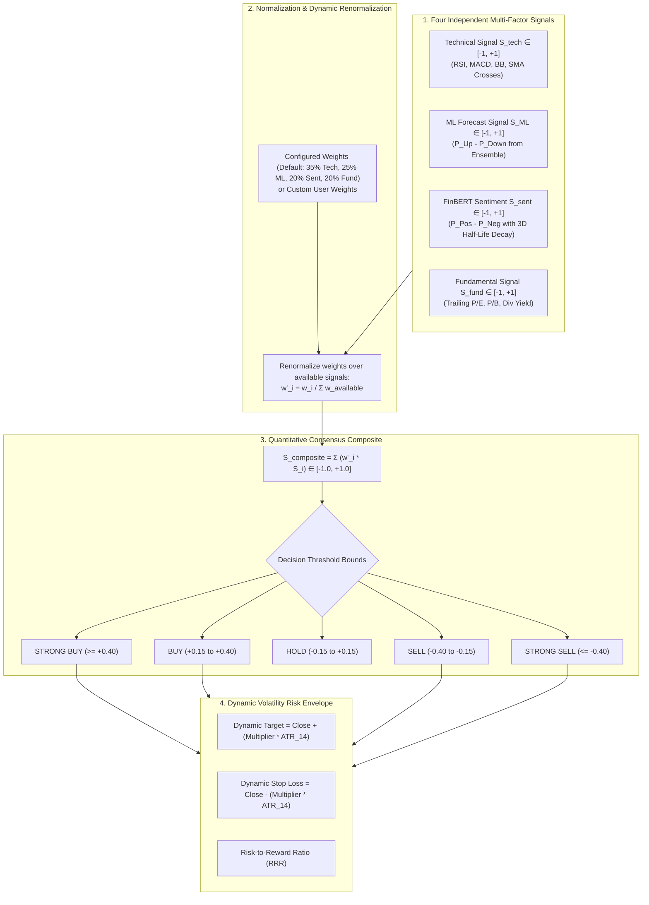

# Quantitative Recommendation Engine Documentation

## 1. Overview & Architectural Philosophy

The **Basarat Recommendation Engine** (`backend/app/services/recommendation_service.py` & `backend/app/api/v1/recommendations.py`) synthesizes multi-factor market signals into an actionable, transparent composite recommendation for Pakistan Stock Exchange (PSX) equities.

Rather than relying purely on an uninterpretable "black-box" model, our engine implements a **4-Pillar Quantitative Multi-Factor Consensus Architecture** that combines:
1. **AI/ML Directional Forecasting** (Attention-BiGRU + XGBoost Soft Voting)
2. **Technical Momentum & Oscillator Signals** (RSI, MACD, Moving Averages, Bollinger Bands)
3. **Fundamental Valuation & Financial Health** (P/E, P/B, Dividend Yield, ROE)
4. **Natural Language Processing (NLP) News Sentiment** (Hugging Face FinBERT)

---

## 2. Signal Normalization & Mathematics

Every individual component signal is strictly normalized into a continuous scale $S_i \in [-1.0, +1.0]$:
* **$+1.0$** $\to$ Strong Bullish / High Conviction Positive
* **$0.0$** $\to$ Neutral / Indeterminate
* **$-1.0$** $\to$ Strong Bearish / High Conviction Negative

### 2.1 AI/ML Forecast Signal ($S_{\text{ML}}$)
Derived from the runtime probability distribution of our hybrid Attention-BiGRU and XGBoost ensemble:
$$S_{\text{ML}} = P(\text{Up}) - P(\text{Down}) \in [-1.0, +1.0]$$

### 2.2 Technical Momentum Signal ($S_{\text{tech}}$)
Aggregates key technical oscillators and trend filters:
* **RSI(14):**
  - RSI $< 30$ (Oversold): $+0.60$ to $+1.00$
  - RSI $> 70$ (Overbought): $-0.60$ to $-1.00$
  - RSI $45–55$ (Neutral): $0.00$
* **MACD:** $\text{Histogram} = \text{MACD Line} - \text{Signal Line}$ ($>0 \implies \text{Bullish}$, $<0 \implies \text{Bearish}$).
* **Moving Average Trend:** Price relative to SMA 20, SMA 50, and Golden/Death cross (SMA 50 vs SMA 200).
* **Bollinger %B:** $(P - \text{Lower}) / (\text{Upper} - \text{Lower})$.

### 2.3 Fundamental Valuation Signal ($S_{\text{fund}}$)
* Evaluates Trailing P/E relative to sector averages, Price-to-Book (P/B), Dividend Yield ($>8\%$ in PSX yields positive score), and Return on Equity (ROE).

### 2.4 FinBERT NLP News Sentiment Signal ($S_{\text{sentiment}}$)
* Ingests scraped articles from Dawn, Business Recorder, and Profit Pakistan:
  $$S_{\text{article}} = P(\text{Positive}) - P(\text{Negative})$$
* Applies a **3-day exponential half-life time decay** ($t_{1/2} = 3\text{ days}$):
  $$S_{\text{sentiment}}(t) = \frac{\sum_i S_i \cdot \exp\left(-\frac{\ln(2)(t - t_i)}{3}\right)}{\sum_i \exp\left(-\frac{\ln(2)(t - t_i)}{3}\right)}$$

---

## 3. Dynamic Renormalization & Missing Data Handling

When a stock lacks one or more data feeds (e.g., a newly listed IPO with no historical news articles or fundamental ratios), the engine does **not** fail or assume a zero score. Instead, it dynamically renormalizes the weights among active sources:

$$w'_i = \frac{w_i}{\sum_{j \in \text{Available}} w_j}$$

**Example:** If News Sentiment ($w = 0.20$) is unavailable:
* $w'_{\text{ML}} = \frac{0.30}{0.80} = 37.5\%$
* $w'_{\text{tech}} = \frac{0.25}{0.80} = 31.25\%$
* $w'_{\text{fund}} = \frac{0.25}{0.80} = 31.25\%$

---

## 4. Actionable Verdict Thresholds

$$S_{\text{composite}} = \sum_{i=1}^4 w'_i \cdot S_i$$

| Composite Score ($S_{\text{composite}}$) | Actionable Signal | Investor Action |
|---|:---:|---|
| **$S_{\text{composite}} \ge +0.40$** | **STRONG BUY** | High-conviction multi-factor alignment across ML, technicals, and sentiment. |
| **$+0.15 \le S_{\text{composite}} < +0.40$** | **BUY** | Positive consensus signal exceeding minimum actionable conviction. |
| **$-0.15 < S_{\text{composite}} < +0.15$** | **HOLD** | Balanced or uncertain signals; maintain current position without new allocation. |
| **$-0.40 < S_{\text{composite}} \le -0.15$** | **SELL** | Negative consensus suggesting capital reallocation or profit-taking. |
| **$S_{\text{composite}} \le -0.40$** | **STRONG SELL** | High-conviction negative multi-factor alignment; strict risk-off signal. |

---

## 5. Dynamic ATR Target Price & Stop-Loss Boundaries

To account for PSX idiosyncratic volatility, target and stop-loss levels adapt dynamically using the **14-day Average True Range (ATR)**:

$$\text{Target Price} = P_{\text{entry}} + (\text{Target Multiplier} \times \text{ATR}_{14})$$
$$\text{Stop Loss} = P_{\text{entry}} - (\text{Stop Multiplier} \times \text{ATR}_{14})$$

### User Risk Profile Adaptation:
| Risk Profile | Target Multiplier | Stop Multiplier | Risk-Reward Ratio (RRR) | Description |
|---|:---:|:---:|:---:|---|
| **Conservative** | $2.0 \times \text{ATR}$ | $1.5 \times \text{ATR}$ | $1.33:1$ | Tight stop-loss to minimize capital drawdown. |
| **Moderate (Default)** | $3.0 \times \text{ATR}$ | $2.0 \times \text{ATR}$ | $1.50:1$ | Balanced swing targets for typical PSX holding periods. |
| **Aggressive** | $4.0 \times \text{ATR}$ | $2.5 \times \text{ATR}$ | $1.60:1$ | Wider volatility leeway for high-beta breakout trades. |

---

## 6. User Customization & API Personalization

In `backend/app/api/v1/recommendations.py`:
1. Users can override default weights by saving custom preferences in their profile (`User.recommendation_weights`).
2. The endpoint `GET /api/v1/recommendations` reads the authenticated user's profile, validates positive values, normalizes them, and produces a customized ranking order tailored to that investor's strategy.
