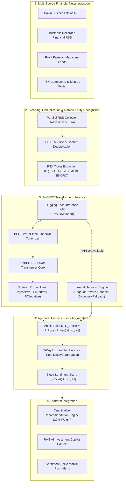

# Financial News Sentiment Analysis Documentation

## 1. Overview & Architecture

The **Basarat Sentiment Intelligence Subsystem** (`backend/app/services/sentiment_service.py` & `backend/app/tasks/sentiment_tasks.py`) provides automated NLP market sentiment scoring for Pakistan Stock Exchange (PSX) equities by processing daily news and corporate disclosures.

---

## 2. FinBERT Transformer Architecture & Training Domain

* **Base Model:** `ProsusAI/finbert` (BERT-base architecture with 12 transformer encoder layers, 768 hidden units, 12 attention heads, and 110M parameters).
* **Domain Adaptation:** Fine-tuned on the **Financial PhraseBank** dataset (5,000+ financial sentences classified by finance professionals).
* **Output Vector:** 3-class probability distribution:
  $$\vec{p} = [P(\text{Positive}), P(\text{Neutral}), P(\text{Negative})], \quad \text{where } \sum p_i = 1.0$$

---

## 3. Mathematical Sentiment Polarity Formulation

### 3.1 Single Article Polarity Score ($S_{\text{article}}$):
$$S_{\text{article}} = P(\text{Positive}) - P(\text{Negative}) \in [-1.0, +1.0]$$

* **Strong Positive:** $S_{\text{article}} \ge +0.15$
* **Neutral / Mixed:** $-0.15 < S_{\text{article}} < +0.15$
* **Strong Negative:** $S_{\text{article}} \le -0.15$

### 3.2 Exponential Time Decay Aggregation ($S_{\text{stock}}(t)$):
Financial news loses relevance rapidly. Our Celery sentiment task applies an **exponential half-life decay function** ($t_{1/2} = 3\text{ days}$), giving higher weight to fresh breaking news while gracefully depreciating older articles:

$$w_i = \exp\left(-\frac{\ln(2) \cdot (t - t_i)}{3}\right)$$

$$S_{\text{stock}}(t) = \frac{\sum_{i=1}^N w_i \cdot S_{\text{article}, i}}{\sum_{i=1}^N w_i}$$

---

## 4. Algorithmic Lexical Fallback Engine

If the external Hugging Face API experiences rate limiting or network downtime, `sentiment_service.py` activates an internal **negation-aware financial lexical analyzer**:
1. Scans text against a curated financial lexicon (e.g., *profit surge, dividend declared, revenue growth* vs. *loss, default, penalty, downgrade*).
2. Uses a **3-word preceding negation window** (e.g., "did *not* report *growth*" properly inverts to negative).
3. Assigns baseline bounded polarity to ensure downstream recommendation pipelines never experience runtime outages.

---

## 5. API Endpoints

* **`GET /api/v1/sentiment/market`:** Returns overall PSX market mood (Bullish, Neutral, Bearish distribution).
* **`GET /api/v1/sentiment/{symbol}`:** Returns the 30-day time-decayed score, article volume, and latest news headlines for a specific stock.
