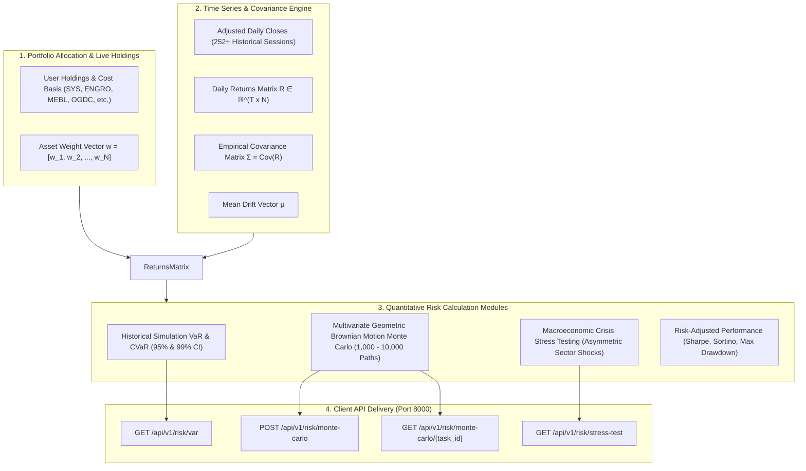

# Portfolio Risk Analytics & Mathematical Modeling Documentation

## 1. Overview & Architecture

The **Basarat Quantitative Risk Subsystem** (`backend/app/api/v1/risk.py` & `backend/app/services/risk_service.py`) provides statistical risk analytics, downside loss modeling, forward wealth projections, and macroeconomic stress testing for investor portfolios holding Pakistan Stock Exchange (PSX) equities.

---

## 2. Value-at-Risk (VaR) & Conditional VaR (CVaR)

### 2.1 Theoretical Definitions:
* **Value-at-Risk ($\text{VaR}_\alpha$):** The maximum expected financial loss at confidence level $\alpha \in \{0.90, 0.95, 0.99\}$ over horizon $H \in \{1\text{D}, 5\text{D}, 10\text{D}, 21\text{D}\}$:
  $$\text{VaR}_\alpha = \inf \{ l \in \mathbb{R} : P(L > l) \le 1 - \alpha \}$$
* **Conditional VaR ($\text{CVaR}_\alpha$ / Expected Shortfall):** A **coherent risk measure** that calculates the expected loss strictly *beyond* the VaR threshold:
  $$\text{CVaR}_\alpha = \mathbb{E}[L \mid L \ge \text{VaR}_\alpha]$$

### 2.2 Historical Simulation Methodology:
Unlike parametric normal distribution assumptions (which underestimate fat-tailed black swan events in emerging markets like PSX), Basarat implements **compounded overlapping historical simulation**:
1. Compounded asset return over horizon $H$:
   $$R_{i, t}^{(H)} = \prod_{k=0}^{H-1} (1 + R_{i, t-k}) - 1$$
2. Portfolio return series:
   $$R_{\text{port}, t} = \sum_{i=1}^N w_i \cdot R_{i, t}^{(H)}$$
3. $\text{VaR}_\alpha$ is computed as the linear quantile at $(1 - \alpha)$, and $\text{CVaR}_\alpha$ is the arithmetic mean of all observations $R_{\text{port}, t} \le \text{VaR}_\alpha$.

---

## 3. Multivariate Monte Carlo Simulation (GBM)

Located in `backend/app/services/risk_service.py` & `backend/app/tasks/risk_tasks.py`.

### 3.1 Geometric Brownian Motion (GBM) Formulation:
Asset prices are modeled as correlated continuous-time stochastic differential equations:
$$dS_{i, t} = \mu_i S_{i, t} dt + \sigma_i S_{i, t} dW_{i, t}$$

### 3.2 Correlated Path Generation (Cholesky / Spectral Decomposition):
1. Compute empirical covariance matrix $\Sigma$ across available portfolio assets.
2. Apply **Spectral Eigenvalue Decomposition** ($L \cdot L^\top = \Sigma$) with numerical jitter to ensure positive semi-definiteness even with highly collinear sector stocks.
3. For each simulated step $t \in [1, \text{horizon}]$ and path $m \in [1, M]$:
   $$\vec{Z} \sim \mathcal{N}(0, I_N)$$
   $$\vec{r}_t = \left(\vec{\mu} - \frac{1}{2}\text{diag}(\Sigma)\right) + L \cdot \vec{Z}$$
   $$S_{i, t+1} = S_{i, t} \cdot \exp(r_{i, t})$$
4. Projected Portfolio Terminal Wealth:
   $$W_M(T) = W_0 \sum_{i=1}^N w_i \cdot \frac{S_{i, T}^{(m)}}{S_{i, 0}}$$

### 3.3 Asynchronous Execution Flow:
* Initiated via `POST /api/v1/risk/monte-carlo` (dispatches Celery task to Redis Broker).
* Client polls `GET /api/v1/risk/monte-carlo/{task_id}` to retrieve percentiles (P5, P25, Median P50, P75, P95), probability of profit, and expected maximum drawdown.

---

## 4. Macroeconomic Crisis Stress Testing

Evaluates portfolio resilience against specific historical Pakistani and global macroeconomic shocks using pre-calibrated asymmetric sector multipliers:

| Scenario | Macroeconomic Context | Sector Impacts |
|---|---|---|
| **`2008_crash`** | Severe Market Liquidity Crisis | Banks: -55%, Tech: -60%, Cement: -50%, Oil: -40%, Power: -25% |
| **`pkr_devaluation`** | 25-30% PKR Currency Devaluation | Tech: -30%, Cement: -25%, Banks: -20%, **Textile: +10% (Export Beneficiary)** |
| **`covid_crash`** | March 2020 Pandemic Lockdown | Oil: -50%, Banks: -35%, Cement: -30%, **Pharma: +20%, Tech: +5%** |
| **`interest_rate_hike`** | SBP Policy Rate Hike (+300 bps) | Tech: -15%, Cement: -15%, Textile: -12%, **Banks: +5% (NIM Expansion)** |

---

## 5. Risk-Adjusted Ratios

* **Annualized Sharpe Ratio:**
  $$\text{Sharpe} = \frac{\bar{R}_{\text{portfolio}} - R_f}{\sigma_{\text{portfolio}} \times \sqrt{252}}$$
  *(Where $R_f$ is the SBP Risk-Free 3-Month T-Bill rate).*
* **Sortino Ratio:** Measures excess return relative to downside deviation only:
  $$\text{Sortino} = \frac{\bar{R}_{\text{portfolio}} - R_f}{\sqrt{\frac{1}{T} \sum \min(0, R_t - R_f)^2} \times \sqrt{252}}$$
