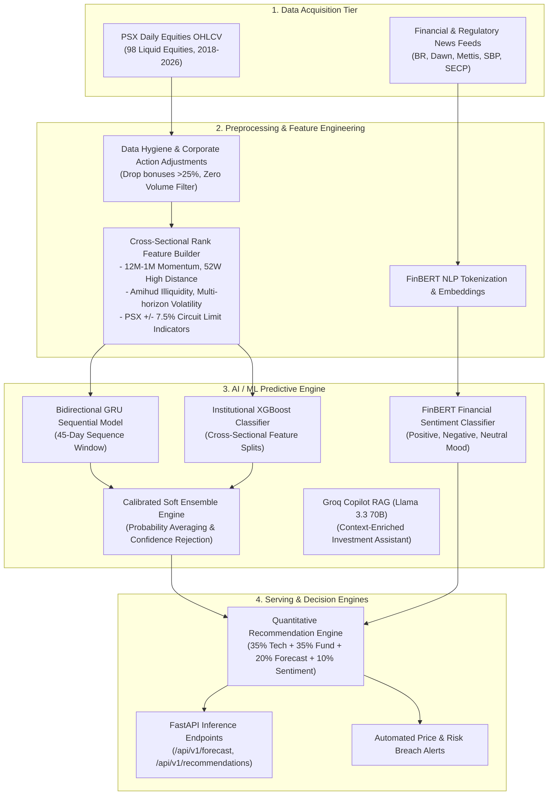

# AI / ML Intelligence Subsystem Documentation

## 1. Overview & Architecture

The **Basarat AI/ML Subsystem** delivers institutional-grade predictive analytics, natural language processing, and automated decision support tailored to the **Pakistan Stock Exchange (PSX)**.

---

## 2. Documentation Directory Map

This dedicated AI/ML directory contains exhaustive technical documentation covering every phase of the machine learning lifecycle:

| Document | Title | Description |
|---|---|---|
| **[01-Dataset.md](file:///d:/FYP/Basarat-fyp-official/docs/09-ai-ml/01-dataset.md)** | Dataset Documentation | Universe selection (98 PSX stocks), temporal coverage (2018–2026), raw schemas, data volume, and calendar structures. |
| **[02-Data-Preprocessing.md](file:///d:/FYP/Basarat-fyp-official/docs/09-ai-ml/02-data-preprocessing.md)** | Data Preprocessing Documentation | Data cleaning, corporate action filtering, outlier clipping, missing value imputation, and point-in-time leakage prevention. |
| **[03-Feature-Engineering.md](file:///d:/FYP/Basarat-fyp-official/docs/09-ai-ml/03-feature-engineering.md)** | Feature Engineering Documentation | Complete mathematical formulation of all 29+ technical, volatility, momentum (12M-1M), liquidity (Amihud), and cross-sectional rank features. |
| **[04-ML-Models.md](file:///d:/FYP/Basarat-fyp-official/docs/09-ai-ml/04-ml-models.md)** | ML Model Architecture Documentation | Deep dive into BiGRU, XGBoost, Attention layers, FinBERT NLP, and Groq Llama 3.3 LLM Copilot architectures. |
| **[05-Model-Training.md](file:///d:/FYP/Basarat-fyp-official/docs/09-ai-ml/05-model-training.md)** | Model Training Documentation | Walk-forward temporal splits, loss functions, class weighting, early stopping, hyperparameter grids, and training pipelines. |
| **[06-Model-Evaluation-Results.md](file:///d:/FYP/Basarat-fyp-official/docs/09-ai-ml/06-model-evaluation-results.md)** | Model Evaluation / Results Report | Comprehensive out-of-sample benchmarking, directional accuracy, F1 scores, confidence-bucket rejection analysis, and Spearman Rank IC. |
| **[07-ML-Deployment-Inference.md](file:///d:/FYP/Basarat-fyp-official/docs/09-ai-ml/07-ml-deployment-inference.md)** | ML Deployment & Inference Documentation | Real-time and batch inference pipelines, Redis caching, post-market Celery workflows, model registry versioning (`final_v3`), and automated evaluation. |
| **[08-Recommendation-Engine.md](file:///d:/FYP/Basarat-fyp-official/docs/09-ai-ml/08-recommendation-engine.md)** | Quantitative Recommendation Engine | 4-pillar multi-factor signal consensus (ML 30%, Tech 25%, Fund 25%, Sentiment 20%), dynamic weight renormalization, and ATR target/stop boundaries. |
| **[09-Sentiment-Analysis.md](file:///d:/FYP/Basarat-fyp-official/docs/09-ai-ml/09-sentiment-analysis.md)** | Financial NLP Sentiment Analysis | Hugging Face FinBERT pipeline, news scraping, 3-day exponential time decay, and lexical heuristic fallback. |
| **[10-Portfolio-Risk-Analytics.md](file:///d:/FYP/Basarat-fyp-official/docs/09-ai-ml/10-portfolio-risk-analytics.md)** | Portfolio Risk & Stress Testing | Value-at-Risk (Historical Simulation), Conditional VaR (Expected Shortfall), 10k-path Monte Carlo GBM, and macroeconomic shock models. |
| **[Viva-Preparation-Guide.md](file:///d:/FYP/Basarat-fyp-official/docs/09-ai-ml/viva-preparation-guide.md)** | Comprehensive AI/ML Viva Defense Guide | Plain-language defense manual, theoretical Q&A, metric definitions, and audit evidence for PhD faculty jurors. |
