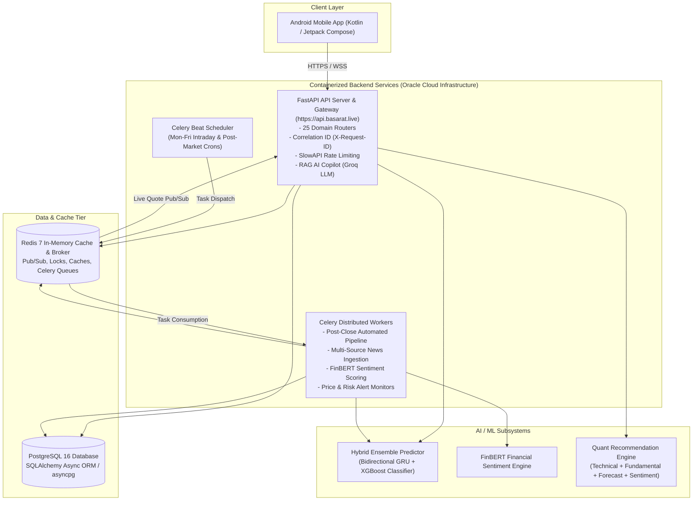

# Basarat Documentation Suite

Welcome to the official technical documentation for **Basarat** — an AI-powered Investment Intelligence Platform for the **Pakistan Stock Exchange (PSX)**.

---

## 1. System Architecture at a Glance

---

## 2. Documentation Sitemap & Reading Paths

The documentation is organized into 9 numbered modules plus core engineering specifications:

| Section | Description | Key Documents |
|---|---|---|
| **[01-Project](./01-project/)** | Product scope, SDLC methodology, functional and non-functional requirements | **[Software Development Life Cycle (SDLC)](./01-project/software-development-life-cycle.md)**, [Project Overview](./01-project/project-overview.md), [Functional Requirements](./01-project/functional-requirements.md), [NFRs](./01-project/non-functional-requirements.md) |
| **[02-Architecture](./02-architecture/)** | High & low-level architecture, C4 diagrams, ER diagrams, ADRs | **[Software Design Document (SDD)](./02-architecture/software-design-document.md)**, [System Architecture (HLD)](./02-architecture/system-architecture.md), [API Architecture (LLD)](./02-architecture/api-architecture.md), [Database Design](./02-architecture/database-design.md), [ADR Decisions](./02-architecture/decisions/) |
| **[03-API](./03-api/)** | Complete endpoint catalog, authentication, error contracts | [API Overview](./03-api/api-overview.md), [Authentication](./03-api/authentication.md), [Error Handling](./03-api/error-handling.md), [API Conventions](./03-api/api-conventions.md) |
| **[04-Development](./04-development/)** | Local environment setup, codebase layout, coding standards | [Project Structure](./04-development/project-structure.md), [Dev Setup](./04-development/development-setup.md), [Environment Variables](./04-development/environment-variables.md), [Coding Standards](./04-development/coding-standards.md) |
| **[05-Security](./05-security/)** | Security architecture, RBAC authorization, PII data protection | [Security Architecture](./05-security/security.md), [Authorization & RBAC](./05-security/authorization.md), [Data Protection](./05-security/data-protection.md) |
| **[06-Testing](./06-testing/)** | Pytest suites, test plans, live endpoint audit verification | [Testing Strategy](./06-testing/testing-strategy.md), [Test Plan](./06-testing/test-plan.md), [Test Cases](./06-testing/test-cases.md) |
| **[07-Deployment](./07-deployment/)** | Oracle Cloud Infrastructure (OCI), Docker Compose, CI/CD pipeline | [Deployment Guide](./07-deployment/deployment.md), [Infrastructure](./07-deployment/infrastructure.md), [Oracle Deployment](./07-deployment/oracle-deployment.md), [CI/CD](./07-deployment/ci-cd.md), [Configuration](./07-deployment/configuration.md) |
| **[08-Operations](./08-operations/)** | Observability, health probes, logging, troubleshooting, runbooks | [Monitoring & Health](./08-operations/monitoring.md), [Logging](./08-operations/logging.md), [Troubleshooting](./08-operations/troubleshooting.md), [Production Review](./08-operations/production-review-2026-10-03.md) |
| **[09-AI-ML](./09-ai-ml/)** | Dedicated AI/ML lifecycle, feature engineering, models, results | [AI/ML Index](./09-ai-ml/README.md), [Dataset](./09-ai-ml/01-dataset.md), [Preprocessing](./09-ai-ml/02-data-preprocessing.md), [Feature Engineering](./09-ai-ml/03-feature-engineering.md), [ML Models](./09-ai-ml/04-ml-models.md), [Training](./09-ai-ml/05-model-training.md), [Evaluation & Results](./09-ai-ml/06-model-evaluation-results.md), [Serving & Deployment](./09-ai-ml/07-ml-deployment-inference.md) |

---

### Recommended Reading Paths

- **FYP Panel & Evaluators**: Start with **[SDLC Methodology](./01-project/software-development-life-cycle.md)** -> **[Software Design Document (SDD)](./02-architecture/software-design-document.md)** -> **[AI/ML Evaluation & Results](./09-ai-ml/06-model-evaluation-results.md)** -> **[Viva Preparation Guide](./09-ai-ml/viva-preparation-guide.md)**.
- **Backend Developers**: Start with [Project Structure](./04-development/project-structure.md) -> [Development Setup](./04-development/development-setup.md) -> [Software Design Document (SDD)](./02-architecture/software-design-document.md) -> [Database Design](./02-architecture/database-design.md).
- **Mobile Engineers (Android)**: Review [API Overview](./03-api/api-overview.md) -> [Authentication](./03-api/authentication.md) -> [API Conventions](./03-api/api-conventions.md) -> [Error Handling](./03-api/error-handling.md).
- **ML / AI Engineers**: Read [AI/ML Index](./09-ai-ml/README.md) -> [Feature Engineering](./09-ai-ml/03-feature-engineering.md) -> [ML Models](./09-ai-ml/04-ml-models.md) -> [Model Evaluation / Results](./09-ai-ml/06-model-evaluation-results.md) -> [Serving](./09-ai-ml/07-ml-deployment-inference.md).
- **DevOps / SRE**: Read [Deployment Guide](./07-deployment/deployment.md) -> [CI/CD](./07-deployment/ci-cd.md) -> [Monitoring](./08-operations/monitoring.md) -> [Troubleshooting](./08-operations/troubleshooting.md).
