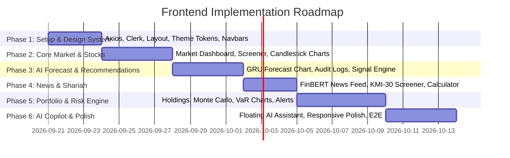

# Basarat (بصارت) — Web Frontend Execution Guide & Architectural Blueprint

> **Target Audience:** Frontend Engineer / React Developer  
> **Platform Scope:** Web Dashboard & Analytics Portal Only  
> **Explicit Exclusions:** Community/Social Module (Android App only) & Firebase SDK (Android App only).  
> **Authentication Provider:** Clerk (`@clerk/clerk-react`)  
> **Backend Integration:** FastAPI REST API (`/api/v1/*`) + WebSocket (`/ws/market`)

---

## 1. Executive Summary & Design Philosophy

**Basarat** is an AI-powered financial intelligence and decision-support workstation for the **Pakistan Stock Exchange (PSX)**. 

### Web Platform Philosophy: "The Pro Trader & Investor Workstation"
Unlike the Android app which focuses on mobile on-the-go tracking and community feeds, the **Web Platform is an analytics-heavy, high-density, pro-grade investor terminal**.

- **High-Density Data**: Financial tables with sparklines, multi-timeframe candlestick charts, and instant screener filters.
- **Explainable AI Integration**: Transparent GRU forecasts with confidence bands and "Predicted vs. Actual" audit trails.
- **Shariah Transparency**: Instant visual indicators for AAOIFI/SECP compliance and integrated dividend purification calculators.
- **Deep Risk Visualizations**: Interactive Monte Carlo simulations, Value-at-Risk (VaR) distributions, and portfolio stress tests.
- **Floating AI Copilot**: Context-aware AI assistant accessible anywhere via a collapsible sidebar or drawer.

---

## 2. Dashboard Navigation, Pages & Tabs Architecture

The Web application is divided into two areas: **Public Landing Pages** and the **Authenticated Dashboard Portal (Main Workstation)**.

### A. Public Routes (Non-Authenticated)
* **`/` (Landing Page)**: 
  * Hero banner with live PSX ticker tape
  * Core value propositions (GRU AI Forecasting, Shariah Screener, FinBERT Sentiment)
  * Feature previews with interactive demo widgets
  * FAQ & CTA to Sign In / Register via Clerk

---

### B. Authenticated Dashboard Portal (Main Navigation Sidebar / Tabs)
Once logged in, the user enters the main workstation with a **Collapsible Sidebar / Top Tab Navigation**:

| Nav Item / Tab | Route | Core Functionality & View Content |
|---|---|---|
| **1. 📊 Market Pulse** *(Default)* | `/dashboard` | • KSE-100 / KSE-30 / KMI-30 index cards & day range<br>• Top 5 Gainers, Losers & Volume Leaders<br>• PSX Sector Heatmap (Banking, Oil & Gas, Tech, Cement)<br>• Live WebSocket market ticker bar |
| **2. 📈 Stocks & Screener** | `/stocks`<br>`/stocks/:symbol` | • Interactive multi-filter PSX Stock Screener<br>• Detailed stock page with Lightweight Candlestick chart<br>• Technical indicators (RSI, MACD, SMA 20/50/200, Bollinger Bands)<br>• Company financial ratios & fundamentals |
| **3. 🧠 AI Forecasts** | `/forecast`<br>`/forecast/:symbol` | • Multi-horizon GRU price trajectory (1D, 1W, 1M)<br>• Upper/lower confidence bands & uncertainty envelope<br>• **"Predicted vs. Actual"** historical audit log & error metrics (MAE/RMSE) |
| **4. 🎯 Trade Signals** | `/recommendations` | • Explainable BUY / HOLD / SELL recommendations<br>• Multi-factor breakdown (Technicals + ML + FinBERT News + Fundamentals)<br>• Target price, stop-loss & risk/reward ratio |
| **5. ☪️ Shariah Screener** | `/shariah` | • AAOIFI / SECP Shariah compliance filter & KMI-30 list<br>• Debt-to-asset, illiquid-asset, and interest income ratio breakdowns<br>• **Dividend Purification Calculator** (calculates exact charity amount) |
| **6. 💼 Portfolio Tracker** | `/portfolio` | • User holdings summary (Total Value, Unrealized P&L PKR/%)<br>• Transaction logger (Add/Edit/Delete Buy/Sell orders)<br>• Asset & sector diversification donut charts |
| **7. 🎲 Risk & Simulation** | `/risk` | • **Value-at-Risk (VaR 95% & 99%)** & Conditional VaR (CVaR)<br>• **Monte Carlo Simulation** (100–1000 projected portfolio paths)<br>• Macro Stress Testing ("Interest Rate Hike +200bps", "Oil Shock -15%") |
| **8. 📰 News & Sentiment** | `/news` | • Pakistani financial news stream (Dawn, Business Recorder, Profit)<br>• FinBERT AI sentiment tags (Bullish / Neutral / Bearish)<br>• Overall PSX Market Sentiment Fear/Greed Meter |
| **9. 🔔 Alerts & Watchlist** | `/alerts` | • Rule builder: Price thresholds, forecast flips, Shariah status changes<br>• Active alerts management & in-app notification history |
| **10. ⚙️ User Settings** | `/settings` | • Risk tolerance assessment profile (Conservative, Moderate, Aggressive)<br>• Clerk user profile & theme preferences |
| **🤖 AI Copilot Drawer** | *Global (Ctrl+J)* | • Floating slide-over assistant grounded in PSX data, portfolio context & Shariah rules |

---

## 3. Tech Stack & Recommended Packages

| Layer | Technology | Rationale |
|---|---|---|
| **Framework** | **React 19 + Vite** | Blazing-fast HMR, lightweight SPA bundle without SSR overhead. |
| **Styling** | **Tailwind CSS v4** | Utility-first, responsive layouts, customizable dark mode design tokens. |
| **Icons** | **Lucide React** (`lucide-react`) | Clean, modern financial & UI icons. |
| **Financial Charting** | **TradingView Lightweight Charts** (`lightweight-charts`) or **Recharts** | High-performance interactive candlestick, volume, and forecast line charts. |
| **Data Fetching & Caching** | **TanStack Query v5** (`@tanstack/react-query`) + **Axios** | Automatic background re-fetching, caching, optimistic UI updates, retry logic. |
| **Auth** | **Clerk React** (`@clerk/clerk-react`) | Managed authentication, JWT bearer token injection to FastAPI backend. |
| **Realtime WebSockets** | **Native WebSocket API / Custom Hook** | Live KSE-100 ticker and price updates. |
| **UI Components** | **Radix UI Primitives / Custom Tailwind** | Accessible modals, tooltips, dropdowns, and tabs. |

---

## 4. Project Directory Structure

```
frontend/
├── public/
│   ├── favicon.ico
│   └── logos/
├── src/
│   ├── api/                     # Axios client & modular API service calls
│   │   ├── client.js            # Base Axios instance with Clerk Bearer token interceptor
│   │   ├── market.js            # /api/v1/market & /api/v1/stocks
│   │   ├── forecast.js          # /api/v1/forecast
│   │   ├── recommendations.js   # /api/v1/recommendations
│   │   ├── news.js              # /api/v1/news & /api/v1/sentiment
│   │   ├── shariah.js           # /api/v1/shariah
│   │   ├── portfolio.js         # /api/v1/portfolio
│   │   ├── risk.js              # /api/v1/risk
│   │   ├── alerts.js            # /api/v1/alerts
│   │   └── assistant.js         # /api/v1/assistant (LangChain Copilot)
│   ├── assets/                  # Brand assets, vectors, illustrations
│   ├── components/              # Reusable UI building blocks
│   │   ├── common/              # Button, Card, Badge, Modal, Tooltip, Skeleton
│   │   ├── layout/              # Navbar, Sidebar, Footer, PageContainer
│   │   ├── charts/              # CandlestickChart, Sparkline, ForecastChart, MonteCarloChart
│   │   ├── tables/              # DataTable, StockTable, ShariahScreenerTable
│   │   ├── assistant/           # CopilotDrawer, ChatMessage, PromptSuggestions
│   │   └── notifications/       # AlertsDropdown, ToastContainer
│   ├── context/                 # Global state (Theme, MarketData, ActivePortfolio)
│   ├── hooks/                   # Custom hooks (useWebSocket, useDebounce, useMarketData)
│   ├── pages/                   # Application view routes
│   │   ├── Landing/             # Public landing page (Hero, Features, Ticker, FAQ)
│   │   ├── Dashboard/           # Main Market Overview & Pulse
│   │   ├── Stocks/              # Stock Screener & Individual Stock Detail Page
│   │   ├── Forecast/            # AI GRU Forecasting & Accuracy Audit Page
│   │   ├── Recommendations/     # Explainable AI Buy/Hold/Sell Signals
│   │   ├── Shariah/             # Shariah Compliance Screener & Purification Tool
│   │   ├── Portfolio/           # Portfolio Tracker & Holdings Breakdown
│   │   ├── RiskAnalytics/       # VaR, CVaR, Monte Carlo Simulation & Stress Testing
│   │   ├── NewsSentiment/       # PSX News Intelligence & FinBERT Sentiment
│   │   └── Settings/            # User Profile, Risk Tolerance & Alert Rules
│   ├── routes/                  # React Router configuration with ProtectedRoute
│   ├── utils/                   # Formatters (PKR currency, percentage, date/time)
│   ├── App.jsx                  # Root App setup
│   ├── index.css                # Global Tailwind tokens & custom scrollbars
│   └── main.jsx                 # Entry point with Clerk & QueryProvider
├── package.json
└── vite.config.js
```

---

## 5. Design System & Theme Guidelines

### 5.1 Color Palette (Dark Mode First)
- **Background Deep**: `#0B0F19` (Rich obsidian)
- **Card / Surface Background**: `#111827` (Slate dark) with `#1F2937` borders
- **Primary Accent**: `#3B82F6` (Electric Blue) / `#6366F1` (Indigo)
- **Market Bull / Gain**: `#10B981` (Emerald Green)
- **Market Bear / Loss**: `#EF4444` (Vibrant Rose Red)
- **Warning / Neutral**: `#F59E0B` (Amber)
- **Shariah Compliance Badge**: `#059669` (Forest Green with subtle glow)
- **Text Primary**: `#F9FAFB` (Crisp white)
- **Text Secondary / Muted**: `#9CA3AF` (Cool gray)

### 5.2 Typography & Spacing
- **Font Family**: `Inter`, `Outfit`, or `Plus Jakarta Sans`
- **Numbers & Financial Tickers**: Monospace tabular numbers (`font-mono` / `tabular-nums`) to prevent shifting layouts on live tick changes.

---

## 6. Detailed Module Specifications & Backend API Mapping

### Module 1: Authentication & User Profile
- **Auth Provider**: Clerk React (`<ClerkProvider>`, `<SignedIn>`, `<SignedOut>`, `useAuth()`).
- **Token Passing**: Attach Clerk JWT token as `Authorization: Bearer <token>` in `src/api/client.js` on every Axios request.
- **Backend Endpoints**:
  - `GET /api/v1/users/me` — Retrieve logged-in user profile, contact info, risk profile & notification preferences.
  - `PATCH /api/v1/users/me` — Update user profile & investment preferences (Payload: `{ "risk_tolerance": "conservative"|"moderate"|"aggressive", "investment_horizon": "short_term"|"medium_term"|"long_term" }`).

---

### Module 2: Market Dashboard & Live Pulse
- **Purpose**: High-level real-time overview of the Pakistan Stock Exchange.
- **Components**:
  - **KSE-100 / KSE-30 / KMI-30 Cards**: Current index value, net points change, % change, day high/low range bar.
  - **Top Movers**: Top Gainers, Top Losers, and Volume Spikes tables.
  - **Market Ticker Tape**: Marquee ticker of active PSX symbols.
  - **Market Sentiment Meter**: Gauge showing market sentiment status (Very Bearish to Very Bullish).
- **Backend Endpoints**:
  - `GET /api/v1/market/indices` — Main market indices snapshot.
  - `GET /api/v1/market/indices/kse-100` — KSE-100 index constituent stocks.
  - `GET /api/v1/market/indices/kse-30` — KSE-30 index constituent stocks.
  - `GET /api/v1/market/indices/kmi-30` — KMI-30 Shariah index constituents.
  - `GET /api/v1/market/gainers?limit=10` — Top gaining stocks.
  - `GET /api/v1/market/losers?limit=10` — Top losing stocks.
  - `GET /api/v1/market/volume-spikes?limit=10` — Stocks with unusual/highest traded volume.
  - `GET /api/v1/market/sentiment-overview` — Aggregated PSX sentiment score & distribution.
  - `WS /ws/market` — Real-time WebSocket connection for live tick feeds.

---

### Module 3: Stocks Screener & Detailed Analysis
- **Purpose**: Search, filter, and inspect individual PSX listed companies.
- **Components**:
  - **Autocomplete Search Bar**: Search by symbol prefix (e.g. `OGDC`, `SYS`) or company name.
  - **Interactive Candlestick Chart**: Powered by `lightweight-charts` with OHLCV bars and timeframe toggles (`1D`, `1W`, `1M`, `1Y`).
  - **Technical Indicators Overlay**: Toggleable indicators (RSI 14, MACD, Bollinger Bands, SMA 20/50/200, ADX).
  - **Company Fundamentals Panel**: Market capitalization, EPS, P/E ratio, 52-week High/Low, Dividend Yield.
- **Backend Endpoints**:
  - `GET /api/v1/stocks/search?q={query}&limit=10` — Real-time search/autocomplete for stock symbols and names.
  - `GET /api/v1/stocks/{symbol}/overview` — Current price, change, volume, high, low, sector snapshot.
  - `GET /api/v1/stocks/{symbol}/price-history?range=1D|1W|1M|1Y` — Historical OHLCV candle bars.
  - `GET /api/v1/stocks/{symbol}/technical-indicators?indicators=RSI,MACD,BB,SMA,ADX&period=14&limit=30` — Indicator series and overall technical summary signal (BULLISH/BEARISH/NEUTRAL).
  - `GET /api/v1/stocks/{symbol}/fundamentals` — Financial metrics (P/E, EPS, Dividend Yield, Market Cap, 52W Range).

---

### Module 4: AI Price Forecasting (GRU Model)
- **Purpose**: AI-driven multi-horizon price trajectory forecasting with confidence bands and historical auditability.
- **Components**:
  - **Horizon Selector**: `1D` (Next Day), `1W` (Next Week), `1M` (Next Month).
  - **Trajectory Chart**: Historical price line with projected future trend and shaded confidence interval.
  - **Probability & Signal Breakdown**: Bullish %, Bearish %, Sideways % probabilities, model version, and gate reason.
  - **"Predicted vs. Actual" Historical Audit Table**: List of past predictions vs real closing prices and calculated model accuracy (MAE/RMSE).
- **Backend Endpoints**:
  - `GET /api/v1/forecast/{symbol}?horizon=1D|1W|1M` — Returns direction, confidence, probabilities (`bullish_pct`, `bearish_pct`, `sideways_pct`), target price, expected range, stop loss, and upside/downside %.
  - `GET /api/v1/forecast/{symbol}/history?limit=30` — Returns past predictions, target dates, actual outcomes (`was_correct`), and overall historical accuracy %.

---

### Module 5: Explainable AI Trade Recommendations
- **Purpose**: Transparent BUY / HOLD / SELL signals synthesizing multiple analytical factors.
- **Components**:
  - **Recommendation Card**: Primary signal badge (`BUY` in Emerald, `HOLD` in Amber, `SELL` in Rose) with confidence score (0–100%).
  - **Explainable Factor Breakdown (Radar / Progress Bars)**:
    - ML Forecast weight & signal.
    - Technical indicators weight & signal.
    - Fundamental valuation weight & signal.
  - **Target & Stop Loss Guidance**: Calculated target price, stop-loss, and risk/reward ratio.
  - **Customizable Weights Modal**: Optional power-user slider to tune weights (GRU weight, Technical weight, Fundamental weight).
- **Backend Endpoints**:
  - `GET /api/v1/recommendations?risk_profile=conservative|moderate|aggressive&sector={sector}&limit=20` — Top recommendations list across the market.
  - `GET /api/v1/recommendations/{symbol}` — Deep explainable recommendation for a specific stock with reasoning text.
  - `GET /api/v1/recommendations/{symbol}/target-stop` — Detailed target price, stop loss, ATR-14, and upside/downside %.
  - `GET /api/v1/recommendations/engine-weights` — Get current active engine weights.
  - `POST /api/v1/recommendations/engine-weights` — Set custom user weights (Payload: `{ "gru_weight": 0.40, "technical_weight": 0.35, "fundamental_weight": 0.25 }`).

---

### Module 6: News Intelligence & FinBERT Sentiment
- **Purpose**: Curated Pakistani financial news stream with AI sentiment classification.
- **Components**:
  - **Live News Feed**: Cards with headline, publisher (Dawn, Business Recorder, Profit), publication time, AI summary, and direct link to source.
  - **Sentiment Tags**: Color-coded sentiment badges (**Bullish**, **Neutral**, **Bearish**) with FinBERT confidence score.
  - **Stock / Sector Filters**: Filter news by stock symbol or market sector.
- **Backend Endpoints**:
  - `GET /api/v1/news?row=news|portfolio&symbol={symbol}&category={category}&limit=20&cursor={cursor}` — Paginated financial news with FinBERT sentiment scores and summaries.
  - `GET /api/v1/news/{article_id}` — Single article detail with sentiment score and extracted company entities.
  - `GET /api/v1/news/sources` — List of supported news sources and health status.
  - `GET /api/v1/events` — Upcoming PSX corporate and market events extracted from news.

---

### Module 7: Shariah Compliance Screener & Purification Calculator
- **Purpose**: AAOIFI & SECP Shariah compliance screening and dividend purification calculation.
- **Components**:
  - **KMI-30 Toggle & Screener**: Quick filter for 100% Shariah-compliant PSX equities.
  - **6-Criteria Compliance Breakdown**:
    1. Core Business Activity (Halal vs Haram screening).
    2. Debt to Total Assets Ratio (< 37%).
    3. Non-Compliant Investments Ratio (< 33%).
    4. Non-Compliant Income / Interest Revenue (< 5%).
    5. Illiquid Assets to Total Assets Ratio (> 25%).
    6. Market Price per share vs Net Liquid Assets per share.
  - **Dividend Purification Calculator**:
    - User inputs number of shares owned and dividend amount received.
    - Outputs exact purification percentage and PKR amount to donate to charity.
- **Backend Endpoints**:
  - `GET /api/v1/shariah/kmi30` — List of all KMI-30 Shariah-compliant companies.
  - `GET /api/v1/shariah/{symbol}` — Screening result for a specific stock (compliance boolean, sector, purification rate).
  - `GET /api/v1/shariah/{symbol}/criteria` — Detailed itemized breakdown of all 6 compliance criteria.
  - `GET /api/v1/shariah/{symbol}/purification?holding_qty={qty}&holding_value={value}` — Calculates exact purification charity amount and notes for user holdings.

---

### Module 8: Portfolio Management & Advanced Risk Analytics
- **Purpose**: Track investor holdings and simulate risk metrics (Monte Carlo, VaR).
- **Components**:
  - **Holdings Table**: Symbol, Quantity, Average Buy Price, Current Price, Unrealized P&L (PKR & %), Day Change.
  - **Add / Edit / Delete Transaction Modal**: Log Buy/Sell trades with date, price, quantity, and commission.
  - **Asset Allocation Visualizer**: Donut charts showing holdings breakdown by stock and by sector.
  - **Value at Risk (VaR)**: Historical simulation VaR (95% & 99% confidence limits) and CVaR (Expected Shortfall).
  - **Monte Carlo Fan Chart**: Interactive simulation showing 100–1000 projected portfolio value paths over 30/90 days.
  - **Macro Stress Testing**: Pre-calibrated PSX scenarios (e.g. "Interest Rate Hike +200bps", "Oil Price Drop 15%").
- **Backend Endpoints**:
  - `GET /api/v1/portfolio` — Complete user portfolio summary (total invested, current value, total P&L) and holdings.
  - `GET /api/v1/portfolio/holdings` — Active holdings list with current market valuations.
  - `GET /api/v1/portfolio/transactions?page=1&limit=20` — User transaction history.
  - `POST /api/v1/portfolio/transactions` — Add transaction (Payload: `{ "symbol": "SYS", "transaction_type": "BUY"|"SELL", "quantity": 100, "price": 450.50, "transaction_date": "2026-09-20" }`).
  - `PUT /api/v1/portfolio/transactions/{transaction_id}` — Edit an existing transaction.
  - `DELETE /api/v1/portfolio/transactions/{transaction_id}` — Delete a transaction.
  - `GET /api/v1/portfolio/allocation` — Asset and sector allocation breakdown.
  - `GET /api/v1/portfolio/pnl` — Realized and unrealized P&L summary.
  - `GET /api/v1/portfolio/performance` — Historical portfolio value trajectory.
  - `GET /api/v1/risk/var?confidence=95&horizon=1D` — Value at Risk (VaR) & CVaR metrics.
  - `POST /api/v1/risk/monte-carlo` — Launch Monte Carlo simulation (Payload: `{ "simulations": 500, "days": 30 }`, returns `task_id`).
  - `GET /api/v1/risk/monte-carlo/{task_id}` — Poll/retrieve Monte Carlo trajectory results.
  - `GET /api/v1/risk/stress-test` — Calibrated PSX macro stress test results.

---

### Module 9: Alert Rules & In-App Notification Center
- **Purpose**: Configure custom price/signal trigger rules and receive in-app alert notifications.
- **Components**:
  - **Create Alert Modal**: Target stock, condition type (`PRICE_ABOVE`, `PRICE_BELOW`, `FORECAST_CHANGE`, `SHARIAH_STATUS_CHANGE`), threshold value.
  - **Active Rules List**: Enable/disable toggle switches, edit, and delete rules.
  - **Notification Bell Dropdown**: Top navbar unread badge counter, notification feed, and "Mark All as Read" action.
- **Backend Endpoints**:
  - `GET /api/v1/alerts/rules` — Fetch all user configured alert rules.
  - `POST /api/v1/alerts/rules` — Create a new alert rule (Payload: `{ "stock_id": "uuid", "condition": "PRICE_ABOVE", "threshold": 500.0 }`).
  - `PUT /api/v1/alerts/rules/{rule_id}` — Update rule status or threshold.
  - `DELETE /api/v1/alerts/rules/{rule_id}` — Delete an alert rule.
  - `GET /api/v1/notifications?page=1&limit=20&unread_only=false` — Paginated notification inbox.
  - `PUT /api/v1/notifications/{notification_id}/read` — Mark a single notification as read.
  - `PUT /api/v1/notifications/read-all` — Mark all notifications as read.

---

### Module 10: Basarat AI Copilot (LangChain Assistant)
- **Purpose**: Intelligent conversational assistant grounded in real-time PSX data, technicals, user portfolio, and Shariah rules.
- **Components**:
  - **Collapsible Slide-Over Drawer**: Opened via floating pill or `Ctrl + J` shortcut.
  - **Chat Interface**: Threaded conversation history with markdown, code snippets, stock ticker badges, and data tables.
  - **Streaming Mode (SSE)**: Real-time word-by-word streaming responses for snappy interaction.
  - **Suggested Quick Prompts**: "Is MEBL Shariah compliant?", "Explain SYS GRU forecast", "What is my portfolio VaR today?".
- **Backend Endpoints**:
  - `POST /api/v1/assistant/chat` — Standard REST chat (Payload: `{ "message": "What is the forecast for OGDC?", "conversation_id": "optional-uuid" }`).
  - `POST /api/v1/assistant/chat/stream` — Real-time Server-Sent Events (SSE) streaming chat endpoint.
  - `GET /api/v1/assistant/conversations` — List previous conversation threads.
  - `POST /api/v1/assistant/conversations` — Start a new conversation thread.
  - `GET /api/v1/assistant/conversations/{conversation_id}/messages` — Fetch message history for a conversation.

---

## 7. Frontend Developer Implementation Phases



### Phase 1: Foundation, Auth & Layout (Days 1–3)
- [ ] Configure `api/client.js` with Clerk Bearer token interceptor and API base URL.
- [ ] Build global Layout (`Sidebar`, `Navbar` with Search & Notification Bell, `PageWrapper`).
- [ ] Setup React Router with protected routes requiring Clerk `<SignedIn>`.
- [ ] Build reusable UI atoms (Badge, Button, Card, Skeleton loader, Modal).

### Phase 2: Market Dashboard & Stock Detail (Days 4–7)
- [ ] Build KSE-100 Index summary card and Top Movers cards (Gainers/Losers/Volume).
- [ ] Integrate WebSocket client (`ws/market`) for live price updates.
- [ ] Build Stock Screener table with sector, price, and Shariah filters.
- [ ] Integrate Lightweight Charts for interactive OHLCV Candlestick charts with timeframes.

### Phase 3: AI Forecast & Recommendation Modules (Days 8–11)
- [ ] Build GRU Forecast visualizer with confidence intervals (1D, 1W, 1M).
- [ ] Build "Predicted vs Actual" audit table for ML transparency.
- [ ] Build Explainable Recommendation Card with factor decomposition progress bars.

### Phase 4: News Sentiment & Shariah Compliance (Days 12–14)
- [ ] Build News stream cards with FinBERT sentiment tags and direct source links.
- [ ] Build Shariah compliance breakdown checklist according to AAOIFI/SECP criteria.
- [ ] Implement interactive Dividend Purification calculator.

### Phase 5: Portfolio & Risk Analytics (Days 15–19)
- [ ] Build Portfolio summary cards (Total Value, Total P&L, Day Gain).
- [ ] Implement Holdings table with Add/Edit transaction modal.
- [ ] Build Monte Carlo projection chart and VaR/CVaR risk scorecards.
- [ ] Build Alert Rule creator and in-app notification dropdown.

### Phase 6: AI Copilot & Final Polish (Days 20–23)
- [ ] Build Collapsible Basarat AI Copilot drawer with quick action chips.
- [ ] Add empty states, error boundaries, and loading skeletons across all tables and charts.
- [ ] Complete UI consistency pass (dark mode accents, typography, mobile responsiveness).

---

## 8. Developer Checklists & Rules of Engagement

1. **No Community Code on Web**: Do not create community forum, post creation, comments, or feed components on the web application. Community is an Android-only feature.
2. **No Firebase SDK on Web**: Do not import `firebase/app`, `firebase/auth`, or `firebase/messaging`. Authentication on web is handled 100% through Clerk React, and API calls use standard Axios with Clerk JWT.
3. **Mandatory Non-Advisory Disclaimer**: Ensure every AI recommendation and forecasting screen has the clear disclaimer: *"Informational & decision-support only. Not financial advice."*
4. **Resilience & Graceful Degradation**: Always show skeleton loaders when fetching data; if ML or Celery tasks are recalculating, display friendly indicators rather than blank screens.
